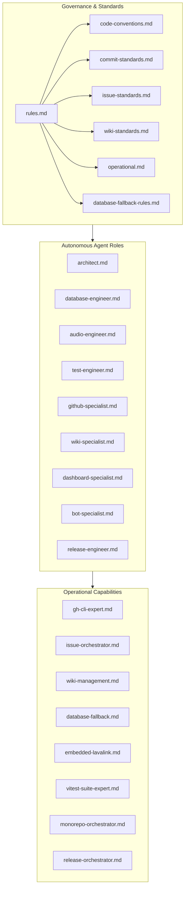

# 📜 Master-Bot Agent System Master Rules

## Overview
This document defines the operational rules, quality gates, and communication standards for all autonomous AI agents, human contributors, and automation pipelines operating within the **Master-Bot** repository.

---

## 🏛️ System Architecture & Principles

---

## 📌 Core Invariants

1. **Zero-Ops Default with Production Scaling**:
   - Zero-configuration local startup MUST always function using SQLite (`file:./db.sqlite`), in-memory `ioredis-mock`, and embedded `@helix-origin/lavalink-server`.
   - Production deployments MUST cleanly scale to external PostgreSQL (`DATABASE_URL=postgresql://...`), external Redis (`REDIS_URL=...`), and remote Lavalink nodes (`LAVA_EXTERNAL=true`) without code changes.

2. **Strict Quality Gates**:
   - Every change must pass:
     - `pnpm lint` (ESLint & `manypkg` validation) with 0 errors.
     - `pnpm type-check` (TypeScript across all workspace projects) with 0 errors.
     - `pnpm test` (Vitest test suite) with 100% pass rate.

3. **Human-Readable Communication with Emojis**:
   - All commits, issue titles, issue comments, and documentation must start with semantic emojis.
   - Use clear formatting, bullet points, and avoid robotic or unformatted text.

4. **GitHub-Formatted Mermaid Diagrams**:
   - Non-trivial architecture, state transitions, pipelines, and protocol interactions must be visually rendered with GitHub-compatible Mermaid diagrams (`flowchart`, `sequenceDiagram`, `stateDiagram-v2`, `erDiagram`).

5. **Hierarchical Sub-Issue Management**:
   - Epics and feature requests must split discrete tasks into dedicated child GitHub issues linked to the parent issue.

---

## 📑 Rule Files Index

| Rule File | Scope & Purpose |
| :--- | :--- |
| [**`rules/code-conventions.md`**](rules/code-conventions.md) | TypeScript conventions, React/Next.js guidelines, Sapphire framework rules |
| [**`rules/commit-standards.md`**](rules/commit-standards.md) | Detailed human-readable commits with emojis, imperative mood, and scopes |
| [**`rules/issue-standards.md`**](rules/issue-standards.md) | Standardized issue layouts, Mermaid diagrams, and GitHub CLI sub-issues |
| [**`rules/wiki-standards.md`**](rules/wiki-standards.md) | GitHub wiki formatting, relative links, Mermaid visuals, sidebar, and footer |
| [**`rules/operational.md`**](rules/operational.md) | Shell commands, pnpm monorepo commands, safety gates, and error handling |
| [**`rules/database-fallback-rules.md`**](rules/database-fallback-rules.md) | Dual database & cache fallback lifecycle rules |
