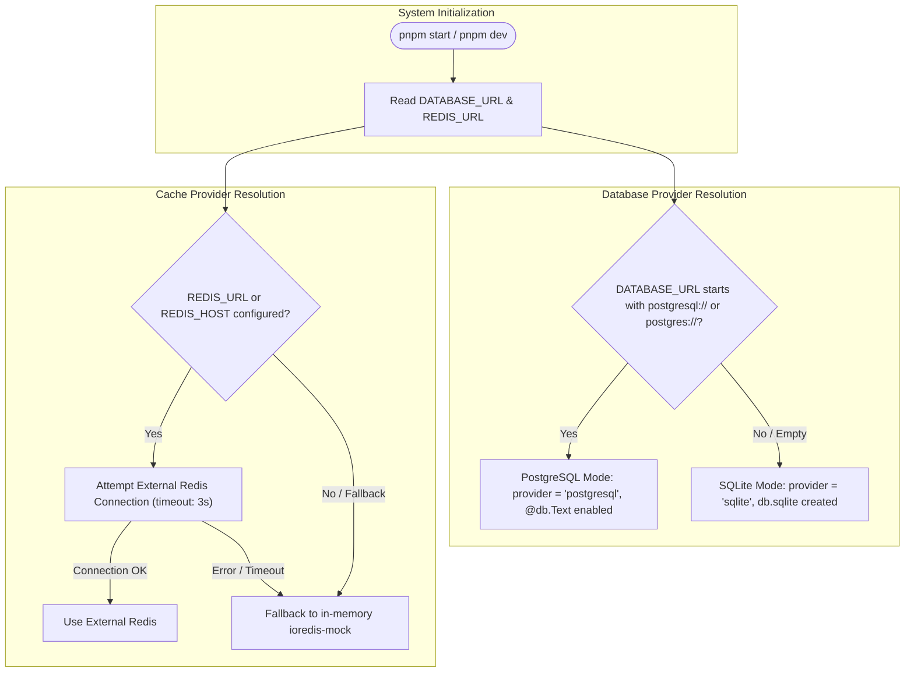

# 🗄️ Rule: Database & Redis Fallback Conventions

## Purpose
Enforce robust dual-database and dual-cache lifecycle rules. The system must effortlessly run with zero external infrastructure while seamlessly scaling to external PostgreSQL and Redis when configured.

---

## 🏛️ Fallback Decision Architecture

---

## Database Rules

1. **Schema Dynamic Generation**:
   - `packages/db/scripts/prepare-schema.mjs` runs prior to `prisma generate` and `prisma db push`.
   - Never hardcode `provider = "sqlite"` or `provider = "postgresql"` in a way that breaks either dialect.
   - Text fields on `Account` must support `@db.Text` in PostgreSQL and clean scalar types in SQLite.

2. **Zero-Ops Default**:
   - When `DATABASE_URL` is omitted, the application defaults to `file:./db.sqlite`.
   - Developers and users cloning the repo must be able to run `pnpm start` without installing or provisioning any database engine.

---

## Redis Cache Rules

1. **Connection Lifecycle**:
   - Check `REDIS_URL` or `REDIS_HOST`.
   - Use short connection timeouts (`connectTimeout: 3000`, `maxRetriesPerRequest: 2`).
   - Register an `error` listener on the Redis instance so connection drops do not crash the Node.js process.

2. **In-Memory Fallback Invariance**:
   - If Redis connection fails or configuration is absent, seamlessly fall back to `ioredis-mock`.
   - Log an informative note: `[packages/db] External Redis encountered error. Active commands continue with fallback.`
   - Expose `isUsingMockRedis()` to notify dashboards and telemetry of active cache mode.
