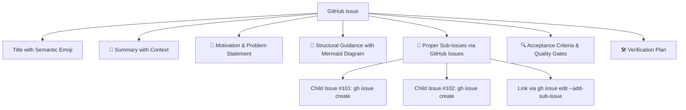
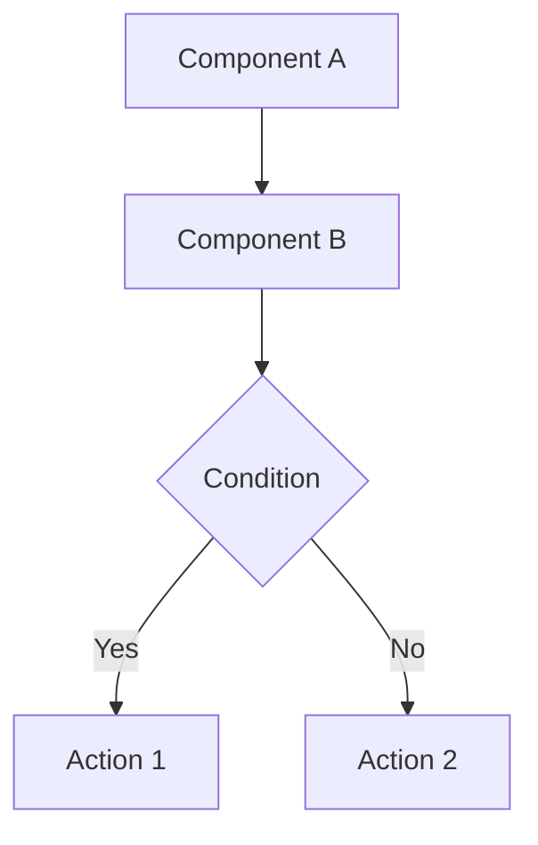

# 📋 Rule: Issue Standards

## Purpose
Ensure all GitHub issues and issue comments created or managed by agents and contributors are **detailed, human-readable with emojis**, incorporate **GitHub-formatted Mermaid diagrams** for structural clarity, and utilize **proper sub-issues** created as dedicated GitHub issues for fine-grained task tracking.

---

## Architecture of a Standardized Issue



---

## 1. Issue Title Format 🏷️

```text
<emoji> <Type>(<Scope>): <Imperative Summary>
```

### Examples:
- `✨ Feature(audio): Embed Lavalink v4 server with automatic supervisor`
- `🐛 Bug(dashboard): Fix INTERNA_URL environment variable typo`
- `⚡️ Perf(redis): Optimize connection retry strategy and in-memory fallback`
- `🗺️ Roadmap(modernization): Master-Bot Unified Architecture and Agent Ecosystem`
- `🧩 Sub-Issue(#828): Implement PostgreSQL schema migration script`

---

## 2. Issue Body Structure & Section Guidelines

Every issue must follow this standardized template:

```markdown
# <emoji> <Type>(<Scope>): <Title>

> [!NOTE]
> Relevant context, parent issue links, or associated pull request references.

## 📖 Summary
Clear, friendly, and human-readable description of the problem or enhancement.

## 🎯 Motivation & Context
Why is this change necessary? What problem does it solve for users, bot operators, or developers?

## 📐 Structural Guidance (Mermaid Diagram)
<!-- REQUIRED for non-trivial changes: flowchart, sequence diagram, state diagram, or ERD -->


## 🧩 Sub-Issues & Tasks (Proper GitHub Sub-Issues)
<!-- REQUIRED: Dedicated GitHub issues linked via gh issue edit --add-sub-issue -->
- [ ] #101 - Implement core logic
- [ ] #102 - Add unit tests
- [ ] #103 - Update wiki documentation

## 🔍 Acceptance Criteria & Quality Gates
- [ ] `pnpm lint` passes with 0 errors
- [ ] `pnpm type-check` passes with 0 errors
- [ ] `pnpm test` passes with 100% pass rate
- [ ] Feature tested in both external and fallback modes

## 🛠️ Verification Plan & Test Commands
Specific test commands and steps to replicate and verify the changes.
```

---

## 3. GitHub Formatted Mermaid Diagrams 📐

All non-trivial issues must provide structural guidance through GitHub-native Mermaid diagrams:

- **Architecture & Pipelines**: Use `flowchart TD` or `flowchart LR`.
- **Protocol & Network Interactions**: Use `sequenceDiagram` with `autonumber`.
- **Lifecycle & Fallback States**: Use `stateDiagram-v2`.
- **Database Schema**: Use `erDiagram`.

---

## 4. Proper Sub-Issue Management 🧩

Sub-tasks must **NEVER** remain simple untracked Markdown text. Each discrete task must be created as an independent GitHub issue and linked to the parent issue.

### Managing Sub-Issues with GitHub CLI (`gh`):

```bash
# 1. Create the parent issue
gh issue create \
  --title "✨ Feature(db): Implement PostgreSQL support with SQLite fallback" \
  --body-file parent-issue.md
# Assume parent issue is #850

# 2. Create discrete child sub-issues
gh issue create \
  --title "🧩 Sub-Issue(#850): Implement dynamic prepare-schema script" \
  --body "Part of #850. Implements packages/db/scripts/prepare-schema.mjs."
# Child is #851

gh issue create \
  --title "🧩 Sub-Issue(#850): Add unit test suite for database provider detection" \
  --body "Part of #850. Implements tests/unit/databaseFallback.test.ts."
# Child is #852

# 3. Link child sub-issues to parent issue:
gh issue edit 850 --add-sub-issue 851
gh issue edit 850 --add-sub-issue 852

# 4. Post comment tracking progress:
gh issue comment 850 --body "Linked sub-issues:
- [ ] #851
- [ ] #852"
```

---

## 5. Issue Comment Standards 💬

When updating or commenting on issues:
- Begin comments with an approved emoji (e.g. `📢`, `🔍`, `🚀`, `✅`, `⚠️`).
- Provide human-readable summaries with clear bullet points.
- Include Mermaid diagrams for status flow or updated architectures.
- List completed tasks and next steps.
