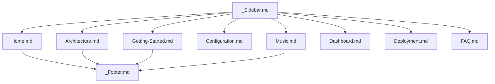
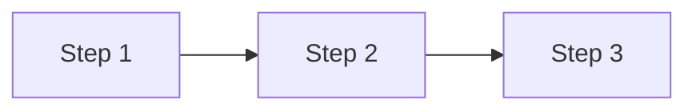

# 📚 Rule: Wiki Standards

## Purpose
Enforce rigorous formatting, structure, navigation, and visual standards across the project's documentation wiki. Every wiki page must be **detailed, human-readable with emojis**, incorporate **GitHub-formatted Mermaid diagrams**, use **proper GitHub wiki links**, feature **syntax-highlighted formatted codeblocks**, and maintain **proper sidebar and footer pages**.

---

## 🏛️ Wiki Navigation Architecture



---

## 1. Page Structure & Styling

Every wiki page must adhere to this uniform layout:

```markdown
# <emoji> <Page Title>

Brief, engaging introduction explaining what this page covers and who it is for.

---

## 📑 Table of Contents
1. [Overview](#-overview)
2. [Architecture & Flow](#-architecture--flow)
3. [Configuration](#-configuration)
4. [Related Guides](#-related-guides)

---

## 📖 Overview
Human-readable explanations using formatted callouts, lists, and tables.

> [!NOTE]
> Helpful tips, caveats, and prerequisites.

---

## 📐 Architecture & Flow


---

## 💻 Configuration & Code Examples
```bash
# Formatted bash commands with syntax highlighting
pnpm dev
```

```typescript
// Formatted TypeScript codeblock with typed interfaces
interface AudioConfig {
  host: string;
  port: number;
}
```

---

## 🔗 Related Guides
- [Home](Home) — Return to wiki main page
- [Architecture](Architecture) — Deep dive into system components
- [Deployment](Deployment) — Production rollout guide
```

---

## 2. GitHub Wiki Link Formatting Rules 🔗

GitHub Wikis use a specific link syntax that must be strictly followed:

| Link Target | GitHub Wiki Syntax | Standard Markdown Syntax (Fallback) |
| :--- | :--- | :--- |
| **Wiki Page** | `[[Page-Name]]` or `[Display Text](Page-Name)` | `[Display Text](Page-Name.md)` |
| **Section Anchor** | `[Section Name](Page-Name#section-anchor)` | `[Section Name](Page-Name.md#section-anchor)` |
| **External Repository** | `[Repo Name](https://github.com/org/repo)` | `[Repo Name](https://github.com/org/repo)` |

### Rules:
- **Do NOT** use absolute file system paths (e.g. `file:///...` or `C:/...`).
- When linking within the wiki directory, use `[Page Title](Page-Name)` (e.g. `[Audio Setup](Music)`).
- Ensure anchors use lower-case kebab-case matching the heading text without emojis (e.g. `#architecture--flow`).

---

## 3. GitHub Formatted Mermaid Diagrams 📐

- Every architectural or conceptual wiki page MUST contain at least one GitHub-formatted Mermaid diagram.
- Use valid Mermaid syntax:
  - Fenced code block with language identifier `mermaid`.
  - Node text containing parentheses or special characters MUST be quoted (e.g. `id["Label (info)"]`).
  - No unescaped HTML inside labels.

---

## 4. Formatted Codeblocks 💻

- **Always specify the language identifier** on every codeblock (`bash`, `typescript`, `javascript`, `json`, `yaml`, `dockerfile`, `prisma`, `sql`).
- Include realistic, production-ready examples with inline explanatory comments.
- Group multiple related commands or file examples logically with clear headings.

---

## 5. Sidebar (`_Sidebar.md`) and Footer (`_Footer.md`) Standards

### Sidebar Requirements (`_Sidebar.md`):
- Provides hierarchical category grouping:
  - 🏠 **Getting Started** (`Home`, `Getting-Started`, `Architecture`, `Configuration`)
  - 🤖 **Features & Systems** (`Music`, `Dashboard`, `Commands`, `Tickets`, `Reminders-and-Twitch`)
  - ☁️ **Operations** (`Deployment`, `FAQ`)
- Highlights external companion repositories (`HELIX-Origin/Lavalink-Server`, `HELIX-Origin/vitest-suite`).

### Footer Requirements (`_Footer.md`):
- Clean, centered navigation footer on every wiki page.
- Provides quick links:
  `[Home](Home) • [Documentation Index](Home) • [GitHub Repository](https://github.com/galnir/Master-Bot)`
- Mentions project licensing and credits.
