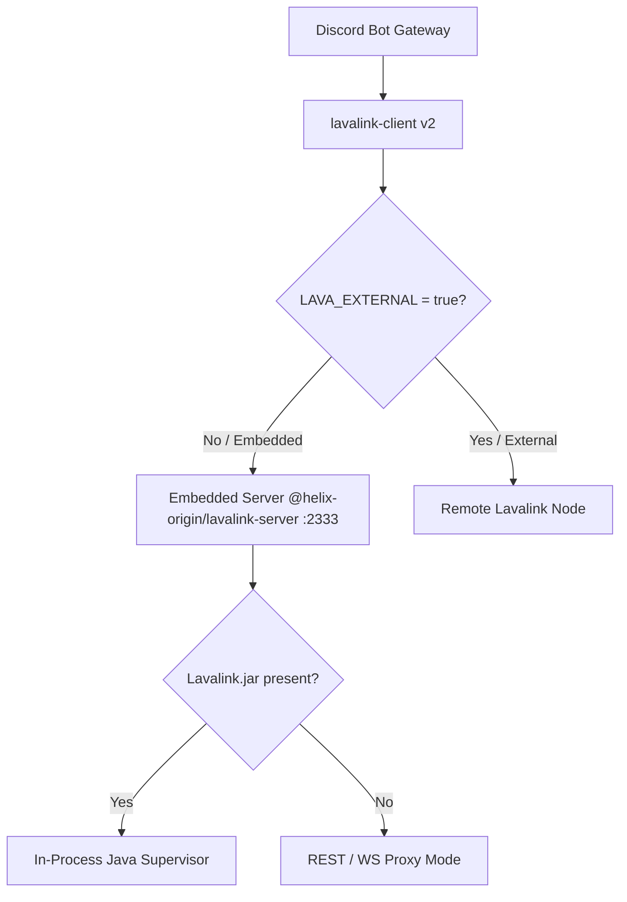

# 🎵 Skill: Embedded Lavalink (`embedded-lavalink`)

## Purpose
Manage, inspect, and configure the embedded Lavalink v4 audio server powered by `@helix-origin/lavalink-server`.

---

## 🏛️ Audio Gateway Architecture

---

## Configuration Reference

| Variable | Default | Purpose |
| :--- | :--- | :--- |
| `LAVA_EXTERNAL` | `false` | When `true`, disables embedded server and connects to remote node |
| `LAVA_HOST` | `127.0.0.1` | Audio gateway host binding |
| `LAVA_PORT` | `2333` | Audio gateway port binding |
| `LAVA_PASS` | `youshallnotpass` | Lavalink authorization secret |
| `LAVA_JAR_AUTO_DOWNLOAD` | `false` | When `true`, automatically downloads official Lavalink v4 JAR if missing |
| `LAVA_ENABLED` | `true` | Master audio engine toggle |

---

## Troubleshooting

- **JVM Missing / No Java**: If Java is not installed, the embedded server operates in proxy mode or logs a clear fallback notice while allowing the bot to continue running all non-audio commands.
- **Cloud Containers (< 512 MB)**: Set `LAVA_EXTERNAL=true` and point `LAVA_HOST` to a dedicated external instance (such as [`HELIX-Origin/Lavalink-Server`](https://github.com/HELIX-Origin/Lavalink-Server)) to eliminate JVM memory footprint.
