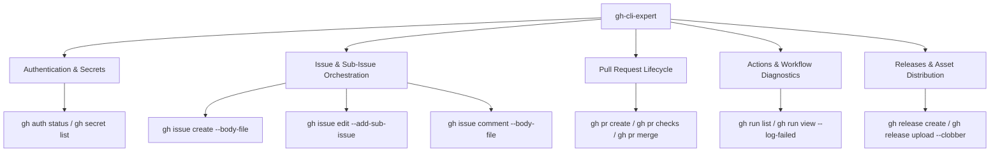

# 🐙 Skill: GitHub CLI Expert (`gh-cli-expert`)

## Purpose
Equip autonomous AI agents with complete, production-ready operational knowledge for interacting with GitHub repositories, issues, sub-issues, pull requests, actions, workflows, and releases using the GitHub CLI (`gh`).

---

## 🏛️ Capabilities Architecture



---

## 🛠️ Command Reference

### 1. Authentication & Scopes
```bash
# Check current authentication status, username, and token scopes
gh auth status

# Verify repository secrets
gh secret list -R <owner>/<repo>
```

### 2. Issue Management & Proper Sub-Issues
```bash
# View open issues
gh issue list -R <owner>/<repo> --state open

# View full issue body and metadata
gh issue view <issue-number> -R <owner>/<repo>

# Create parent issue using a markdown file
gh issue create \
  -R <owner>/<repo> \
  --title "✨ Feature(scope): Title" \
  --body-file /path/to/issue-body.md

# Create a dedicated child sub-issue
gh issue create \
  -R <owner>/<repo> \
  --title "🧩 Sub-Issue(#<parent>): Discrete task title" \
  --body-file /path/to/subissue-body.md

# Link the child sub-issue to the parent issue
gh issue edit <parent-number> -R <owner>/<repo> --add-sub-issue <child-number>

# Post a formatted comment with emojis and Mermaid diagram
gh issue comment <issue-number> -R <owner>/<repo> --body-file /path/to/comment.md

# Close issue upon completion
gh issue close <issue-number> -R <owner>/<repo> --reason completed
```

### 3. Pull Request Management
```bash
# Create a pull request referencing an issue
gh pr create \
  -R <owner>/<repo> \
  --title "✨ feat(scope): Description" \
  --body "Resolves #<issue-number>. Detailed explanation of changes." \
  --base main

# Check CI status on open PRs
gh pr checks <pr-number> -R <owner>/<repo>

# View PR diff
gh pr diff <pr-number> -R <owner>/<repo>
```

### 4. CI/CD Workflow Diagnostics
```bash
# List recent workflow runs
gh run list -R <owner>/<repo> --limit 10

# Immediately isolate failed steps without downloading huge logs
gh run view <run-id> -R <owner>/<repo> --log-failed

# Watch active workflow in real time
gh run watch <run-id> -R <owner>/<repo>
```

### 5. Releases & Tarball Artifacts
```bash
# List existing releases
gh release list -R <owner>/<repo>

# Create release with notes and uploaded asset
gh release create <tag> <asset-file.tgz> \
  -R <owner>/<repo> \
  --title "Release <tag>" \
  --notes-file /path/to/release-notes.md

# Upload or update asset idempotently
gh release upload <tag> <asset-file.tgz> -R <owner>/<repo> --clobber
```

---

## 🤖 Agent Execution Rules

1. **Always Use `--body-file` and `--notes-file`**:
   Never inline complex multi-line markdown strings containing quotes, backticks, or emojis directly into CLI shell arguments. Write the content to a file and supply the file path.

2. **Always Link Sub-Issues**:
   When breaking down epics, always create dedicated child issues and execute `gh issue edit <parent> --add-sub-issue <child>` to preserve GitHub's native task hierarchy.
