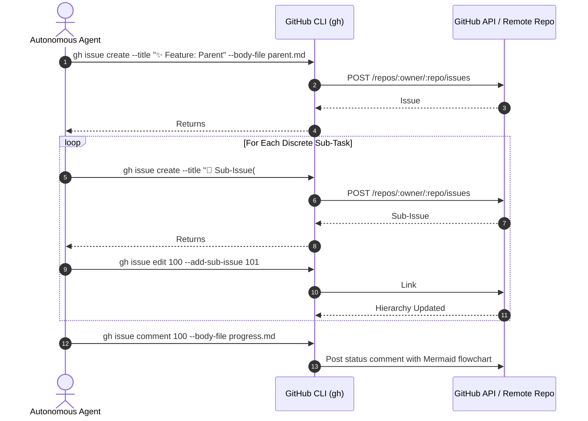

# 📋 Skill: Issue Orchestrator (`issue-orchestrator`)

## Purpose
Guide autonomous AI agents in crafting and maintaining high-quality GitHub issues, writing rich human-readable status comments with emojis, generating structural Mermaid diagrams, and orchestrating hierarchical sub-issues using the GitHub CLI.

---

## 🏛️ Sub-Issue Orchestration Workflow



---

## 🛠️ Step-by-Step Instructions for Agents

### Step 1: Draft Parent Issue
- Select an approved semantic emoji (`✨`, `🐛`, `🗺️`, `⚡️`, `♻️`).
- Follow the sections defined in `.agents/rules/issue-standards.md`.
- Generate at least one Mermaid diagram visualizing the system architecture, flow, or sequence.
- Write the draft to a local markdown file.

### Step 2: Create Parent Issue
```bash
gh issue create \
  -R <owner>/<repo> \
  --title "✨ Feature(scope): Title" \
  --body-file /path/to/parent.md
```

### Step 3: Create & Link Child Sub-Issues
Break the implementation down into atomic, testable sub-tasks:
```bash
# 1. Create sub-issue
gh issue create \
  -R <owner>/<repo> \
  --title "🧩 Sub-Issue(#<parent>): Discrete task description" \
  --body "Part of #<parent>. Implements <specific details>."

# 2. Link to parent
gh issue edit <parent> -R <owner>/<repo> --add-sub-issue <child>
```

### Step 4: Post Human-Readable Comments with Emojis
When providing milestones, debugging logs, or completion notices:
- Lead with an emoji (`📢`, `🔍`, `🚀`, `✅`).
- Include summary metrics, code references, and a Mermaid state/lifecycle diagram.
- Use `--body-file` for formatting fidelity.
