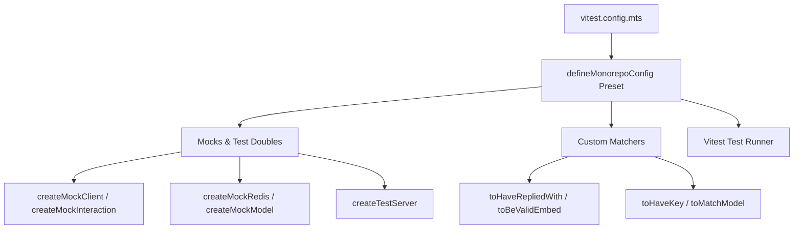

# 🧪 Skill: Vitest Suite Expert (`vitest-suite-expert`)

## Purpose
Author, execute, and troubleshoot unit and integration tests across the Master-Bot monorepo using `@helix-origin/vitest-suite`.

---

## 🏛️ Testing Architecture



---

## 🛠️ Test Authoring Examples

### Testing Discord Interactions:
```typescript
import { describe, it, expect } from 'vitest';
import { createMockClient, createMockInteraction } from '@helix-origin/vitest-suite/discord';

describe('Discord Command Tests', () => {
  it('should handle ping command', async () => {
    const client = createMockClient();
    const interaction = createMockInteraction({ commandName: 'ping' });
    expect(interaction).toBeDefined();
  });
});
```

### Testing Storage & Redis:
```typescript
import { describe, it, expect } from 'vitest';
import { createMockRedis } from '@helix-origin/vitest-suite/storage';

describe('Redis Cache Test', () => {
  it('should write and read cache keys', async () => {
    const redis = createMockRedis();
    await redis.set('key', 'value');
    expect(await redis.get('key')).toBe('value');
  });
});
```
