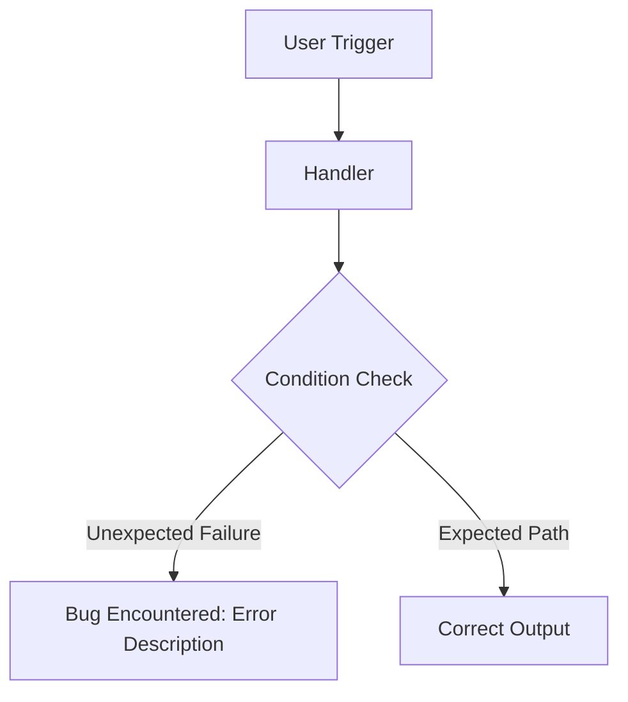

# 🐛 Bug(<scope>): <Brief Description of Defect>

> [!NOTE]
> Context, environment, or PR links.

## 📖 Summary
Clear, human-readable summary of the defect observed.

## 🎯 Motivation & Expected vs Actual
- **Expected Behavior**: What should happen under normal conditions.
- **Actual Behavior**: What currently happens instead.

## 📐 Failure Flow (Mermaid Diagram)

## 🧩 Sub-Issues & Tasks (Proper GitHub Sub-Issues)
<!-- Create individual issues via gh issue create and link via gh issue edit --add-sub-issue -->
- [ ] #000 - Isolate root cause and add regression test
- [ ] #000 - Apply fix and verify in test suite
- [ ] #000 - Update documentation if applicable

## 🔍 Acceptance Criteria
- [ ] Bug is resolved and confirmed via automated test
- [ ] `pnpm lint`, `pnpm type-check`, and `pnpm test` pass with 0 errors

## 🛠️ Reproduction Steps
1. Execute command: `...`
2. Provide input: `...`
3. Observe stack trace or error.
