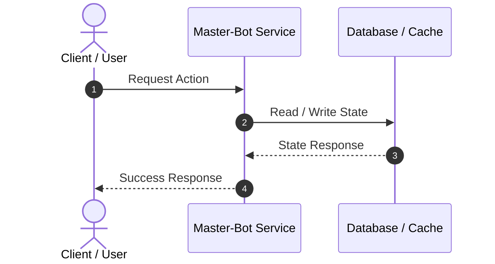

# ✨ Feature(<scope>): <Brief Description of Capability>

> [!NOTE]
> Associated roadmap issue or pull request.

## 📖 Summary
Clear, human-readable overview of the new capability or refactor.

## 🎯 Motivation & Value
Why is this feature needed? How does it benefit users, server admins, or developers?

## 📐 Architecture / Sequence (Mermaid Diagram)

## 🧩 Sub-Issues & Tasks (Proper GitHub Sub-Issues)
<!-- Create individual issues via gh issue create and link via gh issue edit --add-sub-issue -->
- [ ] #000 - Core logic implementation
- [ ] #000 - Unit and integration tests
- [ ] #000 - Wiki documentation update

## 🔍 Acceptance Criteria
- [ ] Feature fully implemented according to specifications
- [ ] Both production and fallback modes verified
- [ ] All CI quality gates pass with 0 errors
