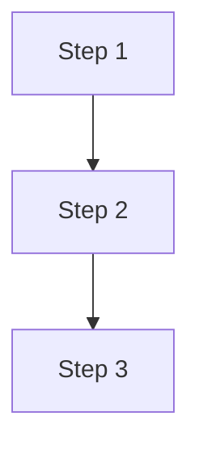

# <emoji> <Page Title>

Brief description of the document topic and audience.

---

## 📑 Table of Contents
1. [Overview](#-overview)
2. [Architecture & Flow](#-architecture--flow)
3. [Configuration & Usage](#-configuration--usage)
4. [Troubleshooting](#-troubleshooting)
5. [Related Guides](#-related-guides)

---

## 📖 Overview
Human-readable narrative explanation using callouts and bulleted lists.

> [!NOTE]
> Important operational notices or best practices.

---

## 📐 Architecture & Flow


---

## 💻 Configuration & Usage
```bash
# Example commands
pnpm start
```

```typescript
// Example TypeScript usage
export const config = {
  active: true
};
```

---

## 🔍 Troubleshooting
- **Symptom**: Explanation of cause and quick fix.

---

## 🔗 Related Guides
- [Home](Home) — Wiki Index
- [Architecture](Architecture) — System Architecture
- [Deployment](Deployment) — Production Deployment
