# 🤖 Master-Bot Autonomous Agent Ecosystem

## Overview
This document serves as the master operating manual and index for the autonomous AI agent ecosystem in **Master-Bot**. It coordinates the roles, skills, rules, and templates defined in the [`.agents/`](.agents/) directory.

---

## 🏛️ Multi-Agent Operating Topology

```mermaid
flowchart TD
    subgraph CoreAgents [Autonomous Agent Roles]
        Architect[🏛️ System Architect: architect.md]
        DBEng[🗄️ Database Engineer: database-engineer.md]
        AudioEng[🎵 Audio Engineer: audio-engineer.md]
        TestEng[🧪 Test Engineer: test-engineer.md]
        GHSpy[🐙 GitHub Specialist: github-specialist.md]
        WikiSpy[📚 Wiki Specialist: wiki-specialist.md]
        DashSpy[💻 Dashboard Specialist: dashboard-specialist.md]
        BotSpy[🤖 Bot Specialist: bot-specialist.md]
        RelEng[📦 Release Engineer: release-engineer.md]
    end

    subgraph CoreSkills [Agent Capabilities]
        GHExpert[🐙 gh-cli-expert.md]
        IssueOrch[📋 issue-orchestrator.md]
        WikiMgmt[📚 wiki-management.md]
        DBFallback[🗄️ database-fallback.md]
        LavaEmbed[🎵 embedded-lavalink.md]
        VitestExp[🧪 vitest-suite-expert.md]
        TurboOrch[🏗️ monorepo-orchestrator.md]
        RelOrch[🚀 release-orchestrator.md]
    end

    subgraph Governance [Rules & Quality Gates]
        RuleMaster[📜 rules.md]
        RuleCommit[📝 commit-standards.md]
        RuleIssue[📋 issue-standards.md]
        RuleWiki[📚 wiki-standards.md]
        RuleCode[💻 code-conventions.md]
        RuleDB[🗄️ database-fallback-rules.md]
        RuleOps[⚙️ operational.md]
    end

    subgraph Templates [Standardized Templates]
        TCommit[📝 commit-template.md]
        TIssueBug[🐛 issue-bug.md]
        TIssueFeat[✨ issue-feature.md]
        TIssueSub[🧩 issue-subissue.md]
        TTestSpec[🧪 test-spec.md]
        TWikiPage[📚 wiki-page.md]
    end

    Governance --> CoreAgents
    CoreAgents --> CoreSkills
    CoreSkills --> Templates
```

---

## 🤖 Agents Directory ([`.agents/agents/`](.agents/agents/))

| Agent | Responsibility | Primary Skills |
| :--- | :--- | :--- |
| [**`architect`**](.agents/agents/architect.md) | High-level system architecture, boundaries, zero-ops invariants | `monorepo-orchestrator`, `database-fallback` |
| [**`database-engineer`**](.agents/agents/database-engineer.md) | PostgreSQL/SQLite schemas, Prisma ORM, Redis & in-memory cache | `database-fallback`, `vitest-suite-expert` |
| [**`audio-engineer`**](.agents/agents/audio-engineer.md) | Embedded Lavalink v4 server, YouTube OAuth, voice gateway | `embedded-lavalink`, `vitest-suite-expert` |
| [**`test-engineer`**](.agents/agents/test-engineer.md) | Test authoring, mocks (`@helix-origin/vitest-suite`), QA gates | `vitest-suite-expert`, `monorepo-orchestrator` |
| [**`github-specialist`**](.agents/agents/github-specialist.md) | GitHub CLI (`gh`), issue hierarchies, PR reviews, workflow runs | `gh-cli-expert`, `issue-orchestrator` |
| [**`wiki-specialist`**](.agents/agents/wiki-specialist.md) | Wiki structure, GitHub wiki links, Mermaid diagrams, sidebar & footer | `wiki-management`, `issue-orchestrator` |
| [**`dashboard-specialist`**](.agents/agents/dashboard-specialist.md) | Next.js 15 App Router, React 18, Tailwind CSS, tRPC v11 API | `monorepo-orchestrator`, `vitest-suite-expert` |
| [**`bot-specialist`**](.agents/agents/bot-specialist.md) | Discord.js v14, Sapphire framework, slash commands, session manager | `vitest-suite-expert`, `monorepo-orchestrator` |
| [**`release-engineer`**](.agents/agents/release-engineer.md) | Versioning, packaging, changelogs, GitHub releases | `release-orchestrator`, `gh-cli-expert` |

---

## 🛠️ Skills Directory ([`.agents/skills/`](.agents/skills/))

| Skill | Description | Key Commands |
| :--- | :--- | :--- |
| [**`gh-cli-expert`**](.agents/skills/gh-cli-expert.md) | Complete guide for GitHub CLI automation (auth, issues, sub-issues, PRs, runs, releases) | `gh issue create`, `gh issue edit --add-sub-issue`, `gh run view --log-failed` |
| [**`issue-orchestrator`**](.agents/skills/issue-orchestrator.md) | Structured issue drafting with emojis, Mermaid diagrams, and atomic child sub-issues | `gh issue comment --body-file` |
| [**`wiki-management`**](.agents/skills/wiki-management.md) | GitHub Wiki standards, relative wiki links, sidebar hierarchy, and navigation footers | Markdown relative linking, Mermaid diagram styling |
| [**`database-fallback`**](.agents/skills/database-fallback.md) | Dual database (PostgreSQL/SQLite) and cache (Redis/ioredis-mock) management | `node packages/db/scripts/prepare-schema.mjs` |
| [**`embedded-lavalink`**](.agents/skills/embedded-lavalink.md) | Embedded Lavalink audio server via `@helix-origin/lavalink-server` and external node routing | `LAVA_EXTERNAL=false`, `startServer()` |
| [**`vitest-suite-expert`**](.agents/skills/vitest-suite-expert.md) | Monorepo testing using `@helix-origin/vitest-suite` mocks and presets | `defineMonorepoConfig`, `createMockRedis`, `createMockClient` |
| [**`monorepo-orchestrator`**](.agents/skills/monorepo-orchestrator.md) | Turborepo and pnpm workspace build and lint pipeline management | `pnpm lint`, `pnpm type-check`, `pnpm build` |
| [**`release-orchestrator`**](.agents/skills/release-orchestrator.md) | Release tagging, changelog generation, tarball packaging | `pnpm build`, `gh release create` |

---

## 📜 Rules Directory ([`.agents/rules/`](.agents/rules/))

- [**`rules/commit-standards.md`**](.agents/rules/commit-standards.md): Detailed, human-readable commit messages with emojis, imperative mood, and scoped summaries.
- [**`rules/issue-standards.md`**](.agents/rules/issue-standards.md): Human-readable issue layouts with emojis, Mermaid diagrams, and dedicated GitHub sub-issues.
- [**`rules/wiki-standards.md`**](.agents/rules/wiki-standards.md): GitHub wiki link formatting, syntax-highlighted codeblocks, Mermaid visuals, and sidebar/footer pages.
- [**`rules/code-conventions.md`**](.agents/rules/code-conventions.md): TypeScript standards, workspace boundaries, and dependency isolation.
- [**`rules/database-fallback-rules.md`**](.agents/rules/database-fallback-rules.md): Zero-ops SQLite and `ioredis-mock` fallbacks with production PostgreSQL/Redis scaling.
- [**`rules/operational.md`**](.agents/rules/operational.md): Monorepo lifecycle commands, safety gates, and data loss prevention.

---

## 📋 Templates Directory ([`.agents/templates/`](.agents/templates/))

- [**`templates/commit-template.md`**](.agents/templates/commit-template.md): Commit message template with approved emoji palette.
- [**`templates/issue-bug.md`**](.agents/templates/issue-bug.md): Defect report template with Mermaid failure flow and sub-issue links.
- [**`templates/issue-feature.md`**](.agents/templates/issue-feature.md): Feature request template with Mermaid sequence diagrams.
- [**`templates/issue-subissue.md`**](.agents/templates/issue-subissue.md): Atomic child sub-issue template.
- [**`templates/test-spec.md`**](.agents/templates/test-spec.md): Vitest test specification using `@helix-origin/vitest-suite`.
- [**`templates/wiki-page.md`**](.agents/templates/wiki-page.md): Standardized wiki page template with navigation and Mermaid diagrams.
