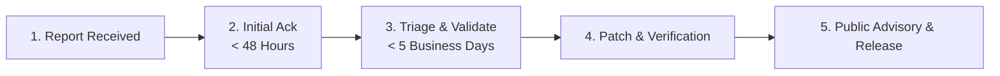

# 🔒 Security Policy for Master-Bot

**Last Updated:** September 16, 2026

The **Master-Bot** team takes the security of our application, self-hosters, server communities, and dependencies seriously. This document outlines our vulnerability disclosure process, supported versions, and operational security recommendations for deploying Master-Bot in production.

---

## 🛡️ Supported Versions

We maintain security updates and patches aligned with the Master-Bot project:

| Version | Supported | Status | Notes |
| :--- | :---: | :--- | :--- |
| **Main Monorepo** | ✅ Yes | **Active** | Next.js 15, discord.js v14, Lavalink v4, dual SQLite/PG. |
| **Legacy Multi-Process** | ❌ No | **End of Life (EOL)** | Older historical layouts prior to unified monorepo modernization. |

> [!NOTE]
> This fork exists for the purpose of fixing issues, adding improvements, and submitting pull requests back to the upstream repository ([galnir/Master-Bot](https://github.com/galnir/Master-Bot)). Security patches developed here are contributed upstream to benefit the entire community.

---

## 🚨 Reporting a Vulnerability

If you discover a security vulnerability, privilege escalation flaw, authentication bypass, or data leak within Master-Bot, **please do not open a public GitHub issue**. Publicly disclosing flaws puts other self-hosters and live Discord servers at risk.

### 📝 How to Report Privately:
1. **GitHub Private Vulnerability Advisory (Recommended)**:
   - Navigate to the repository's [Security Advisories](https://github.com/galnir/Master-Bot/security/advisories) tab.
   - Click **"Report a vulnerability"** to open a confidential discussion directly with repository maintainers.
2. **Direct Contact**:
   - If the advisory tool is unavailable, contact the repository maintainers via private channels on [GitHub](https://github.com/galnir/Master-Bot).

### 📋 What to Include in Your Report:
To help us triage and resolve the issue quickly, please provide:
- **Type of Vulnerability**: (e.g., Cross-Site Scripting [XSS], SQL/Prisma injection, Server-Side Request Forgery [SSRF], Authentication bypass, Remote Code Execution [RCE]).
- **Affected Components**: Packages, files, or slash commands affected (e.g., `apps/dashboard`, `apps/bot`, `@master-bot/db`, `tRPC router`).
- **Steps to Reproduce**: Detailed, step-by-step instructions or proof-of-concept (PoC) code.
- **Potential Impact**: How an attacker could exploit the vulnerability and what assets or data could be compromised.
- **Remediation Suggestions**: Any proposed code fixes, input sanitization, or dependency upgrades (if known).

---

## ⏱️ Response & Disclosure Timeline

We adhere to coordinated vulnerability disclosure principles:



1. **Acknowledgment**: We will acknowledge receipt of your report within **48 hours**.
2. **Assessment & Confirmation**: We will investigate and confirm whether the issue is reproducible within **5 business days**.
3. **Patch Development**: We will prepare a fix in a private security branch and verify the resolution across all test suites.
4. **Coordinated Release**: A patched release tag will be deployed along with a public GitHub Security Advisory acknowledging the researcher (unless anonymity is requested).

---

## 🔐 Operational Security Guidelines for Operators

If you are self-hosting Master-Bot on a VPS or cloud instance, implement the following baseline security protections:

### 1. 🔑 Credentials & Secrets Management
- **Never Commit Secrets**: Ensure `.env`, `.youtube-oauth.json`, and database files are listed in your `.gitignore` and never committed to source control.
- **Discord Bot Token**: Treat `DISCORD_TOKEN` as a root credential. Never share it or display it in console logs. If compromised, regenerate it immediately in the [Discord Developer Portal](https://discord.com/developers/applications).
- **NextAuth Secret**: Generate a cryptographically secure random 32+ character secret for `NEXTAUTH_SECRET`:
  ```bash
  openssl rand -base64 32
  ```

### 2. 🎵 Lavalink Audio Gateway Security
- **Change Default Password**: Never deploy Lavalink in production with the default password (`youshallnotpass`). Set a complex, high-entropy password in `LAVA_PASS`.
- **Port Isolation**: Restrict external access to port `2333` using a firewall (`ufw` or cloud security groups) so that only your bot process can reach the Lavalink audio gateway.

### 3. 🌐 Web Dashboard & SSL / HTTPS
- **Always Enforce HTTPS**: Never run the web dashboard over plaintext HTTP in production. Terminate TLS with a reverse proxy like **Caddy** or **Nginx** with automated Let's Encrypt certificates.
- **OAuth Callback Whitelist**: In the Discord Developer Portal, strictly restrict `Redirect URIs` to your exact canonical domain (`https://your-domain.com/api/auth/callback/discord`).

### 4. 🗄️ Database & File Permissions
- **SQLite Database**: Restrict filesystem permissions for `/data/database.db` so that only the service user running Node.js has read/write access:
  ```bash
  chmod 600 /data/database.db
  ```
- **External PostgreSQL / Redis**: If using external instances, enforce SSL/TLS encryption (`sslmode=require` or `rediss://`) and avoid using default superuser accounts.

---

## 🔍 In-Scope vs. Out-of-Scope

### In-Scope:
- Authentication or authorization bypass in the Next.js dashboard or tRPC API.
- Privilege escalation allowing standard Discord members to run restricted slash commands.
- SQL or ORM injection vectors in Prisma queries.
- Remote Code Execution (RCE) via command inputs, media scrapers, or file handlers.
- Information disclosure exposing server tokens, configuration secrets, or audit logs.

### Out-of-Scope:
- Volumetric Denial of Service (DDoS) against Discord's infrastructure or the hosting provider.
- Social engineering, phishing, or physical attacks against maintainers or host servers.
- Issues related to third-party outages (Discord API downtime, YouTube scraping blocks).
- Vulnerabilities requiring root access to the operator's host machine.

---

## 🏆 Hall of Fame

We believe in recognizing security researchers who help keep Master-Bot and its server communities safe. Responsible disclosures will be publicly credited in our release notes and Security Advisories.
