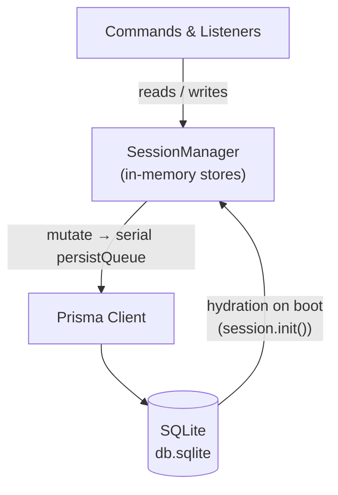
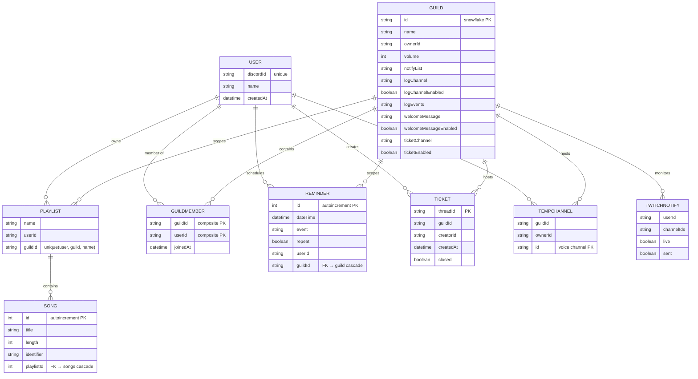
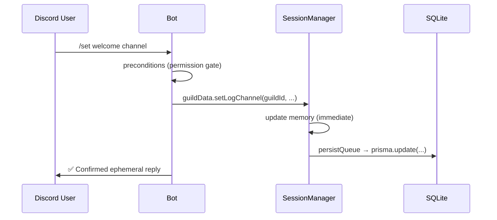

# 🏗️ Architecture

Master-Bot is a **pnpm/Turbo monorepo**. Shared packages and two applications live under `apps/` and `packages/`.

## 📁 Project Structure

```txt
Master-Bot/
├── apps/
│   ├── bot/                       # Discord bot (Sapphire Framework)
│   │   └── src/
│   │       ├── index.ts           # boot: session.init() → client.login()
│   │       ├── commands/          # slash commands (music, moderation, other, gifs, twitch)
│   │       ├── listeners/         # guild, interaction, music, tempchannels events
│   │       └── lib/
│   │           ├── session/       # SessionManager (runtime state hub)
│   │           ├── music/         # Queue, QueueStore, TriviaSession, embeds, YouTube OAuth
│   │           ├── twitch/        # Twitch API client & notify orchestrator
│   │           ├── reminders/     # ReminderManager scheduler
│   │           ├── presence/      # StatusManager rotating presences
│   │           ├── structures/    # ExtendedClient, CommandHelp, HelpRegistry
│   │           └── games/ / gifs/ # mini-games & GIF search
│   └── dashboard/                 # Next.js 15 management dashboard
├── packages/
│   ├── db/                        # Prisma schema, client generation, SQLite
│   ├── auth/                      # NextAuth v5 (Discord OAuth + Prisma adapter)
│   └── config/                    # shared ESLint & Tailwind presets
├── scripts/                       # unified dev/start launchers (common.mjs)
├── packages/db/prisma/       # Prisma schema + db.sqlite (auto-created)
├── application.yml(.example)      # Lavalink v4 server config
├── docker.env / Dockerfile        # container deployment
└── .env.example                   # environment template
```

## 📦 Package Responsibilities

| Package | Stack | Role |
| --- | --- | --- |
| `apps/bot` | Sapphire Framework 4.x, discord.js v14 | Slash commands, listeners, audio engine, schedulers. |
| `apps/dashboard` | Next.js 15, tRPC v11, React Query, Tailwind | Web management for server studios. |
| `packages/db` | Prisma ORM (SQLite) | Declares the schema; exports the typed `PrismaClient`. |
| `packages/auth` | NextAuth v5 (beta), `@auth/prisma-adapter` | Discord OAuth; augments `Session` with `user.id` + `user.discordId`; upserts users by Discord ID. |
| `packages/config` | ESLint, Tailwind | Shared lint/design presets consumed by workspaces. |

## 🧠 Session Layer: How State Is Stored

The bot does **not** hit the database on every command. All runtime state lives in an in-memory **`SessionManager`** (`apps/bot/src/lib/session/SessionManager.ts`), which acts as a typed read/write hub:



- **Hydration:** `session.init()` loads every store from SQLite **before** `client.login()`, so all data is present at first connection.
- **Writes:** mutating a store updates memory synchronously and queues the database write through a serial `persistQueue`, preserving foreign-key ordering (`User → Guild → GuildMember → …`).
- **Resilience:** a failed write is logged; the in-memory state still works. Persistence is fire-and-forget, never blocking a command.

### Public Stores

| Store | Type | Contents |
| --- | --- | --- |
| `users` | `Map` | Bot users, keyed by Discord ID, tracking `dbId`. |
| `guildData` | `Map` | Per-guild settings (volume, logs, welcome, tickets, twitch…). |
| `members` | `Map` | Per-guild member rows (created on join, removed on leave). |
| `welcomeMessages` / `tickets` / `hubChannels` | `Map` | Server-level feature state. |
| `playlists` / `songs` | `Map` | Custom playlists (per guild+user) and their tracks. |
| `twitchConfig` | `Map` | Streamer subscriptions + notification settings. |
| `reminders` | `Map` | Scheduled reminders with repeat rules. |
| `commands` | `Map` | Slash command usage/registry info. |

## 🗄️ Database (SQLite + Prisma)

The schema lives in `packages/db/prisma/schema.prisma`. SQLite offers zero-ops persistence and easy backups (copy `db.sqlite`). Run migrations with `pnpm db:push`; explore data with `pnpm db:studio`.



**Key design decisions**

- **Per-guild scoping:** playlists are unique per `(userId, guildId, name)`; reminders belong to a guild via the `ReminderGuild` relation. Two servers can have the same playlist name or reminder without collisions.
- **Member lifecycle:** when a user joins a guild, a `GuildMember` row is created; when they leave, the bot cascades-deletes their tickets, temp channels, playlists + songs, reminders, and Twitch subscriptions for that guild (see `clearUserGuildData`).
- **Cascade integrity:** `Song→Playlist`, `Playlist→Guild/User`, `Reminder→Guild`, `Ticket/TempChannel/GuildMember→Guild` all use `onDelete: Cascade`, keeping SQLite consistent under `persistQueue`.

## 🔀 Data Flow Behind a Command



## 🌐 Bootstrap Sequence

1. `session.init()` hydrates all stores from SQLite.
2. `client.login()` connects to Discord; commands are registered.
3. Feature flags from `.env` enable/disable modules (Lavalink, GIFs, Twitch, News, IGDB).
4. Background schedulers start: reminders (`ReminderManager`, 30s tick), Twitch monitor, status rotation (`StatusManager`).

---

See [**Database nuances**](Architecture.md#database-sqlite--prisma), [**Web Dashboard**](Dashboard.md), and [**Deployment**](Deployment.md) for the rest of the picture.