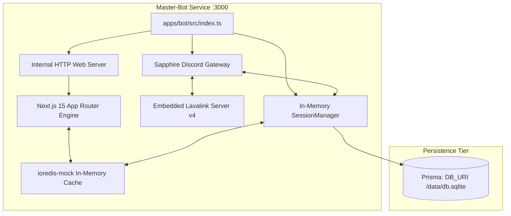
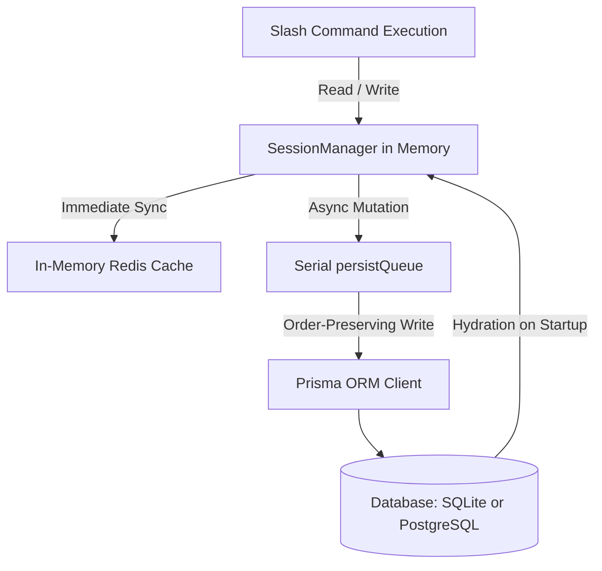
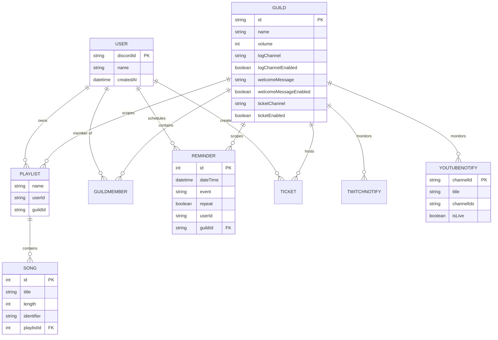
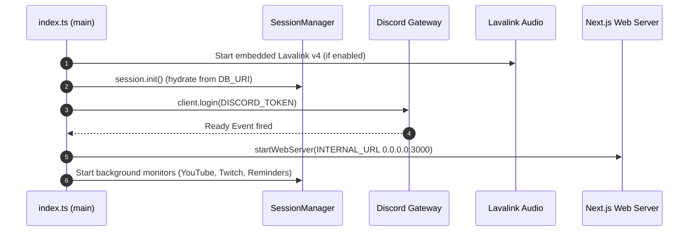

# 🏗️ Architecture & System Topology

Master-Bot is engineered as a unified **Turborepo** monorepo running both the **Discord Bot Gateway** and the **Next.js Web Dashboard** inside a single Node.js process, supported by a dual-database persistence tier (`DB_URI`) and an in-memory/external caching layer.

---

## 📑 Table of Contents
1. [Monorepo Workspace Structure](#-monorepo-workspace-structure)
2. [Package Responsibilities](#-package-responsibilities)
3. [Single-Process Unified Runtime](#-single-process-unified-runtime)
4. [Session Layer & State Management](#-session-layer--state-management)
5. [🗄️ Database Tier (`DB_URI`) & Schema](#️-database-tier-db_uri--schema)
6. [Command & Submodule Architecture](#-command--submodule-architecture)
7. [Bootstrap & Lifecycle Sequence](#-bootstrap--lifecycle-sequence)
8. [Related Guides](#-related-guides)

---

## 📁 Monorepo Workspace Structure

```text
Master-Bot/
├── apps/
│   ├── bot/                       # Discord bot application (Sapphire Framework & discord.js v14)
│   │   └── src/
│   │       ├── index.ts           # Unified process boot: session → login → web server
│   │       ├── commands/          # Slash commands categorized (fun, moderation, music, other)
│   │       ├── listeners/         # Gateway event listeners (guild, interaction, music, tickets)
│   │       └── lib/
│   │           ├── embeds/        # Standardized rich embed factory
│   │           ├── gifs/          # Consolidated /gif option handlers & tag registry
│   │           ├── set/           # Consolidated /set option handlers & settings registry
│   │           ├── lavalink/      # Embedded Lavalink v4 integration (@helix-origin/lavalink-server)
│   │           ├── music/         # Audio queue management, filters, and playlists
│   │           ├── youtube/       # YouTube OAuth, RSS parser, and stream monitor
│   │           ├── twitch/        # Twitch API client and stream monitor
│   │           ├── reminders/     # ReminderManager background scheduler
│   │           ├── server/        # Internal HTTP web server & health pinger
│   │           └── session/       # SessionManager, SessionStore, and state handlers
│   └── dashboard/                 # Next.js 15 App Router & tRPC v11 web dashboard
├── packages/
│   ├── auth/                      # NextAuth.js v5 with Discord OAuth provider & Prisma adapter
│   ├── config/                    # Shared ESLint and Tailwind presets
│   └── db/                        # Shared Prisma ORM client & ioredis-mock cache fallback
├── tests/unit/                    # Comprehensive Vitest test suite (@helix-origin/vitest-suite)
├── application.yml.example        # Lavalink v4 configuration blueprint
├── Dockerfile & docker.env        # Containerized production blueprint
└── .env.example                   # Master environment variable template
```

---

## 📦 Package Responsibilities

| Package | Technology Stack | Responsibility |
| :--- | :--- | :--- |
| `apps/bot` | Sapphire 4.x, discord.js v14 | Discord gateway, slash commands, audio routing, background monitors. |
| `apps/dashboard` | Next.js 15, React 18, Tailwind, tRPC v11 | Responsive web management studios for server configuration. |
| `packages/db` | Prisma ORM 5.x | Database connection, schema compilation, and client distribution. |
| `packages/auth` | NextAuth.js, Discord OAuth | Secure web session tokens and user identity linking. |
| `packages/config` | ESLint, TypeScript, Tailwind | Unified monorepo linting, typing, and style configurations. |

---

## ⚡ Single-Process Unified Runtime

Master-Bot avoids fragile multi-process architectures by hosting both the Discord bot and the Next.js web application inside one single Node.js process:



---

## 🧠 Session Layer & State Management

The bot does **not** execute blocking database queries during command execution. All live server configurations and active states reside in memory within the **`SessionManager`**:



- **Hydration at Boot**: When `session.init()` runs during startup, all server settings, custom playlists, reminder schedules, and stream alert configurations are loaded into memory.
- **Asynchronous Persistence**: Database writes are placed onto a FIFO `persistQueue` that enforces relational integrity (`User → Guild → GuildMember`) without delaying Discord interaction responses.

---

## 🗄️ Database Tier (`DB_URI`) & Schema

Master-Bot features zero-ops database auto-configuration via `DB_URI`:
- **SQLite (Default)**: Automatically prepares `packages/db/prisma/schema.prisma` with `provider = "sqlite"` and `file:/data/db.sqlite`. Creates the directory on boot.
- **PostgreSQL**: When `DB_URI` begins with `postgresql://`, the prepare script sets `provider = "postgresql"` and prepares Prisma for external clustering.



---

## 🧩 Command & Submodule Architecture

Commands avoid bloated monolith files by adopting the **Modular Option Submodules** pattern:
- **Consolidated Slash Commands**: Single command registration with options (`/gif [tag]`, `/set [option]`) keeps the bot well within Discord's 100 application command ceiling.
- **Submodules in `lib/`**: Individual options are isolated into discrete TypeScript files under `src/lib/<feature>/options/`, managed through a typed `registry.ts`.
- **Themed Embeds**: Rich messages are generated through factory functions in `src/lib/embeds/` ensuring visual consistency.

---

## 🚀 Bootstrap & Lifecycle Sequence



---

## 🔗 Related Guides
- [Home](Home) — Return to wiki main page
- [Developer Guide](Development-Guide) — How to add new commands and listeners
- [Configuration](Configuration) — Master `.env` reference
- [Deployment](Deployment) — Production self-hosting and container deployment

---
[Home](Home) • [Documentation Index](Home) • [GitHub Repository](https://github.com/galnir/Master-Bot)