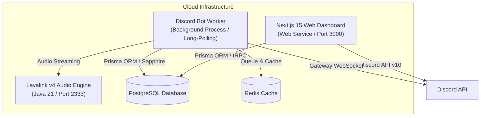

# Cloud Hosting & Deployment Guide

This guide details how to deploy **Master-Bot** and its **Next.js 15 Web Dashboard** across modern cloud hosting providers, including **Render**, **Railway**, **Fly.io**, **Heroku**, and **Self-Hosted VPS (Docker Compose)**.

---

## 🏗️ Deployment Architecture

Master-Bot consists of two deployable application services and three backing infrastructure services:



---

## 1. 🚀 Deploying on Render (render.com)

Render allows running the Web Dashboard as a **Web Service** and the Discord Bot as a **Background Worker**.

### A. Managed Database & Redis Setup

1. Create a **PostgreSQL** database on Render (copy `Internal Database URL`).
2. Create a **Redis** instance on Render (copy `Internal Redis URL` and port).

### B. Deploy Discord Bot (Background Worker)

1. In Render Dashboard, click **New +** -> **Background Worker**.
2. Connect your GitHub repository fork.
3. Configure settings:
   - **Environment**: `Node`
   - **Build Command**: `pnpm install && pnpm db:generate && pnpm build`
   - **Start Command**: `pnpm --filter @master-bot/bot start` (or `node apps/bot/dist/index.js`)
4. Add Environment Variables:
   - `DISCORD_TOKEN`, `DISCORD_CLIENT_ID`, `DISCORD_CLIENT_SECRET`, `DISCORD_OWNER_ID`
   - `DATABASE_URL` (Internal PostgreSQL URL)
   - `REDIS_HOST`, `REDIS_PORT`
   - `LAVA_ENABLED` (`false` or your external Lavalink node host/password)

### C. Deploy Web Dashboard (Web Service)

1. Click **New +** -> **Web Service**.
2. Connect the same repository.
3. Configure settings:
   - **Environment**: `Node`
   - **Build Command**: `pnpm install && pnpm db:generate && pnpm build`
   - **Start Command**: `pnpm --filter @master-bot/dashboard start`
4. Add Environment Variables:
   - `NEXTAUTH_URL` (your Render `https://<service-name>.onrender.com` domain)
   - `NEXTAUTH_SECRET` (generate a random 32-character string)
   - `DISCORD_CLIENT_ID`, `DISCORD_CLIENT_SECRET`, `DISCORD_TOKEN`
   - `DATABASE_URL` (Internal PostgreSQL URL)

### D. Infrastructure as Code (`render.yaml` Blueprint)

You can deploy the complete stack using Render Blueprints:

```yaml
services:
  # Next.js 15 Web Dashboard
  - type: web
    name: master-bot-dashboard
    env: node
    plan: starter
    buildCommand: pnpm install && pnpm db:generate && pnpm build
    startCommand: pnpm --filter @master-bot/dashboard start
    envVars:
      - key: NODE_ENV
        value: production
      - key: NEXTAUTH_URL
        sync: false
      - key: NEXTAUTH_SECRET
        generateValue: true
      - key: DATABASE_URL
        fromDatabase:
          name: master-bot-db
          property: connectionString

  # Sapphire Discord Bot
  - type: worker
    name: master-bot-worker
    env: node
    plan: starter
    buildCommand: pnpm install && pnpm db:generate && pnpm build
    startCommand: pnpm --filter @master-bot/bot start
    envVars:
      - key: NODE_ENV
        value: production
      - key: DISCORD_TOKEN
        sync: false
      - key: DATABASE_URL
        fromDatabase:
          name: master-bot-db
          property: connectionString

databases:
  - name: master-bot-db
    plan: starter
```

---

## 2. 🚆 Deploying on Railway (railway.app)

1. Create a **New Project** on Railway.
2. Add **PostgreSQL** and **Redis** from Railway templates.
3. Add a new service from your GitHub repository for the **Discord Bot**:
   - Custom Start Command: `pnpm --filter @master-bot/bot start`
   - Set `DATABASE_URL` to `${{Postgres.DATABASE_URL}}`
   - Set `REDIS_HOST` to `${{Redis.REDISHOST}}` and `REDIS_PORT` to `${{Redis.REDISPORT}}`
4. Add a second service from your GitHub repository for the **Web Dashboard**:
   - Custom Start Command: `pnpm --filter @master-bot/dashboard start`
   - Generate a public domain under service settings.
   - Set `NEXTAUTH_URL` to your Railway generated domain.

---

## 3. ✈️ Deploying on Fly.io

1. Install Fly CLI: `curl -L https://fly.io/install.sh | sh`
2. Launch database: `fly postgres create --name master-bot-db`
3. Launch Redis: `fly redis create --name master-bot-redis`
4. Deploy using the multi-process Docker setup:
   ```bash
   fly launch --no-deploy
   fly secrets set DISCORD_TOKEN="your-token" NEXTAUTH_SECRET="your-secret"
   fly deploy
   ```

---

## 4. 🐳 Self-Hosted Docker Compose (VPS / Dedicated Server)

For full control, deploy the complete 5-container ecosystem (Bot, Dashboard, PostgreSQL, Redis, Lavalink v4) on any Linux VPS (Ubuntu, Debian, AlmaLinux):

```bash
# 1. Clone repository
git clone https://github.com/galnir/Master-Bot.git
cd Master-Bot

# 2. Copy and populate docker.env
cp docker.env.example docker.env
nano docker.env

# 3. Launch stack in background
docker compose --env-file docker.env up -d --build

# 4. View live logs
docker compose logs -f
```

---

## 5. 🟣 Heroku Deployment

For Heroku Buildpacks and Container Registry deployment, see the dedicated [Heroku Deployment Guide](Heroku-Deployment.md).
