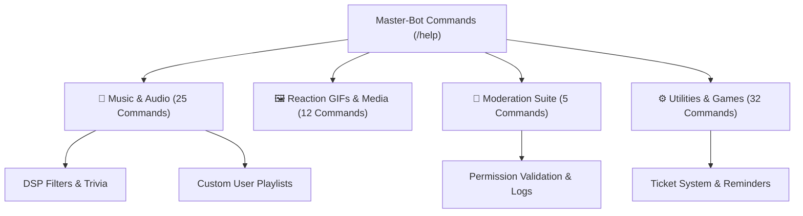

# Complete Commands Reference

Master-Bot features **74 slash commands** organized cleanly into categories. Use `/help` in Discord to open the interactive category browser or view specific parameter details.

---

## 🎵 Music & Audio Commands

| Command                 | Description                                                   | Usage                                                                               |
| ----------------------- | ------------------------------------------------------------- | ----------------------------------------------------------------------------------- |
| `/play`                 | Play any song or playlist from YouTube, Spotify, and more     | `/play query: darude sandstorm [is-custom-playlist: True] [shuffle-playlist: True]` |
| `/jump`                 | Jump directly to a specific track position in the queue       | `/jump position: 4`                                                                 |
| `/pause`                | Pause music playback                                          | `/pause`                                                                            |
| `/resume`               | Resume paused music playback                                  | `/resume`                                                                           |
| `/queue`                | Display the current music queue and upcoming tracks           | `/queue`                                                                            |
| `/shuffle`              | Randomly shuffle all upcoming tracks in the music queue       | `/shuffle`                                                                          |
| `/seek`                 | Seek to a specific timestamp in the current track             | `/seek seconds: 90`                                                                 |
| `/remove`               | Remove a track from the queue by position number              | `/remove position: 3`                                                               |
| `/move`                 | Move a queued track from one position to another              | `/move current-position: 4 new-position: 1`                                         |
| `/leave`                | Disconnect the bot from the voice channel and stop playback   | `/leave`                                                                            |
| `/volume`               | Set the audio playback volume level                           | `/volume setting: 80`                                                               |
| `/lyrics`               | Look up lyrics for a song title or the currently playing song | `/lyrics [title: Hotel California]`                                                 |
| `/bassboost`            | Boost the bass frequencies of the audio stream                | `/bassboost`                                                                        |
| `/karaoke`              | Apply the karaoke voice attenuation filter                    | `/karaoke`                                                                          |
| `/nightcore`            | Toggle high-pitch and speed boost (Nightcore)                 | `/nightcore`                                                                        |
| `/vaporwave`            | Toggle slow-tempo and pitched-down audio (Vaporwave)          | `/vaporwave`                                                                        |
| `/create-playlist`      | Create a custom user playlist                                 | `/create-playlist playlist-name: Favorites`                                         |
| `/save-to-playlist`     | Save a track or playlist URL to your custom playlist          | `/save-to-playlist playlist-name: Favorites url: <url>`                             |
| `/my-playlists`         | View your saved custom playlists                              | `/my-playlists`                                                                     |
| `/display-playlist`     | View all songs inside a saved custom playlist                 | `/display-playlist playlist-name: Favorites`                                        |
| `/delete-playlist`      | Delete an entire saved playlist                               | `/delete-playlist playlist-name: Favorites`                                         |
| `/remove-from-playlist` | Remove a specific song from a saved playlist                  | `/remove-from-playlist playlist-name: Favorites location: 2`                        |
| `/music-trivia`         | Start an interactive 10-round Music Trivia game               | `/music-trivia [rounds: 5] [category: 90s]`                                         |
| `/stop-trivia`          | Terminate the active Music Trivia game in this server         | `/stop-trivia`                                                                      |

> 💡 _Note: Skipping tracks is handled directly via the **Next** (⏭️) button on the Now Playing embed, alongside Repeat and Shuffle toggle buttons._

---

## 🖼️ Reaction GIFs & Media (Powered by Klipy & Waifu.im)

| Command    | Description                                        | Usage                       |
| ---------- | -------------------------------------------------- | --------------------------- |
| `/gif`     | Send a random GIF or search with keywords          | `/gif [query: dancing cat]` |
| `/anime`   | Send a random anime GIF                            | `/anime`                    |
| `/amongus` | Send an Among Us GIF                               | `/amongus`                  |
| `/baka`    | Send a "baka" reaction GIF (with optional mention) | `/baka [target: @User]`     |
| `/gintama` | Send a Gintama reaction GIF                        | `/gintama`                  |
| `/jojo`    | Send a JoJo's Bizarre Adventure GIF                | `/jojo`                     |
| `/hug`     | Send a warm hug GIF to a friend                    | `/hug [target: @User]`      |
| `/pat`     | Give someone or yourself a gentle head pat         | `/pat [target: @User]`      |
| `/slap`    | Send a slap reaction GIF                           | `/slap [target: @User]`     |
| `/cat`     | Send a cute random cat GIF                         | `/cat`                      |
| `/doggo`   | Send an adorable doggo GIF                         | `/doggo`                    |
| `/waifu`   | Send a high-res waifu illustration (waifu.im)      | `/waifu`                    |

---

## 🔨 Moderation & Server Management

| Command     | Description                                                     | Usage                                                    |
| ----------- | --------------------------------------------------------------- | -------------------------------------------------------- |
| `/ban`      | Ban a member with audit logging and optional message purging    | `/ban user: @User [reason: Spam] [delete-messages: 24h]` |
| `/kick`     | Kick a member from the server with audit reason                 | `/kick user: @User [reason: Rule violation]`             |
| `/timeout`  | Apply or remove a Discord timeout (mute)                        | `/timeout user: @User duration: 5m [reason: Spam]`       |
| `/slowmode` | Set or remove a text channel rate limit                         | `/slowmode seconds: 10 [channel: #general]`              |
| `/purge`    | Bulk delete messages from a channel (with optional user filter) | `/purge amount: 25 [user: @User]`                        |

---

## 🎮 Gaming, Info & Fun Utilities

| Command              | Description                                                 | Usage                                                          |
| -------------------- | ----------------------------------------------------------- | -------------------------------------------------------------- |
| `/game-search`       | Search video game releases and ratings (IGDB)               | `/game-search game: Elden Ring`                                |
| `/tv-show-search`    | Search TV show information and schedules (TVMaze)           | `/tv-show-search query: Breaking Bad`                          |
| `/weather`           | Get current weather and 3-day forecast for any location     | `/weather location: Tokyo`                                     |
| `/twitch-status`     | Check if a Twitch broadcaster is currently live             | `/twitch-status streamer: shroud`                              |
| `/world-news`        | Fetch world news headlines by category or keyword (NewsAPI) | `/world-news [category: technology] [query: AI] [country: us]` |
| `/poll`              | Create an interactive multi-choice poll with button voting  | `/poll question: Lunch? options: Pizza, Tacos [duration: 30]`  |
| `/reminder`          | Schedule, list, or delete personal/server reminders         | `/reminder set time: 10m event: Pizza [description: Notes]`    |
| `/connect-four`      | Play Connect 4 interactively with Discord buttons           | `/connect-four [opponent: @User]`                              |
| `/tic-tac-toe`       | Play Tic-Tac-Toe interactively with Discord buttons         | `/tic-tac-toe [opponent: @User]`                               |
| `/speedrun`          | Look up world record speedrun times (speedrun.com)          | `/speedrun game: Mario [category: Any%]`                       |
| `/urban`             | Look up definitions on Urban Dictionary                     | `/urban query: typescript`                                     |
| `/translate`         | Translate text into target languages (Google Translate)     | `/translate target: es text: Hello`                            |
| `/8ball`             | Ask the Magic 8-Ball any question                           | `/8ball question: Will I win?`                                 |
| `/reddit`            | Fetch hot or top posts from any subreddit                   | `/reddit subreddit: memes sort: hot`                           |
| `/random`            | Generate a random number within a range                     | `/random min: 1 max: 10`                                       |
| `/games`             | Launch an interactive game selector                         | `/games`                                                       |
| `/rockpaperscissors` | Play Rock Paper Scissors against the bot                    | `/rockpaperscissors move: rock`                                |
| `/activity`          | Generate a Discord Voice Activity invite link               | `/activity channel: #Voice activity: YouTube Together`         |
| `/kanye`             | Quote a random Kanye West statement                         | `/kanye`                                                       |
| `/trump`             | Quote a random Donald Trump statement                       | `/trump`                                                       |
| `/advice`            | Receive helpful advice                                      | `/advice`                                                      |
| `/bored`             | Generate a fun, random activity to cure your boredom        | `/bored [type: Category] [participants: Number]`               |
| `/motivation`        | Receive a motivational quote                                | `/motivation`                                                  |
| `/fortune`           | Open a fortune cookie                                       | `/fortune`                                                     |
| `/chucknorris`       | Receive a satirical Chuck Norris fact                       | `/chucknorris`                                                 |
| `/insult`            | Generate a playful insult                                   | `/insult`                                                      |

---

## ⚙️ Utilities & Owner Commands

| Command         | Description                                             | Usage                                      |
| --------------- | ------------------------------------------------------- | ------------------------------------------ |
| `/help`         | Interactive category browser and command guide          | `/help [command-name: play]`               |
| `/set`          | Master server settings configuration suite              | `/set <subcommand>`                        |
| `/youtube-auth` | Authorize YouTube playback via Device Flow (Owner Only) | `/youtube-auth`                            |
| `/avatar`       | Display a user's Discord avatar in full resolution      | `/avatar [user: @User]`                    |
| `/about`        | Display detailed Bot, Server, or User telemetry         | `/about <bot\|server\|user> [user: @User]` |
| `/dashboard`    | Retrieve the direct link to the web management portal   | `/dashboard`                               |
| `/ping`         | Check the bot's Discord gateway latency                 | `/ping`                                    |

---

## 🔧 Server Settings (`/set` Subcommands)

| Subcommand                       | Description                                                                     |
| -------------------------------- | ------------------------------------------------------------------------------- |
| `/set view`                      | Display the current server settings overview                                    |
| `/set welcome-channel`           | Set the channel for member welcome greetings                                    |
| `/set welcome-message`           | Set a custom welcome message (`{user}`, `{username}`, `{server}`, `{position}`) |
| `/set welcome-toggle`            | Enable or disable automatic welcome greetings                                   |
| `/set welcome-test`              | Test the welcome greeting in the current channel                                |
| `/set log-channel`               | Set the channel for server audit & event logging                                |
| `/set log-toggle`                | Enable or disable audit & event logging                                         |
| `/set log-disable`               | Disable audit logging and clear the channel                                     |
| `/set ticket-channel`            | Set the channel for the support ticket panel                                    |
| `/set ticket-toggle`             | Enable or disable the support ticket system                                     |
| `/set ticket-panel`              | Post or update the interactive ticket creation panel                            |
| `/set ticket-transcript`         | Set the channel for closed ticket transcript archival                           |
| `/set ticket-transcript-disable` | Disable ticket transcript archiving                                             |
| `/set ticket-role`               | Set the ticket manager role for support tickets                                 |
| `/set ticket-role-disable`       | Remove/disable the ticket manager role                                          |
| `/set twitch-add`                | Add a Twitch streamer to the live notification monitor                          |
| `/set twitch-remove`             | Remove a Twitch streamer from the monitor                                       |
| `/set twitch-list`               | Display monitored Twitch channels                                               |
| `/set default-volume`            | Set the default audio playback volume                                           |

---

## 🎫 Support Ticket Buttons & Thread Workflow

Master-Bot utilizes button listeners to eliminate command bloat:

1. **Open Ticket (`ticket_create`):** Clicking the button on the panel creates a dedicated Discord Thread (`🎫・ticket-username`), mentions the ticket creator, and presents the greeting embed with a **Close Ticket** button.
2. **Close Ticket (`ticket_close`):** Clicking the button marks the ticket closed, compiles a full `.txt` chat transcript if a transcript channel is configured, posts it with audit metadata, and locks/archives the thread.
