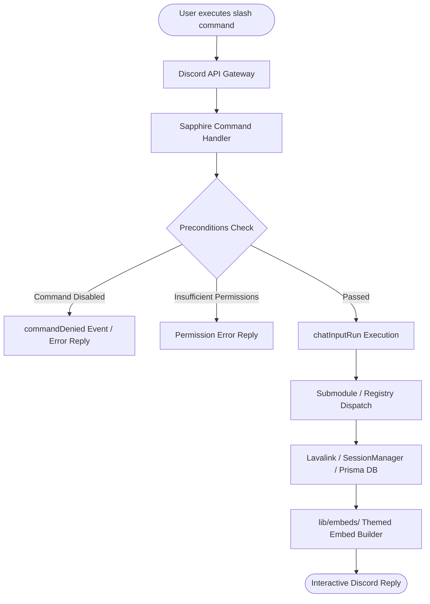

# ⌨️ Commands Reference & Usage Guide

Master-Bot provides an extensive suite of **slash commands** across Music, Moderation, Utility, Entertainment, and Notifications. Every command is Discord slash-command native with type-safe argument validation and interactive embeds.

---

## 📑 Table of Contents
1. [Overview & Permissions](#-overview--permissions)
2. [Command Architecture & Flow](#-command-architecture--flow)
3. [🎵 Music Suite](#-music-suite)
4. [🔨 Moderation Suite](#-moderation-suite)
5. [⚙️ `/set` Server Configuration Hub](#️-set-server-configuration-hub)
6. [🔔 YouTube & Twitch Alerts](#-youtube--twitch-alerts)
7. [🎭 Fun & Reaction GIFs](#-fun--reaction-gifs)
8. [🎲 General Utility & Games](#-general-utility--games)
9. [Related Guides](#-related-guides)

---

## 📖 Overview & Permissions

Commands automatically validate Discord member permissions and hierarchy before execution:

| Scope | Required Permission | Applicable Commands |
| :--- | :--- | :--- |
| **Server Admin** | `ManageGuild` or `Administrator` | `/set` (all options) |
| **Moderators** | `BanMembers` | `/ban` |
| **Moderators** | `KickMembers` | `/kick` |
| **Moderators** | `ModerateMembers` | `/timeout` |
| **Moderators** | `ManageMessages` | `/purge` |
| **Moderators** | `ManageChannels` | `/slowmode` |
| **Members** | Standard Member (`SendMessages`) | Music, GIFs, Reminders, Games, Utilities |

> [!NOTE]
> All moderation commands enforce **role hierarchy**: the bot cannot moderate members whose highest role is equal to or higher than the bot's role or the executing moderator's role.

---

## 📐 Command Architecture & Flow



---

## 🎵 Music Suite

Requires Lavalink (`LAVA_ENABLED=true`) and the user to be connected to a voice channel. Supports YouTube, Spotify, SoundCloud, Twitch, Vimeo, and direct streams.

| Command | Usage | Description |
| :--- | :--- | :--- |
| `/play` | `/play query: <song/url>` | Play a track, album, playlist, or search query. |
| `/pause` | `/pause` | Pause currently playing track. |
| `/resume` | `/resume` | Resume playback of paused track. |
| `/queue` | `/queue [page: 1-N]` | Display the interactive queued tracks and now-playing progress bar. |
| `/now-playing` | `/now-playing` | Display real-time progress bar, track details, and requester. |
| `/jump` | `/jump position: <number>` | Jump directly to a specific track index in the queue. |
| `/shuffle` | `/shuffle` | Randomize the order of tracks currently in queue. |
| `/seek` | `/seek timestamp: <01:30>` | Seek to a specific timestamp in the currently playing track. |
| `/remove` | `/remove position: <number>` | Remove a track from the queue by its index. |
| `/move` | `/move from: <int> to: <int>` | Move a track to a new position in the queue. |
| `/skip` | `/skip` | Skip the currently playing track. |
| `/skipall` | `/skipall` | Clear the remaining queue and stop audio. |
| `/leave` | `/leave` | Disconnect the bot from voice and clear the session. |
| `/volume` | `/volume [volume: 1-100]` | Adjust or view audio volume for the current guild. |
| `/lyrics` | `/lyrics [song: <query>]` | Fetch song lyrics via the Genius API. |
| `/bassboost` | `/bassboost` | Toggle DSP bass boost audio filter. |
| `/karaoke` | `/karaoke` | Toggle vocal suppression DSP audio filter. |
| `/nightcore` | `/nightcore` | Toggle nightcore (pitch and tempo elevation) DSP filter. |
| `/vaporwave` | `/vaporwave` | Toggle vaporwave (slowed tempo and reverb) DSP filter. |
| `/music-trivia` | `/music-trivia` | Start a music trivia guessing game based on queued tracks. |
| `/stop-trivia` | `/stop-trivia` | Terminate the current trivia game and show final scores. |
| `/create-playlist` | `/create-playlist name: <name>` | Create a custom per-server playlist. |
| `/save-to-playlist` | `/save-to-playlist name: <name>` | Save the currently playing track into your playlist. |
| `/my-playlists` | `/my-playlists` | View all playlists created by you on this server. |
| `/display-playlist`| `/display-playlist name: <name>` | View paginated tracks inside a specific playlist. |
| `/delete-playlist` | `/delete-playlist name: <name>` | Permanently delete a custom playlist. |
| `/remove-from-playlist` | `/remove-from-playlist name: <n> track: <i>` | Remove a track index from a custom playlist. |

---

## 🔨 Moderation Suite

Comprehensive moderation commands with role hierarchy protection, audit logging, and styled embeds.

| Command | Usage | Description |
| :--- | :--- | :--- |
| `/ban` | `/ban member: @User [reason: Text]` | Permanently ban a member from the guild. |
| `/kick` | `/kick member: @User [reason: Text]` | Kick a member from the guild. |
| `/timeout` | `/timeout member: @User duration: <time> [reason: Text]` | Apply a Discord timeout (e.g. `60s`, `10m`, `2h`, `1d`). |
| `/slowmode` | `/slowmode duration: <time>` | Set channel slowmode delay (e.g. `0s`, `5s`, `15m`, `6h`). |
| `/purge` | `/purge amount: 1-100` | Bulk-delete up to 100 recent messages in the current channel. |

---

## ⚙️ `/set` Server Configuration Hub

The `/set` command is the central server management hub for Master-Bot. It consolidates 22 configuration actions into a single command with options, ensuring that bot registrations remain well within Discord application limits:

```text
/set [option: Option] [channel: #channel] [value: Text] [enabled: True/False] [role: @Role] [number: 1-100] [alerts: Type]
```

> [!TIP]
> Running `/set` without any arguments defaults to displaying the server's current settings overview (`view`).

### Setting Options Directory:

| Option Name | Parameters | Description |
| :--- | :--- | :--- |
| `view` | *(None)* | Display an overview embed of all server settings (default). |
| `welcome-channel` | `channel: #channel` | Set the target text channel for new member greetings. |
| `welcome-message` | `value: "Text"` | Set custom welcome message (`{user}`, `{server}`, `{memberCount}`). |
| `welcome-toggle` | `enabled: True/False` | Enable or disable new member welcome greetings. |
| `welcome-test` | *(None)* | Test the welcome greeting in the configured channel. |
| `youtube-add` | `value: "@channel"`, `channel: #channel`, `[alerts: all/streams/uploads]` | Add YouTube alert (supports text & forum channels). |
| `youtube-remove` | `value: "@channel"`, `channel: #channel` | Remove a YouTube alert subscription. |
| `youtube-list` | *(None)* | List all monitored YouTube channels in the guild. |
| `twitch-add` | `value: "streamer"`, `channel: #channel` | Add Twitch streamer live alerts (supports text & forum channels). |
| `twitch-remove` | `value: "streamer"`, `channel: #channel` | Remove a Twitch streamer subscription. |
| `twitch-list` | *(None)* | List all monitored Twitch streamers in the guild. |
| `log-channel` | `channel: #channel` | Set channel for audit and moderation logs. |
| `log-toggle` | `enabled: True/False` | Enable or disable audit logging. |
| `log-disable` | *(None)* | Disable audit logging. |
| `ticket-channel` | `channel: #channel` | Set channel for support ticket creation panels. |
| `ticket-panel` | *(None)* | Post the interactive support ticket button panel. |
| `ticket-role` | `role: @Role` | Assign staff/support role with ticket permissions. |
| `ticket-role-disable` | *(None)* | Remove assigned ticket support role. |
| `ticket-toggle` | `enabled: True/False` | Enable or disable support ticket system. |
| `ticket-transcript` | `channel: #channel` | Set channel for archiving closed ticket transcripts. |
| `ticket-transcript-disable` | *(None)* | Disable ticket transcript archiving. |
| `default-volume` | `number: 1-100` | Set server default audio playback volume. |

---

## 🔔 YouTube & Twitch Alerts

Master-Bot features background polling monitors for YouTube and Twitch creators. Alerts can be delivered to **standard text channels** or **forum channels** (creating automated discussion threads).

| Command | Usage | Description |
| :--- | :--- | :--- |
| `/set` (`youtube-add`) | `/set option: youtube-add value: @MKBHD channel: #feed alerts: all` | Subscribe to live streams and/or video uploads. |
| `/set` (`twitch-add`) | `/set option: twitch-add value: shroud channel: #streams` | Subscribe to live stream broadcast alerts. |
| `/twitch-status` | `/twitch-status streamer: <username>` | Check live broadcast status of a Twitch streamer on-demand. |

---

## 🎭 Fun & Reaction GIFs

All reaction commands are unified under a single `/gif` command with modular submodules in `apps/bot/src/lib/gifs/options/`:

```text
/gif [tag: Tag] [query: Keyword] [target: @User]
```

### Tag Presets:
- `amongus` — Random Among Us reaction
- `anime` — Anime reactions
- `baka` — "Baka" anime reaction
- `cat` — Cute cat media
- `doggo` — Cute dog media
- `gintama` — Gintama anime moments
- `hug` — Warm hug reaction (supports `target: @User`)
- `jojo` — JoJo's Bizarre Adventure GIF
- `pat` — Gentle headpat reaction (supports `target: @User`)
- `slap` — Playful slap reaction (supports `target: @User`)
- `waifu` — Waifu illustration from Waifu.im

---

## 🎲 General Utility & Games

| Command | Usage | Description |
| :--- | :--- | :--- |
| `/help` | `/help [command: <name>]` | Interactive paginated help embed and command lookup. |
| `/dashboard` | `/dashboard` | Direct link to the server's web management dashboard. |
| `/reminder` | `/reminder duration: <time> message: <text>` | Set a DM reminder (e.g. `20m`, `3h`, `1d`). |
| `/poll` | `/poll question: <question>` | Create an emoji-reaction voting poll. |
| `/weather` | `/weather city: <location>` | Current weather and forecast for any city. |
| `/translate` | `/translate text: <text> target_lang: <lang>` | Translate text using Google Translate. |
| `/game-search` | `/game-search name: <title>` | Search game details, ratings, and platforms via IGDB. |
| `/world-news` | `/world-news [query: <topic>]` | Search international news headlines via NewsAPI. |
| `/connect-four` | `/connect-four opponent: @User` | Play Connect Four with another member. |
| `/tic-tac-toe` | `/tic-tac-toe opponent: @User` | Play Tic-Tac-Toe with another member. |
| `/rockpaperscissors` | `/rockpaperscissors` | Play Rock Paper Scissors against the bot. |
| `/8ball` | `/8ball question: <text>` | Magic 8-ball answers to life's questions. |
| `/urban` | `/urban term: <query>` | Look up definitions on Urban Dictionary. |

---

## 🔗 Related Guides
- [Home](Home) — Return to wiki main page
- [Developer Guide](Development-Guide) — How to add new commands and options
- [Stream Alerts](Reminders-and-Twitch) — YouTube and Twitch notification setup
- [Configuration](Configuration) — Environment variable documentation
- [Deployment](Deployment) — Production self-hosting guide

---
[Home](Home) • [Documentation Index](Home) • [GitHub Repository](https://github.com/galnir/Master-Bot)