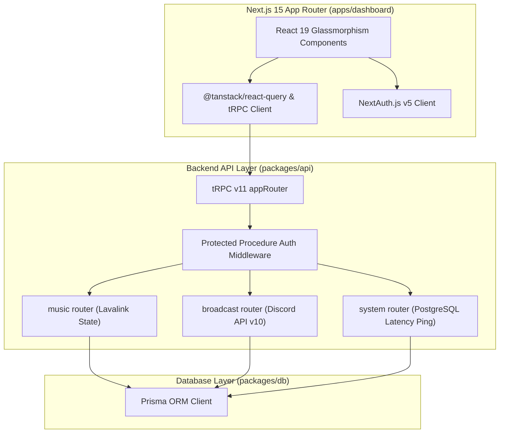

# 🏛️ Web Dashboard Technical Architecture

Technical architecture of `apps/dashboard`, `packages/api`, and `packages/auth`.

---

## Architecture Flow

---

## Core Packages

1. **`apps/dashboard`**: Next.js 15 App Router with Server Components and Client Components.
2. **`packages/api`**: End-to-end type-safe tRPC v11 API procedures across 15 router namespaces.
3. **`packages/auth`**: Shared NextAuth.js v5 configuration with Discord OAuth2 provider.
