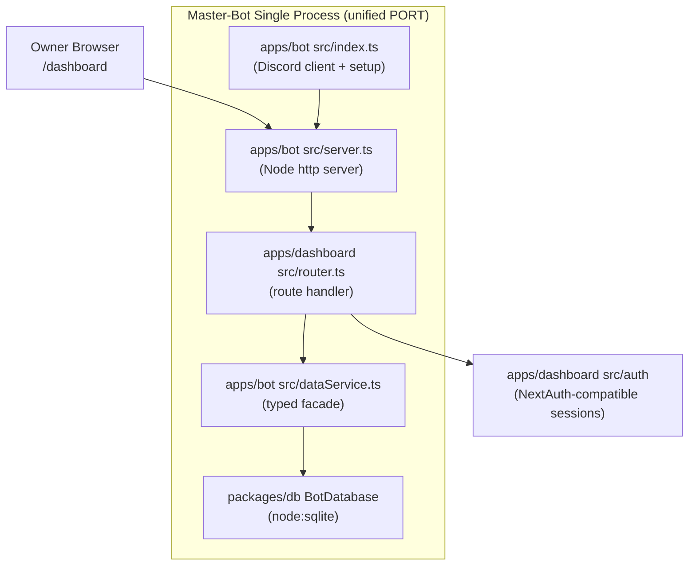

# 🏛️ Web Dashboard Technical Architecture

Technical architecture of `apps/dashboard` and how it lives inside `apps/bot`.

---

## Architecture Flow

---

## How the Pieces Fit

1. **Bootstrap**: `apps/bot/src/index.ts` calls `setDatabasePath(getDbPath())` (SQLite at `<root>/data/bot.sqlite` or `DISCORD_DB_PATH`), builds a `DashboardContext`, injects it via `setDashboardContext()`, then starts the HTTP server on `PORT`.
2. **Routing**: `apps/dashboard/src/router.ts` (`routeDashboardRequest`) serves the UI shell, `/invite` redirect, `/api/auth/*` (OAuth2 callbacks/session), `/api/dashboard/stats`, `/api/dashboard/guilds`, and `/api/dashboard/bot/*` action endpoints. Anything unhandled falls through to the bot's 404.
3. **Data access**: Handlers never touch `process.env` or SQL directly — they call the `dataService` facade (`apps/bot/src/dataService.ts`) which mirrors the original tRPC router shapes and wraps `BotDatabase` CRUD.
4. **Auth**: `apps/dashboard/src/auth/config.ts` + `handlers.ts` implement Discord OAuth2 with HMAC-signed session cookies compatible with the original NextAuth cookie format (`next-auth.session-token`).
5. **Env**: All keys flow through `apps/bot/src/env.ts` — one shared env layer for both bot and dashboard (`PORT`, `DISCORD_CLIENT_ID`, `NEXTAUTH_SECRET`, …).