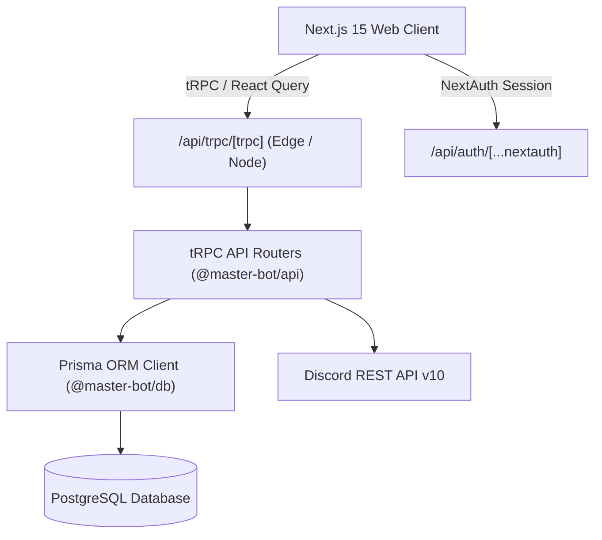

# Next.js 15 Web Dashboard Architecture

The Master-Bot Web Dashboard is a full-featured management and telemetry command center built on **Next.js 15 (App Router)**, **React 18 / React 19**, **Tailwind CSS**, **tRPC v11**, and **NextAuth.js v5**.

---

## 🏗️ Architecture Overview

---

## 🌟 Command Center Feature Studios

The dashboard is structured into 9 dedicated feature studios:

| Studio Route              | Module                | Purpose                                                                               |
| ------------------------- | --------------------- | ------------------------------------------------------------------------------------- |
| `/`                       | Landing Page          | Hero banner, live cluster status, and features showcase                               |
| `/dashboard`              | Server Hub            | Authenticated server switcher and guild picker                                        |
| `/dashboard/[server_id]`  | Server Overview       | Quick status metrics, module toggles, and studio shortcuts                            |
| `/dashboard/music`        | Audio Studio          | Lavalink v4 player controls, audio DSP filters, and saved playlist sync               |
| `/dashboard/broadcast`    | Embed Broadcaster     | WYSIWYG Discord embed builder with live side-by-side preview and channel dispatcher   |
| `/dashboard/logs`         | 18-Event Audit Stream | Real-time moderation, message, member, channel, and voice event log viewer            |
| `/dashboard/integrations` | Twitch Integrations   | Live stream alert configuration and guild channel subscriptions                       |
| `/dashboard/system`       | Cluster Diagnostics   | PostgreSQL query latency, Discord gateway ping, shard telemetry, and ecosystem totals |
| `/dashboard/reminders`    | Smart Reminders       | Personal user reminders, recurring alerts, and scheduled channel notifications        |

---

## 🔐 End-to-End Type Safety & tRPC API

The dashboard communicates with the backend via end-to-end type-safe tRPC v11 procedures defined in `packages/api/src/routers/`:

- `music`: Audio player state queries, volume settings, and user playlists.
- `broadcast`: Validates Discord embed schemas and sends channel messages directly.
- `system`: Telemetry metrics, service latencies, and database pool health.
- `guild`: Server configuration, prefixes, and module states.
- `command`: Slash command toggles and permission bit overrides.
- `welcome`: Welcome/farewell message configuration and preview.
- `tickets`: Support ticket categories, staff roles, and transcripts.
- `logs`: Log channel event subscriptions (18 event triggers).
- `twitch`: Tracked streamer subscriptions and live notifications.
