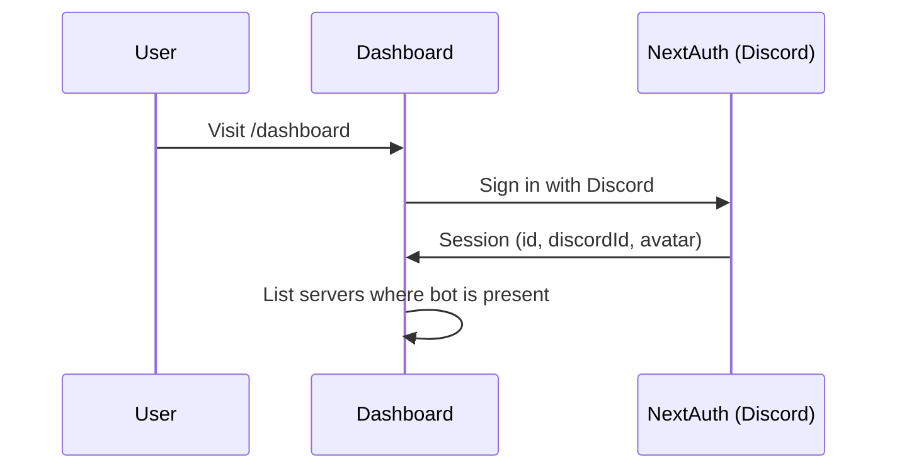
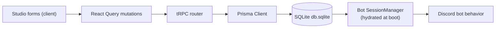

# 🌐 Web Dashboard

The **Master-Bot Dashboard** is a Next.js 15 management console where you configure everything `/set` can — plus studios that live better on a big screen.

## 🧱 Stack

| Layer | Technology |
| --- | --- |
| Framework | Next.js 15 (App Router), React 18 |
| API | tRPC v11 (client/react-query/server) + `superjson` |
| Data fetching | TanStack React Query 5 |
| Auth | NextAuth v5 (beta) via `@master-bot/auth` — Discord OAuth (`identify guilds email` scopes) |
| Styling | Tailwind CSS 3.4, Radix UI primitives, custom UI components |
| Backend data | Prisma Client (`@master-bot/db`) — reads the same SQLite database the bot writes |

## 🔐 Authentication

- Discord OAuth grants the `identify`, `guilds`, and `email` scopes.
- `packages/auth` uses a custom Prisma adapter whose `createUser` **upserts by Discord ID**, linking dashboard users to the same `User` rows the bot manages.
- The `Session` type is augmented with `user.id` and `user.discordId` for API calls.

## 🗺️ Pages

| Route | Studio |
| --- | --- |
| `/` | Landing page with features + invite. |
| `/dashboard` | Server hub — pick a server where the bot is present. |
| `/dashboard/[server_id]` | Server layout with per-guild navigation. |
| `…/welcome-message` | Welcome channel, template editor, toggle, and send-test actions. |
| `…/log-channel` | Audit-log channel + the full **20-event trigger switchboard** (`log-events-form`). |
| `…/tickets` | Ticket channel/role/transcript configuration. |
| `…/reminders` | View and manage server reminders. |
| `…/commands/[command_id]` | Per-command info and per-server command toggles. |
| `/dashboard/music` | Global music settings. |
| `/dashboard/broadcast` | Rich broadcast composer for announcements. |
| `/dashboard/integrations` | Link external services / manage credentials. |
| `/dashboard/system` | Runtime health, version, uptime telemetry. |

## ⚙️ Data Flow

Because the bot **hydrates from the same SQLite file at every boot**, a setting you save in the dashboard is live the next time the bot picks it up (and vice versa for `/set`).

> ⚠️ **Tip:** run the bot and dashboard from the same working directory / volume so both processes share `db.sqlite`. In container setups, mount it as a persistent volume — see [Deployment](Deployment.md).