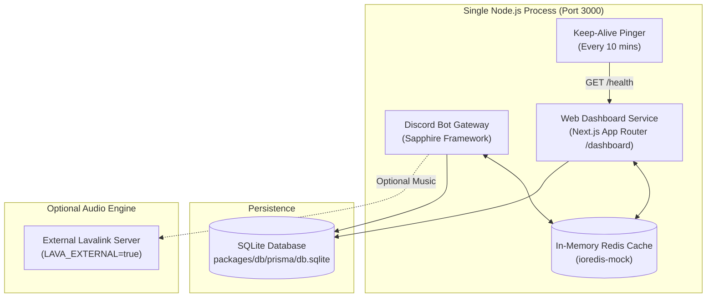

# 🚀 Deployment & Cloud Hosting Guide

Master-Bot runs as a consolidated, single-process Node.js runtime that hosts both the **Discord Bot Gateway** and the **Next.js Web Dashboard** on the exact same service and port (`PORT`, default `3000`).

Thanks to the built-in zero-binary **`ioredis-mock`** cache and **SQLite persistence**, Master-Bot boots up instantly on any machine or cloud platform with a simple `pnpm install` and `pnpm start` — without installing an external Redis binary or managing a separate database server.

---

## ⚡ Quick Architecture Overview



- **Single Console Window:** No child-process console popups or separate terminal windows.
- **Only Two Ports Required Across Entire System:**
  1. `PORT` (default `3000`): Unified web port shared by the Discord bot gateway, Next.js web dashboard (`/dashboard`), and health/keep-alive endpoints (`/health`).
  2. `LAVA_PORT` (default `2333`): Used exclusively by the Lavalink audio server (the only component running as a separate process/server).
- **Zero Redis Server Process:** In-process in-memory `ioredis-mock` shares live state seamlessly between the bot and dashboard with zero separate binaries, processes, or ports.
- **SQLite Persistence Layer:** Single embedded file (`db.sqlite`) preserves all guild configurations, roles, tickets, and playlists across restarts without requiring an external database server or port.

---

## 🎵 Audio Engine on Cloud Hosts (External Lavalink Required)

> [!IMPORTANT]
> **One-click cloud deployments (Render, Railway, Heroku, Fly.io) cannot run an internal Lavalink server.**
> Cloud free tiers run in standard single-process Node.js container environments with strict RAM limits (typically 512 MB) and no Java runtime. Running an internal Lavalink audio engine with YouTube Java plugins inside the same free container would cause immediate Out-Of-Memory (OOM) crashes.
>
> Therefore:
> - `LAVA_ENABLED` defaults to `false` on all one-click cloud deployment templates.
> - To enable music commands on cloud platforms, deploy a standalone external Lavalink server using the one-click buttons below:

### 🔊 One-Click External Lavalink Server Deployment

| Platform | Free Tier | Lavalink Deploy Button |
| :--- | :---: | :--- |
| **Render** | ✅ 100% Free | [](https://render.com/deploy?repo=https://github.com/HELIX-Origin/Lavalink-Server) |
| **Railway** | ✅ Free Starter | [](https://railway.com/new/template?template=https%3A%2F%2Fgithub.com%2FHELIX-Origin%2FLavalink-Server) |
| **Heroku** | ✅ Eco Dyno | [](https://heroku.com/deploy?template=https://github.com/HELIX-Origin/Lavalink-Server) |
| **Fly.io** | ✅ Free MicroVM | [](https://github.com/HELIX-Origin/Lavalink-Server#flyio-deployment) |

Once your external server is up, configure your bot's environment variables:
```env
LAVA_ENABLED=true
LAVA_EXTERNAL=true
LAVA_HOST=your-lavalink-server.onrender.com
LAVA_PORT=443
LAVA_PASS=youshallnotpass
LAVA_SECURE=true
```

---

## ☁️ Supported Cloud Hosting Platforms (100% Free Tiers)

| Platform | Free Tier Support | Persistence | Configuration File |
| :--- | :--- | :--- | :--- |
| **Render** | Free Web Service (512 MB RAM) | Optional Persistent Disk | [`render.yaml`](../render.yaml) |
| **Railway** | Free Starter / Trial | Persistent Volume (`/packages/db/prisma`) | [`railway.json`](../railway.json) |
| **Heroku** | Eco / Student Tier | Ephemeral (DB resets on dyno restart) | [`app.json`](../app.json) & [`Procfile`](../Procfile) |
| **Fly.io** | Free Tier (shared-cpu-1x, 512 MB) | Encrypted NVMe Volume (`master_bot_data`) | [`fly.toml`](../fly.toml) |

---

## 1. 🟣 Render (`render.com`)

Render offers managed Node.js Web Services on its 100% Free Tier plan.

### ⚠️ Critical Notice: Custom Domains & Browser Phishing Protections

> [!WARNING]
> **Why You Need a Custom Domain on Render:**
> Render's default free subdomains (`*.onrender.com`) are frequently abused by bad actors for malicious token-logging and phishing campaigns. As a result, **Discord Trust & Safety and major web browser protections (Google Safe Browsing, Chromium SmartScreen) frequently flag default `*.onrender.com` URLs with deceptive site / phishing warnings**.
>
> **How to Fix:**
> Always attach a **custom domain or subdomain** (e.g. `bot.yourdomain.com`) to your Render web service:
> 1. Render provides **free, automatic Let's Encrypt SSL certificates** for all custom domains on free plans.
> 2. Free domain names can be obtained from [ifreedomains.com](https://ifreedomains.com). *(Note: free domains may take up to 48 hours to be fully activated and propagate across global DNS).*
> 3. Add your custom domain under your service's **Settings > Custom Domains** tab in the Render dashboard.
> 4. Set `NEXTAUTH_URL=https://bot.yourdomain.com` in your Render Environment Variables.
> 5. Add `https://bot.yourdomain.com/api/auth/callback/discord` to your Discord Developer Portal OAuth2 Redirects.

### 💓 Inactivity Throttling & Built-In Keep-Alive

Render's free tier automatically spins down web services after 15 minutes of inbound HTTP inactivity. Because Discord bots communicate via outbound WebSocket (Discord Gateway), Render does not detect Discord messages as HTTP activity.

Master-Bot includes an integrated **Keep-Alive Service** (`apps/bot/src/lib/server/keepAlive.ts`). It pings the public `/health` endpoint every 10 minutes, generating the necessary inbound HTTP traffic to keep your service active 24/7 without manual intervention.

### One-Click Deploy on Render
Click the **Deploy to Render** button in the [README.md](../README.md) or use Blueprint:
1. In the [Render Dashboard](https://dashboard.render.com), click **New +** > **Blueprint**.
2. Connect your repository fork. Render reads `render.yaml` automatically.
3. Fill in your required environment variables:
   - `DISCORD_TOKEN`: Bot token from [Discord Developer Portal](https://discord.com/developers/applications).
   - `DISCORD_CLIENT_ID`: Application ID.
   - `DISCORD_CLIENT_SECRET`: Application secret.
   - `NEXTAUTH_URL`: Your custom domain (e.g. `https://bot.yourdomain.com`).
4. Click **Apply**.

### Manual Render Setup
1. **New Web Service** > Connect Git repository.
2. Settings:
   - **Environment:** `Node`
   - **Plan:** `Free`
   - **Build Command:** `pnpm install && pnpm build`
   - **Start Command:** `pnpm start`
3. Environment Variables:
   - `NODE_ENV`: `production`
   - `PORT`: `10000`
   - `KEEP_ALIVE_ENABLED`: `true`
   - `LAVA_ENABLED`: `false`
   - `LAVA_EXTERNAL`: `true`
   - `INTERNAL_URL`: `http://localhost:10000`
   - `PUBLIC_URL`: `https://bot.yourdomain.com`
   - `DISCORD_CALLBACK_URL`: `https://discord.com/api/oauth2/authorize?client_id=your_client_id&permissions=8&scope=bot`

---

## 2. 🚂 Railway (`railway.app`)

Railway runs full containerized workloads with instant GitHub deploys and persistent volume support.

### Step 1: Deploy from GitHub
1. In your [Railway Dashboard](https://railway.app), click **New Project** > **Deploy from GitHub repo**.
2. Select your `Master-Bot` repository.
3. Railway automatically detects `railway.json` and uses the Nixpacks builder.

### Step 2: Add Persistent Storage for SQLite
To preserve your SQLite database across deploys:
1. Click on your service block on the Railway canvas.
2. Go to the **Volumes** tab and click **Add Volume**.
3. Set the **Mount Path** to:
   ```text
   /Master-Bot/packages/db/prisma
   ```

### Step 3: Networking & Environment Variables
1. Under **Settings > Networking**, click **Generate Domain** (e.g. `master-bot-production.up.railway.app`).
2. Under the **Variables** tab, add:
   - `DISCORD_TOKEN`: `your_bot_token`
   - `DISCORD_CLIENT_ID`: `your_client_id`
   - `DISCORD_CLIENT_SECRET`: `your_client_secret`
   - `NEXTAUTH_SECRET`: `random_32_char_string`
   - `NEXTAUTH_URL`: `https://master-bot-production.up.railway.app`
   - `LAVA_ENABLED`: `false`
   - `KEEP_ALIVE_ENABLED`: `true`

---

## 3. ✈️ Fly.io (`fly.io`)

Fly.io runs applications in lightweight microVMs with fast persistent NVMe storage.

### Step 1: Install flyctl and Initialize
```bash
fly launch --no-deploy
```

### Step 2: Create a Persistent Volume for SQLite
```bash
fly volumes create master_bot_data --size 1 --region iad
```

### Step 3: Configure `fly.toml`
Verify that `fly.toml` mounts the volume to the Prisma database directory:
```toml
app = "master-bot"
primary_region = "iad"

[http_service]
  internal_port = 3000
  force_https = true
  auto_stop_machines = false
  auto_start_machines = true
  min_machines_running = 1

[checks]
  [checks.health]
    port = 3000
    type = "http"
    path = "/health"
    interval = "30s"
    timeout = "5s"

[mounts]
  source = "master_bot_data"
  destination = "/Master-Bot/packages/db/prisma"

[[vm]]
  memory = "512mb"
  cpu_kind = "shared"
  cpus = 1
```

### Step 4: Set Secrets and Deploy
```bash
fly secrets set \
  DISCORD_TOKEN="your_bot_token" \
  DISCORD_CLIENT_ID="your_client_id" \
  DISCORD_CLIENT_SECRET="your_client_secret" \
  NEXTAUTH_SECRET="random_32_char_string" \
  NEXTAUTH_URL="https://master-bot.fly.dev" \
  LAVA_ENABLED="false" \
  KEEP_ALIVE_ENABLED="true"

fly deploy
```

---

## 4. 🟪 Heroku (`heroku.com`)

Heroku supports Node.js applications via the official Heroku Node buildpack and `app.json`.

### Deploy using Heroku Git
```bash
heroku create your-master-bot-app
heroku buildpacks:set heroku/nodejs

heroku config:set \
  NODE_ENV="production" \
  DISCORD_TOKEN="your_bot_token" \
  DISCORD_CLIENT_ID="your_client_id" \
  DISCORD_CLIENT_SECRET="your_client_secret" \
  NEXTAUTH_SECRET="random_32_char_string" \
  NEXTAUTH_URL="https://your-master-bot-app.herokuapp.com" \
  LAVA_ENABLED="false" \
  KEEP_ALIVE_ENABLED="true"

git push heroku main
```

> [!WARNING]
> **Ephemeral Filesystem on Heroku:**
> Heroku dynos feature an ephemeral filesystem that cycles at least once every 24 hours. Because SQLite writes to disk, any data modified will reset unless backed up off-dyno. For production persistence with zero maintenance, **Render**, **Railway**, or **Fly.io** (which all support persistent volumes) are strongly recommended over Heroku.

---

## 🖥️ Local / VPS Production Launch

On a local machine or VPS (Ubuntu, Debian, macOS, Windows):

```bash
pnpm install   # Installs dependencies & pushes SQLite database schema
pnpm build     # Builds Next.js dashboard and compiles bot
pnpm start     # Starts consolidated bot + dashboard in a single console window
```

Once running:
- **Web Dashboard:** [http://localhost:3000/dashboard](http://localhost:3000/dashboard)
- **Health Check:** [http://localhost:3000/health](http://localhost:3000/health)

---

## 🔐 Production Environment Checklist

| Variable | Required | Description |
| :--- | :---: | :--- |
| `DISCORD_TOKEN` | **Yes** | Bot authentication token from Discord Developer Portal. |
| `DISCORD_CLIENT_ID` | **Yes** | Discord Application Client ID. |
| `DISCORD_CLIENT_SECRET` | **Yes** | Discord Application Client Secret. |
| `NEXTAUTH_SECRET` | **Yes** | 32+ character random string to sign auth session cookies. |
| `NEXTAUTH_URL` | **Yes** | The public HTTPS URL of your application dashboard. |
| `PORT` | No | Listening port for web dashboard and health check (default: `3000`). |
| `KEEP_ALIVE_ENABLED` | No | Set to `true` to enable background HTTP pings for cloud hosts. |
| `LAVA_ENABLED` | No | Set to `false` for cloud hosts without external Lavalink (default: `false`). |
| `LAVA_EXTERNAL` | No | Set to `true` when connecting to an external Lavalink audio server. |
| `LAVA_HOST` | No | External Lavalink hostname / IP address. |
| `LAVA_PORT` | No | External Lavalink port (e.g. `443` or `2333`). |
| `LAVA_PASS` | No | External Lavalink password. |
| `LAVA_SECURE` | No | Set to `true` for TLS/SSL (WSS/HTTPS) Lavalink connections. |