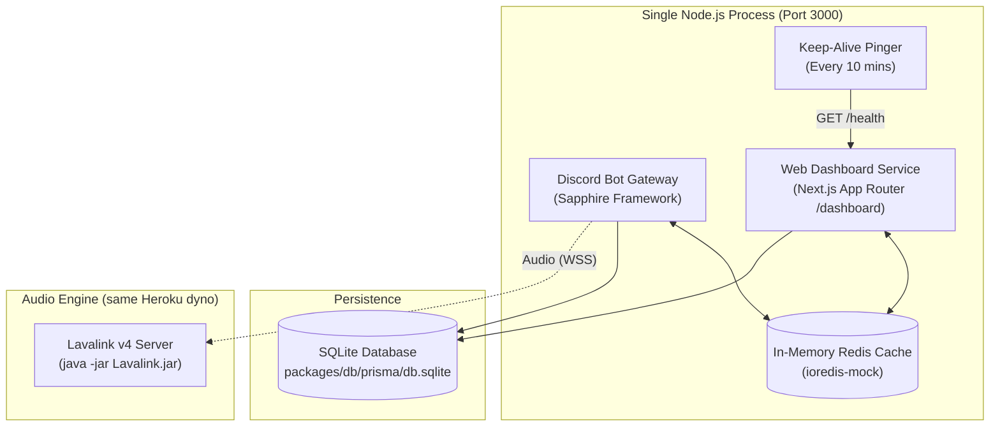

# 🚀 Deployment & Cloud Hosting Guide

Master-Bot runs as a consolidated, single-process Node.js runtime that hosts both the **Discord Bot Gateway** and the **Next.js Web Dashboard** on the exact same service and port (`PORT`, default `3000`).

Thanks to the built-in zero-binary **`ioredis-mock`** cache and **SQLite persistence**, Master-Bot boots up instantly on any machine or cloud platform with a simple `pnpm install` and `pnpm start` — without installing an external Redis binary or managing a separate database server.

---

## ⚡ Quick Architecture Overview



- **Single Console Window:** No child-process console popups or separate terminal windows.
- **Only Two Ports Required Across Entire System:**
  1. `PORT` (default `3000`): Unified web port shared by the Discord bot gateway, Next.js web dashboard (`/dashboard`), and health/keep-alive endpoints (`/health`).
  2. `LAVA_PORT` (default `2333`): The external Lavalink audio server port (bot connects over WebSocket).
- **Zero Redis Server Process:** In-process in-memory `ioredis-mock` shares live state seamlessly between the bot and dashboard with zero separate binaries, processes, or ports.
- **SQLite Persistence Layer:** Single embedded file (`db.sqlite`) preserves all guild configurations, roles, tickets, and playlists across restarts without requiring an external database server or port.

---

## 🎵 Audio Engine: External Lavalink (Heroku does not run it)

Master-Bot does **not** bundle a Lavalink server on Heroku: a Java audio server alongside Node exceeds the eco dyno's 512 MB memory limit (R14 crash), so the app hosts the **bot + dashboard only** and connects to an **external Lavalink v4** server.

Connect to the public **HELIX Origin** instance (see [Music & Lavalink](Music.md)) or self-host Lavalink via Docker/VPS:

```env
LAVA_ENABLED=true
LAVA_EXTERNAL=true
LAVA_HOST=your-lavalink-host.com
LAVA_PORT=443
LAVA_PASS=youshallnotpass
LAVA_SECURE=true
```

> ⚠️ **Configuration:** whichever server you use must run with a Lavalink v4 config equivalent to **Master-Bot's `application.yml.example`**, which contains custom fixes (YouTube multi-client + OAuth via the `youtube-plugin`, Spotify → YouTube resolution via `lavasrc`, tuned streaming buffers) that are **broken in Lavalink's stock default config**. Do **not** use the `application.yml` from the Lavalink release as-is — see [Lavalink Configuration](Lavalink.md).
>
> ℹ️ **While your Lavalink server is offline,** set `LAVA_ENABLED=false` on Heroku to run the bot and dashboard normally without music commands (no memory overhead, no crash risk).

---

## ☁️ Supported Hosting Options

| Platform | Notes |
| :--- | :--- |
| **Heroku** | Recommended. One eco dyno hosts the bot + dashboard; Lavalink runs externally. Deployed entirely through the Heroku CLI (below). |
| **Docker / VPS** | Self-hosted. `Dockerfile` + `docker-compose.yml` run bot + dashboard and Lavalink in dedicated containers with persistent storage. |

---

## 1. 🟪 Heroku (`heroku.com`)

Heroku is the supported cloud platform. The app uses the official **`heroku/nodejs`** buildpack (pnpm). Everything is managed from the Heroku CLI — no dashboard clicks required.

> 💰 **Pricing:** Heroku no longer offers a free tier. This deployment requires a paid **Eco dyno** — a flat **$5/month** subscription that provides a pool of **1,000 dyno-hours per month, shared by every Eco dyno in your account**. A credit card is required to run the app.
>
> - Eco dynos **sleep after ~30 minutes of inactivity** to conserve the shared hour pool; Master-Bot's keep-alive pings keep the web process awake, so one bot easily fits in the 1,000 monthly hours. Watch the pool if you run *other* Eco apps in the same account.
> - Eco plans allow **one dyno per process type** — the app runs bot + dashboard in a single `web` dyno, so this constraint is satisfied.
> - The subscription renews on the 1st of each month; you're billed the full $5/month whether or not the app is used, and you can unsubscribe at any time. (See [Eco Dyno Hours](https://devcenter.heroku.com/articles/eco-dyno-hours).)

### Step 1 — Install the Heroku CLI and log in

```bash
# macOS (Homebrew)
brew tap heroku/brew && brew install heroku

# Linux / WSL
curl https://cli-assets.heroku.com/install.sh | sh

# Windows
winget install Heroku.HerokuCLI
# or download the installer: https://devcenter.heroku.com/articles/heroku-cli

heroku login
```

### Step 2 — Create the app and set buildpacks

```bash
heroku create your-master-bot-app

# Node.js buildpack only (Java/Lavalink run externally, not on Heroku)
heroku buildpacks:set heroku/nodejs
```

### Step 3 — Push your environment variables from `.env`

The Heroku CLI reads `.env` files through the official `heroku-config` plugin — a single command imports every variable from your repo-root `.env`:

```bash
heroku plugins:install heroku-config
heroku config:push --app your-master-bot-app
```

`config:push` **merges** your local values into the app's config vars (run `heroku help config:push` for the `-o` overwrite / `-c` delete-absent flags). Update a single value anytime with `heroku config:set KEY=value`.

Make sure your `.env` contains at minimum:

```env
DATABASE_URL="file:./db.sqlite"
DISCORD_TOKEN=
DISCORD_CLIENT_ID=
DISCORD_CLIENT_SECRET=
NEXTAUTH_SECRET=            # random 32+ character string
NEXTAUTH_URL="https://your-master-bot-app.herokuapp.com"
PUBLIC_URL="https://your-master-bot-app.herokuapp.com"
INTERNAL_URL="http://localhost:3000"
LAVA_ENABLED=true      # set to false while your external Lavalink is offline
```

> 🚀 **pnpm prerequisites** — Master-Bot installs and runs with pnpm, and its runtime scripts depend on devDependencies (`prisma`, `dotenv-cli`). Disable dependency pruning on Heroku:
>
> ```bash
> heroku config:set PNPM_SKIP_PRUNING=true NODE_MODULES_CACHE=false
> ```
>
> 🔐 `.env` is git-ignored, so your secrets are never committed. Also push the optional API keys (YouTube, Spotify, Twitch, Klipy, News, Genius) and feature toggles listed in `.env.example` & the [Configuration Wiki](Configuration.md).

### Step 4 — Deploy

```bash
git push heroku main
```

The build output shows the pnpm install/build, and finally the release. Once it's live:

- **Dashboard:** `https://your-master-bot-app.herokuapp.com/dashboard`
- **Health check:** `https://your-master-bot-app.herokuapp.com/health`
- Add the OAuth redirect URI `<NEXTAUTH_URL>/api/auth/callback/discord` to your Discord app under **OAuth2 → Redirects**.

### Useful Heroku commands

```bash
heroku logs --tail            # live logs
heroku config                 # list config vars
heroku config:pull            # fetch current config back into a local file
heroku run pnpm db:push       # push schema changes (e.g. after pulling new code)
heroku ps                     # dyno status / restarts
```

> [!WARNING]
> **Ephemeral Filesystem:** Heroku dynos use an ephemeral filesystem. SQLite data is lost on restarts and redeploys, so take regular backups (see [Backups](#-backups)) or move persistence to an external database.

---

## 2. 🐳 Docker / VPS Self-Hosting

Run Master-Bot on your own server/VPS for full control and persistent storage:

```bash
cp .env.example .env          # fill in your credentials
docker compose --env-file docker.env up -d --build
```

- `docker-compose.yml` starts **Master-Bot** (bot + dashboard on port `3000`) and a dedicated **Lavalink v4** container, wired together through the `lavalink` service name (`LAVA_HOST=lavalink` in `docker.env`).
- SQLite persists in the `sqlite-data` volume (`/Master-Bot/packages/db/prisma`), so restarts do not lose data.
- See [Docker Deployment](../README.md#-docker-deployment) for the container requirements.

---

## 🖥️ Local / VPS Production Launch

On a local machine or VPS (Ubuntu, Debian, macOS, Windows):

```bash
pnpm install   # Installs dependencies & pushes SQLite database schema
pnpm build     # Builds Next.js dashboard and compiles bot
pnpm start     # Starts consolidated bot + dashboard in a single console window
```

For audio locally, start a Lavalink v4 server (Java 17+) in the workspace root after copying the config: `cp application.yml.example application.yml && java -jar Lavalink.jar` — see [Music & Lavalink](Music.md).

Once running:
- **Web Dashboard:** [http://localhost:3000/dashboard](http://localhost:3000/dashboard)
- **Health Check:** [http://localhost:3000/health](http://localhost:3000/health)

---

## 💾 Backups

The SQLite database lives at `packages/db/prisma/db.sqlite`.

- **Local / VPS:** stop the app (or use the SQLite online backup API) and copy the file:
  ```bash
  sqlite3 packages/db/prisma/db.sqlite ".backup 'backup-$(date +%F).db'"
  ```
- **Heroku (ephemeral):** pull a file off a running dyno with `heroku ps:copy`:
  ```bash
  heroku ps:copy packages/db/prisma/db.sqlite
  ```
  Schedule this regularly (e.g. a daily cron) — dynos recycle at least once every 24 hours and redeploys reset the filesystem.

---

## 🔐 Production Environment Checklist

| Variable | Required | Description |
| :--- | :---: | :--- |
| `DISCORD_TOKEN` | **Yes** | Bot authentication token from Discord Developer Portal. |
| `DISCORD_CLIENT_ID` | **Yes** | Discord Application Client ID. |
| `DISCORD_CLIENT_SECRET` | **Yes** | Discord Application Client Secret. |
| `NEXTAUTH_SECRET` | **Yes** | 32+ character random string to sign auth session cookies. |
| `NEXTAUTH_URL` | **Yes** | The public HTTPS URL of your application dashboard. |
| `PUBLIC_URL` | **Yes** | The public HTTPS URL used for the `/dashboard` command invite link. |
| `DATABASE_URL` | No | SQLite file path (default `file:./db.sqlite`). |
| `PORT` | No | Listening port for web dashboard and health check (default: `3000`). |
| `KEEP_ALIVE_ENABLED` | No | Set to `true` to enable background HTTP pings for cloud hosts. |
| `LAVA_ENABLED` | No | Set to `true` to enable the audio engine (external Lavalink). |
| `LAVA_EXTERNAL` | No | `true` when connecting to an external Lavalink server. |
| `LAVA_HOST` | No | The external Lavalink hostname / IP. |
| `LAVA_PORT` | No | Lavalink port (default `2333`; `443` for TLS external instances). |
| `LAVA_PASS` | No | Lavalink password (must match `application.yml`). |
| `LAVA_SECURE` | No | `true` for TLS (WSS) external instances. |
| `PNPM_SKIP_PRUNING` | **Yes (Heroku)** | `true` — keeps pnpm devDependencies (prisma, dotenv-cli) at runtime. |