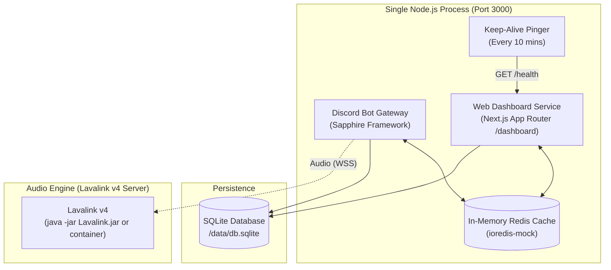

# 🚀 Deployment Guide (Self-Hosted)

Master-Bot runs as a consolidated, single-process Node.js runtime that hosts both the **Discord Bot Gateway** and the **Next.js Web Dashboard** on the exact same service and port (`PORT`, default `3000`).

Thanks to the built-in zero-binary **`ioredis-mock`** cache and **SQLite persistence**, Master-Bot boots up instantly on any machine or VPS with a simple `pnpm install` and `pnpm start` — without installing an external Redis binary or managing a separate database server.

---

## ⚡ Quick Architecture Overview



- **Single Console Window:** No child-process console popups or separate terminal windows.
- **Only Two Ports Required Across Entire System:**
  1. `PORT` (default `3000`): Unified web port shared by the Discord bot gateway, Next.js web dashboard (`/dashboard`), and health/keep-alive endpoints (`/health`).
  2. `LAVA_PORT` (default `2333`): The Lavalink audio server port (bot connects over WebSocket).
- **Zero Redis Server Process:** In-process in-memory `ioredis-mock` shares live state seamlessly between the bot and dashboard with zero separate binaries, processes, or ports.
- **SQLite Persistence Layer:** Single embedded file (`/data/db.sqlite`) preserves all guild configurations, roles, tickets, and playlists across restarts without requiring an external database server or port.

---

## 🎵 Audio Engine: External Lavalink

Master-Bot keeps the audio engine **separate** from the app process: the bot + dashboard run in one Node.js process, and music is served by a dedicated **Lavalink v4** server. Music commands require that server to be reachable.

Self-host Lavalink via Docker or a dedicated VPS (see [Music & Lavalink](Music)):

```env
LAVA_ENABLED=true
LAVA_EXTERNAL=true
LAVA_HOST=your-lavalink-host.com
LAVA_PORT=443
LAVA_PASS=youshallnotpass
LAVA_SECURE=true
```

> ⚠️ **Configuration:** whichever server you use must run with a Lavalink v4 config equivalent to **Master-Bot's `application.yml.example`**, which contains custom fixes (YouTube multi-client + OAuth via the `youtube-plugin`, Spotify → YouTube resolution via `lavasrc`, tuned streaming buffers) that are **broken in Lavalink's stock default config**. Do **not** use the `application.yml` from the Lavalink release as-is — see [Lavalink Configuration](Lavalink).
>
> ℹ️ **While your Lavalink server is offline,** set `LAVA_ENABLED=false` to run the bot and dashboard normally without music commands (no memory overhead, no crash risk).

---

## 📦 Hosting Strategy: Low-Cost VPS vs. Cloud PaaS

> [!IMPORTANT]
> **Why Cloud PaaS Hosting (Render, Railway, Fly.io, etc.) is Not Ideal:**
> 1. **Ephemeral File Storage**: PaaS containers wipe their local filesystem on every restart, redeploy, or dyno sleep cycle. This destroys SQLite persistence (`/data/db.sqlite`) unless you configure and pay for external managed database add-ons.
> 2. **Process & Memory Throttling**: Discord gateway bots require persistent, low-latency WebSocket connections. Free and entry-tier cloud containers frequently sleep or throttle after periods of inactivity, dropping Discord voice and gateway sessions.
> 3. **High Costs**: Running Node.js, Next.js App Router, and Lavalink audio requires 1.5–2 GB RAM. Cloud platforms charge steep monthly fees for this memory, whereas a dedicated VPS offers 4 GB RAM for as little as €3.79/month.
> 4. **Domain & OAuth Reputation**: Default cloud subdomains (e.g., `*.herokuapp.com`, `*.onrender.com`) frequently suffer from automated safe-browsing blocks, breaking Discord OAuth and YouTube authentication.
>
> **Recommendation**: Host Master-Bot on a **budget-friendly Linux VPS** (via Docker or PM2) for permanent file storage, fixed IP addresses, and 100% uptime. For users who specifically require cloud hosting, **Heroku** is supported as an optional alternative (see below).

---

## 🌐 Recommended Low-Cost VPS Providers & Hosts

The following reputable, low-cost VPS providers offer excellent price-to-performance, unthrottled networking, and full root access for Master-Bot:

| Provider | Starting Price | Specs / Recommended Plan | Key Advantages | Datacenter Regions |
| :--- | :--- | :--- | :--- | :--- |
| [**Hetzner Cloud**](https://www.hetzner.com/cloud) | **~€3.79 / mo** | **CX22** (2 vCPU, 4 GB RAM, 40 GB NVMe) | **Best overall value.** Exceptional CPU & NVMe speeds, 20 TB traffic. | Germany, Finland, USA |
| [**OVHcloud**](https://www.ovhcloud.com/en/vps/) | **~$4.20 / mo** | **Starter VPS** (1 vCPU, 2 GB RAM, 20 GB SSD) | Unmetered bandwidth, industry-leading anti-DDoS mitigation. | US, Canada, Europe, APAC |
| [**DigitalOcean**](https://www.digitalocean.com/) | **~$4.00 - $6.00 / mo** | **Basic Droplet** (1 vCPU, 1-2 GB RAM, 25 GB NVMe) | 1-Click Docker marketplace app, ultra-reliable network, easy snapshotting. | Global (NYC, SFO, AMS, SGP, etc.) |
| [**Linode (Akamai)**](https://www.linode.com/) | **~$5.00 / mo** | **Nanode 1GB / Shared 2GB** (1-2 vCPU, 1-2 GB RAM) | 99.99% network SLA, 24/7 technical support, simple management. | Global (11+ locations) |
| [**Vultr**](https://www.vultr.com/) | **~$3.50 - $5.00 / mo** | **Cloud Compute** (1 vCPU, 1-2 GB RAM, 25-32 GB NVMe) | Over 32+ global datacenter locations, instant hourly provisioning. | Global (32+ cities) |
| [**Contabo**](https://contabo.com/) | **~$5.50 / mo** | **Cloud VPS S** (4 vCPU, 8 GB RAM, 50 GB NVMe) | Maximum RAM and vCPU per dollar. Ideal for bot + dashboard + Lavalink all in one. | US, EU, UK, Asia, Australia |

### 💡 VPS Sizing Guide:
- **Bot + Web Dashboard only (SQLite + ioredis-mock):** 1 vCPU, 1 GB RAM (e.g., DigitalOcean $4, Vultr $3.50).
- **Bot + Dashboard + External Lavalink Audio Engine:** 2 vCPU, 2–4 GB RAM (e.g., Hetzner CX22, OVH Starter, Contabo VPS S).

---

## 1. 🐳 VPS Deployment via Docker Compose (Recommended)

Docker Compose provides the cleanest, most isolated setup on any Linux VPS (Ubuntu/Debian):

### Step 1: Install Docker & Docker Compose on your VPS
```bash
# Update and install Docker
sudo apt update && sudo apt install -y docker.io docker-compose-v2
sudo systemctl enable --now docker
```

### Step 2: Clone Master-Bot & Configure
```bash
git clone https://github.com/galnir/Master-Bot.git
cd Master-Bot

# Copy environment template and fill in your credentials
cp .env.example .env
nano .env
```

### Step 3: Launch Containers
```bash
docker compose --env-file docker.env up -d --build
```

- Docker runs **Master-Bot** (`apps/bot` + `apps/dashboard`) on port `3000` and a dedicated **Lavalink v4** container on port `2333`.
- SQLite persists in the volume `/data` (`/data/db.sqlite`), surviving all container restarts and updates.

---

## 2. 🖥️ VPS Deployment via Node.js & PM2 (Native Performance)

If you prefer running directly on Ubuntu/Debian without Docker:

### Step 1: Install Node.js 20+ and pnpm
```bash
# Install Node.js 20 LTS via NodeSource
curl -fsSL https://deb.nodesource.com/setup_20.x | sudo -E bash -
sudo apt install -y nodejs git

# Install pnpm and PM2 process supervisor
sudo npm install -g pnpm pm2
```

### Step 2: Install and Build Master-Bot
```bash
git clone https://github.com/galnir/Master-Bot.git
cd Master-Bot
cp .env.example .env
nano .env

# Install dependencies and compile monorepo
pnpm install
pnpm build
```

### Step 3: Start with PM2
```bash
pm2 start pnpm --name "master-bot" -- start
pm2 save
pm2 startup
```

### Step 4: Optional SSL Reverse Proxy (Caddy)
To expose your dashboard securely at `https://your-domain.com`:
```bash
sudo apt install -y debian-keyring debian-archive-keyring apt-transport-https
curl -1sLf 'https://dl.cloudsmith.io/public/caddy/stable/gpg.key' | sudo gpg --dearmor -o /usr/share/keyrings/caddy-stable-archive-keyring.gpg
curl -1sLf 'https://dl.cloudsmith.io/public/caddy/stable/debian.deb.txt' | sudo tee /etc/apt/sources.list.d/caddy-stable.list
sudo apt update && sudo apt install -y caddy
```
Edit `/etc/caddy/Caddyfile`:
```caddy
your-domain.com {
    reverse_proxy localhost:3000
}
```
Reload Caddy: `sudo systemctl reload caddy`. Automatic Let's Encrypt SSL certificates are provisioned instantly.

---

## 3. ☁️ Optional Cloud Hosting: Heroku

For users who specifically prefer managed cloud hosting, Master-Bot can be deployed to **Heroku**.

> [!WARNING]
> **Heroku Considerations:**
> - **Dyno Sleep:** Eco/Basic dynos sleep after 30 minutes of inactivity unless pinged. Set `KEEP_ALIVE_ENABLED=true` in your Heroku settings.
> - **Ephemeral Storage:** Heroku dynos reset their filesystems upon restart. If you use Heroku, configure an external PostgreSQL database via `DB_URI` (such as the Heroku Postgres add-on).
> - **Lavalink Audio:** Due to memory constraints on 512 MB dynos, do not run embedded Lavalink on Heroku. Set `LAVA_EXTERNAL=true` and point to an external Lavalink audio host.

### Heroku Setup Steps:
1. **Create Heroku App:**
   ```bash
   heroku create my-master-bot
   ```
2. **Add Node.js Buildpack:**
   ```bash
   heroku buildpacks:set heroku/nodejs
   ```
3. **Provision PostgreSQL Database (Required for persistent storage on Heroku):**
   ```bash
   heroku addons:create heroku-postgresql:essential-0
   ```
4. **Configure Environment Variables:**
   ```bash
   heroku config:set DISCORD_TOKEN="your-discord-token" \
     DISCORD_CLIENT_ID="your-client-id" \
     DISCORD_CLIENT_SECRET="your-client-secret" \
     NEXTAUTH_SECRET="random-32-char-secret" \
     NEXTAUTH_URL="https://my-master-bot.herokuapp.com" \
     PUBLIC_URL="https://my-master-bot.herokuapp.com" \
     LAVA_EXTERNAL="true" \
     LAVA_HOST="your-external-lavalink.com" \
     LAVA_PORT="443" \
     LAVA_PASS="youshallnotpass" \
     LAVA_SECURE="true" \
     KEEP_ALIVE_ENABLED="true"
   ```
5. **Deploy:**
   ```bash
   git push heroku main
   ```

---

## 💾 Backups & Maintenance

The SQLite database lives at `/data/db.sqlite`.

To perform a hot backup while Master-Bot is running on your VPS:

```bash
sqlite3 /data/db.sqlite ".backup 'backup-$(date +%F).db'"
```

Schedule this via a daily cron job (`crontab -e`):
```cron
0 3 * * * sqlite3 /data/db.sqlite ".backup '/path/to/backups/backup-\$(date +\%F).db'"
```

---

## 🔐 Production Environment Checklist

| Variable | Required | Description |
| :--- | :---: | :--- |
| `DISCORD_TOKEN` | **Yes** | Bot authentication token from Discord Developer Portal. |
| `DISCORD_CLIENT_ID` | **Yes** | Discord Application Client ID. |
| `DISCORD_CLIENT_SECRET` | **Yes** | Discord Application Client Secret. |
| `NEXTAUTH_SECRET` | **Yes** | 32+ character random string to sign auth session cookies. |
| `PUBLIC_URL` | **Yes** | The public HTTPS URL of your application dashboard. |
| `INTERNAL_URL` | **Yes** | Host/port binding (`0.0.0.0:3000`) ensuring the service listens on all network interfaces. |
| `DB_URI` | No | Database connection URI string (default `file:/data/db.sqlite` for SQLite; PostgreSQL supported). |
| `PORT` | No | Listening port for web dashboard and health check (default: `3000`). |
| `KEEP_ALIVE_ENABLED` | No | Set to `true` to enable background HTTP pings to keep the process warm. |
| `LAVA_ENABLED` | No | Set to `true` to enable the audio engine (Lavalink v4). |
| `LAVA_EXTERNAL` | No | Set to `true` when connecting to an external Lavalink server. |
| `LAVA_HOST` | No | The Lavalink hostname / IP. |
| `LAVA_PORT` | No | Lavalink port (default `2333`; `443` for TLS external instances). |
| `LAVA_PASS` | No | Lavalink password (must match `application.yml`). |
| `LAVA_SECURE` | No | Set to `true` for TLS (WSS) remote instances. |
| `YOUTUBE_CLIENT_ID` | No | Google Cloud OAuth Client ID for YouTube stream alerts and authentication. |
| `YOUTUBE_CLIENT_SECRET` | No | Google Cloud OAuth Client Secret for YouTube stream alerts. |
| `YOUTUBE_REFRESH_TOKEN` | No | YouTube OAuth 2.0 refresh token for stream alerts and Lavalink. |