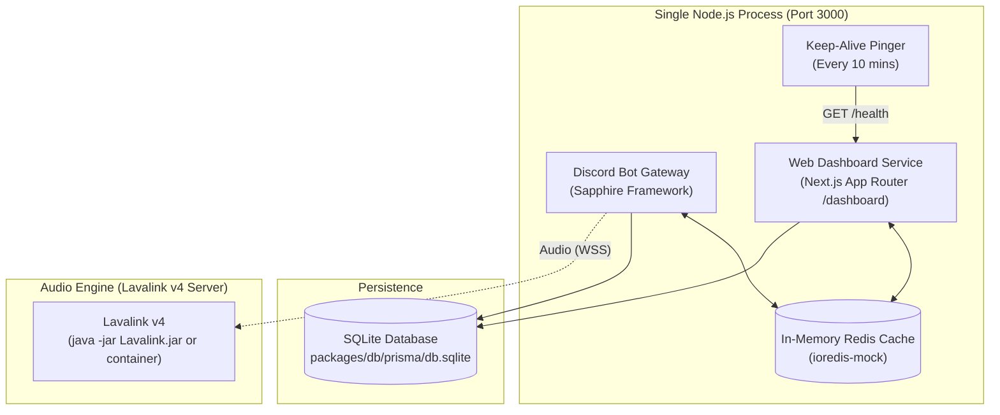

# 🚀 Deployment Guide (Self-Hosted)

Master-Bot runs as a consolidated, single-process Node.js runtime that hosts both the **Discord Bot Gateway** and the **Next.js Web Dashboard** on the exact same service and port (`PORT`, default `3000`).

Thanks to the built-in zero-binary **`ioredis-mock`** cache and **SQLite persistence**, Master-Bot boots up instantly on any machine or VPS with a simple `pnpm install` and `pnpm start` — without installing an external Redis binary or managing a separate database server.

---

## ⚡ Quick Architecture Overview



- **Single Console Window:** No child-process console popups or separate terminal windows.
- **Only Two Ports Required Across Entire System:**
  1. `PORT` (default `3000`): Unified web port shared by the Discord bot gateway, Next.js web dashboard (`/dashboard`), and health/keep-alive endpoints (`/health`).
  2. `LAVA_PORT` (default `2333`): The Lavalink audio server port (bot connects over WebSocket).
- **Zero Redis Server Process:** In-process in-memory `ioredis-mock` shares live state seamlessly between the bot and dashboard with zero separate binaries, processes, or ports.
- **SQLite Persistence Layer:** Single embedded file (`db.sqlite`) preserves all guild configurations, roles, tickets, and playlists across restarts without requiring an external database server or port.

---

## 🎵 Audio Engine: External Lavalink

Master-Bot keeps the audio engine **separate** from the app process: the bot + dashboard run in one Node.js process, and music is served by a dedicated **Lavalink v4** server. Music commands require that server to be reachable.

Self-host Lavalink via Docker or a dedicated VPS (see [Music & Lavalink](Music.md)):

```env
LAVA_ENABLED=true
LAVA_EXTERNAL=true
LAVA_HOST=your-lavalink-host.com
LAVA_PORT=443
LAVA_PASS=youshallnotpass
LAVA_SECURE=true
```

> ⚠️ **Configuration:** whichever server you use must run with a Lavalink v4 config equivalent to **Master-Bot's `application.yml.example`**, which contains custom fixes (YouTube multi-client + OAuth via the `youtube-plugin`, Spotify → YouTube resolution via `lavasrc`, tuned streaming buffers) that are **broken in Lavalink's stock default config**. Do **not** use the `application.yml` from the Lavalink release as-is — see [Lavalink Configuration](Lavalink.md).
>
> ℹ️ **While your Lavalink server is offline,** set `LAVA_ENABLED=false` to run the bot and dashboard normally without music commands (no memory overhead, no crash risk).

---

## 📦 Hosting Options

> 💡 **Why self-host only?** Master-Bot deliberately targets local / Docker / VPS hosting and does **not** document a managed cloud path.
>
> 1. **External API allowlists** — the OAuth/login flows the dashboard depends on (Discord, Google) are effectively restricted by browser-safe-browsing and OAuth allowlists to a handful of well-known domains. Freshly generated cloud subdomains (e.g. Heroku's random-suffix `*-<id>.herokuapp.com`, free DDNS names) get flagged as "dangerous sites" and **blocked**, breaking the dashboard login — the same blocklists that hit Lavalink's surrounding APIs. Only top-tier/self-owned domains escape it.
> 2. **Pricing** — the paid tiers the remaining providers offer (e.g. Heroku Eco is a flat **$5/month**) don't make sense for an open-source bot with no revenue stream.
>
> Combined, that makes managed cloud hosting a poor fit — so this guide covers **free, self-controlled hosting only**.

| Platform | Notes |
| :--- | :--- |
| **Docker / VPS** | Recommended. `docker-compose.yml` runs the bot + dashboard and Lavalink in dedicated containers with persistent storage. |
| **Local / bare VPS** | `pnpm install && pnpm build && pnpm start` on any Node.js 20+ machine; Lavalink started separately with Java 17+. |

### 🌐 Recommended Low-Cost Compatible VPS Providers

For high uptime, low latency, and dedicated unshared IP routing, the following budget-friendly VPS providers are recommended:

| Provider | Starting Price | Key Benefits | Recommended Plan |
| :--- | :--- | :--- | :--- |
| [**Hetzner Cloud**](https://www.hetzner.com/cloud) | ~€3.79 / mo | Top price-to-performance, fast NVMe, EU/US locations | CX22 (2 vCPU, 4 GB RAM) / CAX11 |
| [**OVHcloud**](https://www.ovhcloud.com/en/vps/) | ~$4.20 / mo | Unmetered bandwidth, anti-DDoS, global datacenters | Starter / Value VPS |
| [**DigitalOcean**](https://www.digitalocean.com/) | ~$4.00 - $6.00 / mo | 1-Click Docker droplets, intuitive management | Basic Droplet (1-2 GB RAM) |
| [**Linode (Akamai)**](https://www.linode.com/) | ~$5.00 / mo | High network reliability, 24/7 support | Nanode 1GB / Shared 2GB |
| [**Vultr**](https://www.vultr.com/) | ~$3.50 - $5.00 / mo | 30+ worldwide datacenters, fast deployment | Cloud Compute (1-2 GB RAM) |

> 💡 **Sizing Recommendation:**
> - **Bot + Dashboard only:** 1 vCPU, 1 GB RAM.
> - **Bot + Dashboard + Lavalink Audio Engine:** 2 vCPU, 2-4 GB RAM (e.g. Hetzner CX22 or OVH Starter).

---

## 1. 🐳 Docker / VPS Self-Hosting

Run Master-Bot on your own server/VPS for full control and persistent storage:

```bash
cp .env.example .env          # fill in your credentials
docker compose --env-file docker.env up -d --build
```

- `docker-compose.yml` starts **Master-Bot** (bot + dashboard on port `3000`) and a dedicated **Lavalink v4** container, wired together through the `lavalink` service name (`LAVA_HOST=lavalink` in `docker.env`).
- SQLite persists in the `sqlite-data` volume (`/Master-Bot/packages/db/prisma`), so restarts do not lose data.
- See [Docker Deployment](../README.md#-docker-deployment) for the container requirements.

---

## 2. 🖥️ Local / VPS Production Launch

On a local machine or VPS (Ubuntu, Debian, macOS, Windows):

```bash
pnpm install   # Installs dependencies & pushes SQLite database schema
pnpm build     # Builds Next.js dashboard and compiles bot
pnpm start     # Starts consolidated bot + dashboard in a single console window
```

For audio locally, start a Lavalink v4 server (Java 17+) in the workspace root after copying the config: `cp application.yml.example application.yml && java -jar Lavalink.jar` — see [Music & Lavalink](Music.md).

Once running:
- **Web Dashboard:** [http://localhost:3000/dashboard](http://localhost:3000/dashboard)
- **Health Check:** [http://localhost:3000/health](http://localhost:3000/health)

---

## 💾 Backups

The SQLite database lives at `packages/db/prisma/db.sqlite`.

Stop the app (or use the SQLite online backup API) and copy the file:

```bash
sqlite3 packages/db/prisma/db.sqlite ".backup 'backup-$(date +%F).db'"
```

Schedule this regularly (e.g. a daily cron) on VPS deployments.

---

## 🔐 Production Environment Checklist

| Variable | Required | Description |
| :--- | :---: | :--- |
| `DISCORD_TOKEN` | **Yes** | Bot authentication token from Discord Developer Portal. |
| `DISCORD_CLIENT_ID` | **Yes** | Discord Application Client ID. |
| `DISCORD_CLIENT_SECRET` | **Yes** | Discord Application Client Secret. |
| `NEXTAUTH_SECRET` | **Yes** | 32+ character random string to sign auth session cookies. |
| `NEXTAUTH_URL` | **Yes** | The public HTTPS URL of your application dashboard. |
| `PUBLIC_URL` | **Yes** | The public HTTPS URL used for the `/dashboard` command invite link. |
| `DATABASE_URL` | No | SQLite file path (default `file:./db.sqlite`). |
| `PORT` | No | Listening port for web dashboard and health check (default: `3000`). |
| `KEEP_ALIVE_ENABLED` | No | Set to `true` to enable background HTTP pings to keep the process warm. |
| `LAVA_ENABLED` | No | Set to `true` to enable the audio engine (external Lavalink). |
| `LAVA_EXTERNAL` | No | `true` when connecting to an external Lavalink server. |
| `LAVA_HOST` | No | The external Lavalink hostname / IP. |
| `LAVA_PORT` | No | Lavalink port (default `2333`; `443` for TLS external instances). |
| `LAVA_PASS` | No | Lavalink password (must match `application.yml`). |
| `LAVA_SECURE` | No | `true` for TLS (WSS) external instances. |