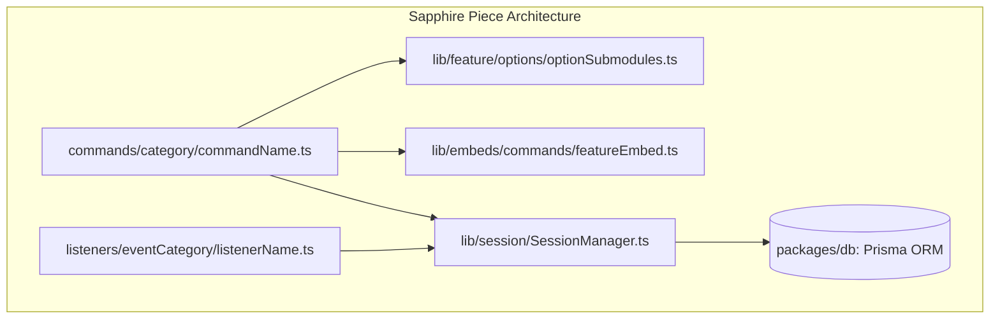
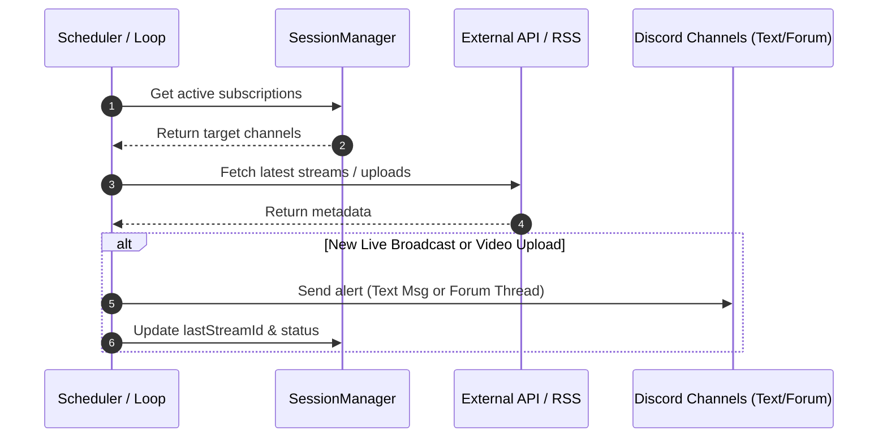

# 🛠️ Developer Guide: Building Commands, Listeners & Features

Welcome to the **Master-Bot Developer Guide**! This comprehensive manual details the architecture, coding standards, and step-by-step processes for extending Master-Bot with new slash commands, event listeners, background monitors, and full-stack features.

---

## 📑 Table of Contents
1. [Monorepo Architecture & Code Standards](#-monorepo-architecture--code-standards)
2. [Building a New Slash Command](#-building-a-new-slash-command)
3. [Modular Option Submodules Pattern](#-modular-option-submodules-pattern)
4. [Standardized Rich Embeds](#-standardized-rich-embeds)
5. [Building an Event Listener](#-building-an-event-listener)
6. [Creating Features & Background Monitors](#-creating-features--background-monitors)
7. [Database & State Management](#-database--state-management)
8. [Writing Unit Tests with Vitest](#-writing-unit-tests-with-vitest)
9. [Related Guides](#-related-guides)

---

## 🏗️ Monorepo Architecture & Code Standards

Master-Bot is organized as a unified **Turborepo** workspace powered by **pnpm**:

```text
Master-Bot/
├── apps/
│   ├── bot/                 # Discord.js v14 & Sapphire Framework Bot Gateway
│   └── dashboard/           # Next.js 15 App Router & tRPC v11 Web Dashboard
├── packages/
│   ├── auth/                # Shared Discord OAuth configuration (NextAuth.js)
│   ├── config/              # Shared ESLint and Tailwind tooling
│   └── db/                  # Shared Prisma ORM client & ioredis-mock fallback
├── tests/unit/              # Vitest monorepo testing suite (@helix-origin/vitest-suite)
└── wiki/                    # Complete project documentation
```

### 📐 Mandatory Coding Standards

Before contributing code, ensure you adhere to our unified project conventions:

1. **CamelCase File Naming**: All TypeScript source and test files must use `camelCase.ts` (e.g. `youtubeAPI.ts`, `streamAlerts.ts`, `youtubeAlerts.test.ts`).
2. **Zero `index.ts` Files in `apps/bot` Subdirectories**: The Sapphire Framework piece loader automatically scans directory trees for runnable pieces. Naming files `index.ts` inside subdirectories causes conflicts; use `registry.ts` or `optionRegistry.ts` for modules.
3. **Submodules in `lib/`**: Complex command options, API helpers, and handlers must be modularized into discrete files under `src/lib/<feature>/` rather than stuffed into a monolithic command file.
4. **Typed Imports & Exports**: Use explicit type imports (`import type { ... } from '...'`) to ensure clean compilation under TypeScript with zero type pollution.



---

## ⚡ Building a New Slash Command

Commands in Master-Bot are built on the **Sapphire Framework** and **discord.js v14**.

### 1. File Location
Create your command file under `apps/bot/src/commands/<category>/<commandName>.ts`:
- Music commands go to `apps/bot/src/commands/music/`
- Moderation commands go to `apps/bot/src/commands/moderation/`
- Fun commands go to `apps/bot/src/commands/fun/`
- General/Utility commands go to `apps/bot/src/commands/other/`

### 2. Basic Command Boilerplate

```typescript
import { ApplyOptions } from '@sapphire/decorators';
import { Command } from '@sapphire/framework';
import type { ChatInputCommandInteraction } from 'discord.js';

@ApplyOptions<Command.Options>({
	name: 'example',
	description: 'An example slash command demonstrating standard architecture',
	preconditions: ['isCommandDisabled']
})
export class ExampleCommand extends Command {
	public override registerApplicationCommands(registry: Command.Registry) {
		registry.registerChatInputCommand(builder =>
			builder
				.setName(this.name)
				.setDescription(this.description)
				.addStringOption(option =>
					option
						.setName('message')
						.setDescription('Message to echo')
						.setRequired(false)
				)
		);
	}

	public override async chatInputRun(interaction: ChatInputCommandInteraction) {
		const message = interaction.options.getString('message') || 'Hello World!';

		return interaction.reply({
			content: `Echo: **${message}**`,
			ephemeral: true
		});
	}
}
```

> [!NOTE]
> Always include the `isCommandDisabled` precondition. This enables guild administrators to disable or enable individual slash commands from the dashboard or via configuration.

---

## 🧩 Modular Option Submodules Pattern

To comply with Discord's command limits and keep commands maintainable, we consolidate related subcommands into a single command with **options**, splitting individual handlers into discrete files in `src/lib/<feature>/options/`.

### 1. Directory Structure

```text
apps/bot/src/lib/custom/options/
├── registry.ts           # Central option registry and execution router
├── types.ts              # Option interfaces and context types
├── firstOption.ts        # First option implementation
└── secondOption.ts       # Second option implementation
```

### 2. Defining Option Handlers

In `apps/bot/src/lib/custom/options/types.ts`:
```typescript
import type { ChatInputCommandInteraction } from 'discord.js';

export interface CustomOptionContext {
	interaction: ChatInputCommandInteraction;
	value?: string | null;
}

export interface CustomOptionHandler {
	name: string;
	description: string;
	execute(context: CustomOptionContext): Promise<unknown>;
}
```

In `apps/bot/src/lib/custom/options/firstOption.ts`:
```typescript
import type { CustomOptionHandler, CustomOptionContext } from './types';

export const firstOption: CustomOptionHandler = {
	name: 'first',
	description: 'Executes the first operation',
	async execute({ interaction, value }: CustomOptionContext) {
		return interaction.reply({
			content: `First option executed with value: ${value ?? 'None'}`,
			ephemeral: true
		});
	}
};
```

In `apps/bot/src/lib/custom/options/registry.ts`:
```typescript
import type { CustomOptionHandler, CustomOptionContext } from './types';
import { firstOption } from './firstOption';

export const customOptions: Record<string, CustomOptionHandler> = {
	first: firstOption
};

export async function executeCustomOption(
	optionName: string,
	context: CustomOptionContext
): Promise<unknown> {
	const handler = customOptions[optionName];
	if (!handler) {
		return context.interaction.reply({
			content: `:x: Unknown option \`${optionName}\`.`,
			ephemeral: true
		});
	}
	return handler.execute(context);
}
```

---

## 🎨 Standardized Rich Embeds

All embeds should be generated through factory functions located in `apps/bot/src/lib/embeds/` to preserve unified branding, colors, and timestamps across the bot.

```typescript
import { EmbedBuilder } from 'discord.js';
import type { User } from 'discord.js';

export interface AlertEmbedOptions {
	title: string;
	description: string;
	user?: User;
	url?: string;
}

export function createAlertEmbed(options: AlertEmbedOptions): EmbedBuilder {
	const embed = new EmbedBuilder()
		.setColor('#5865F2') // Unified Discord Blurple branding
		.setTitle(options.title)
		.setDescription(options.description)
		.setTimestamp();

	if (options.url) embed.setURL(options.url);
	if (options.user) {
		embed.setFooter({
			text: `Requested by ${options.user.username}`,
			iconURL: options.user.displayAvatarURL()
		});
	}

	return embed;
}
```

---

## 👂 Building an Event Listener

Listeners react to Discord gateway events, interaction events, or internal Sapphire events.

### 1. File Location
Create your listener under `apps/bot/src/listeners/<category>/<listenerName>.ts`.

### 2. Example Listener Implementation

```typescript
import { ApplyOptions } from '@sapphire/decorators';
import { Listener, Events } from '@sapphire/framework';
import type { GuildMember } from 'discord.js';
import Logger from '../../lib/logger';

@ApplyOptions<Listener.Options>({
	event: Events.GuildMemberAdd
})
export class MemberJoinListener extends Listener<typeof Events.GuildMemberAdd> {
	public override async run(member: GuildMember) {
		Logger.info(`[MemberJoin] User ${member.user.tag} joined ${member.guild.name}`);

		const welcomeConfig = member.client.session.guilds.get(member.guild.id)?.welcome;
		if (!welcomeConfig?.enabled || !welcomeConfig.channelId) return;

		const channel = member.guild.channels.cache.get(welcomeConfig.channelId);
		if (channel && 'send' in channel) {
			const formattedMessage = (welcomeConfig.message || 'Welcome {user} to {server}!')
				.replace('{user}', `<@${member.id}>`)
				.replace('{server}', member.guild.name)
				.replace('{memberCount}', String(member.guild.memberCount));

			await channel.send({ content: formattedMessage });
		}
	}
}
```

---

## 🔄 Creating Features & Background Monitors

Master-Bot features background pollers (such as YouTube and Twitch stream alerts, and reminder schedulers).



### Best Practices for Polling Services:
1. **Concurrency Control**: Use an `isRunning` lock boolean to prevent overlapping execution cycles if an API response is slow.
2. **Quota & Rate-Limit Preservation**: Utilize fast, free XML feeds (e.g. YouTube RSS feeds) for routine checks, saving API keys or OAuth tokens for enrichment when new items appear.
3. **Forum Channel Routing**: Always inspect `channel.type`:
   - If `ChannelType.GuildForum`, create a thread with `forum.threads.create({ name, message })`.
   - If standard `TextChannel`, send directly via `channel.send({ content, embeds })`.
4. **Lifecycle Hooks**: Export `startMonitor(client)` and `stopMonitor()` functions so processes are gracefully cleaned up during shutdown.

---

## 🗄️ Database & State Management

Master-Bot uses a dual database and caching tier:
- **`DB_URI`**: Automatically resolves connection strings. Defaults to zero-ops SQLite (`file:/data/database.db`) with production scaling to PostgreSQL (`postgresql://...`).
- **Prisma Client**: Shared via `@master-bot/db`. Run `pnpm db:generate` to regenerate types when schemas change.
- **`SessionManager` (`client.session`)**: Provides instantaneous in-memory caching and Redis synchronization (`ioredis-mock` or external Redis).

```typescript
// Accessing database models via Prisma:
import prisma from '@master-bot/db';

// Accessing live session state:
const guildData = client.session.guilds.get(guildId);
```

---

## 🧪 Writing Unit Tests with Vitest

Master-Bot uses `@helix-origin/vitest-suite` to provide mocks for Discord clients, interactions, and Redis.

### 1. Writing a Test Spec
Create `tests/unit/<featureName>.test.ts`:

```typescript
import { describe, it, expect, beforeEach } from 'vitest';
import { createMockClient } from '@helix-origin/vitest-suite';

describe('Custom Feature Suite', () => {
	let mockClient: ReturnType<typeof createMockClient>;

	beforeEach(() => {
		mockClient = createMockClient();
	});

	it('should perform expected validation', () => {
		expect(mockClient).toBeDefined();
	});
});
```

### 2. Validation Quality Gates
Always run the complete quality pipeline before submitting a pull request:

```bash
# 1. Run unit test suite
pnpm test

# 2. Type-check all workspace packages
pnpm type-check

# 3. Verify linting and workspace boundary rules
pnpm lint
```

---

## 🔗 Related Guides
- [Home](Home) — Return to wiki main page
- [Architecture](Architecture) — Deep dive into system architecture and data flows
- [Commands Reference](Commands) — Full breakdown of existing slash commands
- [Stream Alerts](Reminders-and-Twitch) — YouTube and Twitch notification configuration
- [Deployment](Deployment) — Production self-hosting and deployment guide

---
[Home](Home) • [Documentation Index](Home) • [GitHub Repository](https://github.com/galnir/Master-Bot)
