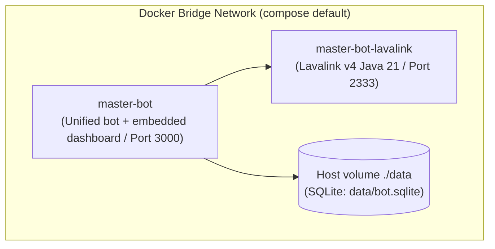

# 🐳 Docker Compose Deployment Guide

Deploy the Master-Bot Docker ecosystem (**master-bot** app + **Lavalink v4** audio engine) locally or on a server using Docker. The dashboard is embedded in the bot process — no separate dashboard container, PostgreSQL, or Redis required.

---

## 🏗️ Docker Ecosystem Architecture



---

## 🚀 Quick Launch Steps

1. **Clone Repository & Prepare Environment**:
   ```bash
   git clone https://github.com/galnir/Master-Bot.git
   cd Master-Bot
   cp .env.example .env
   nano .env
   ```

2. **Lavalink config**: copy `application.yml.example` to `application.yml` (mounted into the Lavalink container).

3. **Launch the Stack**:
   ```bash
   docker compose --env-file docker.env up -d --build
   ```
   The `./data` and `./logs` host folders are mounted into the container — the SQLite database (auto-created) survives restarts there.

4. **Check Container Status**:
   ```bash
   docker compose ps
   ```

5. **View Live Logs**:
   ```bash
   # All containers
   docker compose logs -f

   # Discord Bot (unified dashboard + bot logs)
   docker compose logs -f master-bot
   ```

6. **Access the Dashboard**: `http://localhost:3000/dashboard`

7. **Stop Stack**:
   ```bash
   docker compose down
   ```