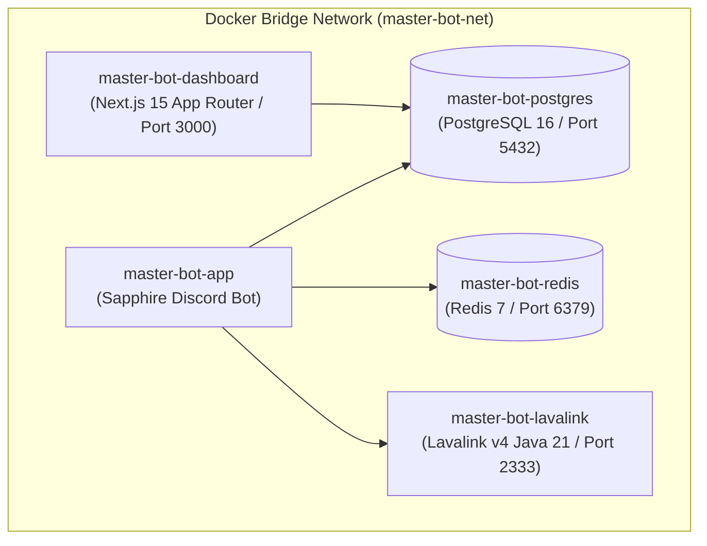

# 🐳 Docker Compose Deployment Guide

Deploy the entire 5-container Master-Bot ecosystem (Bot, Dashboard, PostgreSQL, Redis, Lavalink v4) locally or on a server using Docker.

---

## 🏗️ Docker Ecosystem Architecture



---

## 🚀 Quick Launch Steps

1. **Clone Repository & Prepare Environment**:
   ```bash
   git clone https://github.com/galnir/Master-Bot.git
   cd Master-Bot
   cp docker.env.example docker.env
   nano docker.env
   ```

2. **Launch All 5 Containers**:
   ```bash
   docker compose --env-file docker.env up -d --build
   ```

3. **Check Container Status**:
   ```bash
   docker compose ps
   ```

4. **View Live Logs**:
   ```bash
   # All containers
   docker compose logs -f

   # Discord Bot only
   docker compose logs -f bot

   # Dashboard only
   docker compose logs -f dashboard
   ```

5. **Stop Stack**:
   ```bash
   docker compose down
   ```
