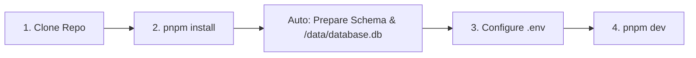

# 🚀 Getting Started with Master-Bot

This guide walks you through system prerequisites, installation, environment configuration, and launching **Master-Bot** for local development and self-hosting.

---

## 📑 Table of Contents
1. [Prerequisites](#-prerequisites)
2. [Step-by-Step Installation](#-step-by-step-installation)
3. [Discord Application Setup](#-discord-application-setup)
4. [Environment Configuration](#-environment-configuration)
5. [Launching the Stack](#-launching-the-stack)
6. [Testing & Quality Verification](#-testing--quality-verification)
7. [Where Data Lives](#-where-data-lives)
8. [Related Guides](#-related-guides)

---

## ✅ Prerequisites

Ensure your host environment meets the following specifications:

| Requirement | Supported Version | Purpose |
| :--- | :--- | :--- |
| **Node.js** | `>= 20.0.0` (v24 LTS recommended) | JavaScript/TypeScript runtime for bot and dashboard. |
| **pnpm** | `>= 8.0.0` (repository pins `pnpm@8.6.7`) | Fast, disk-efficient package manager. |
| **Java** | `Java 17+` (Adoptium / Temurin 21 recommended) | Only required if running a local Lavalink v4 audio engine. |
| **Discord App** | Developer Portal Account | Bot token, client ID, and secret. |

> [!TIP]
> Master-Bot operates with zero external database dependencies for local setups. SQLite persistence and in-memory Redis caching (`ioredis-mock`) are initialized automatically.

---

## 📦 Step-by-Step Installation



### 1. Clone the repository
```bash
git clone https://github.com/galnir/Master-Bot.git
cd Master-Bot
```

### 2. Install dependencies & initialize database
```bash
pnpm install
```

`pnpm install` automatically runs the database bootstrap hook:
- Compiles the Prisma schema for SQLite.
- Creates the `/data` directory if missing.
- Pushes the database schema directly to `/data/database.db`.

---

## 🔐 Discord Application Setup

1. Open the [Discord Developer Portal](https://discord.com/developers/applications) and click **New Application**.
2. Under the **Bot** tab:
   - Click **Reset Token** and save your `DISCORD_TOKEN`.
   - Enable **Privileged Gateway Intents**:
     - ✅ **Presence Intent**
     - ✅ **Server Members Intent**
     - ✅ **Message Content Intent**
3. Under the **OAuth2 → General** tab:
   - Copy your **Client ID** (`DISCORD_CLIENT_ID`) and **Client Secret** (`DISCORD_CLIENT_SECRET`).
   - Add your redirect callback: `https://your-domain.com/api/auth/callback/discord` (or `http://localhost:3000/api/auth/callback/discord` for local dev).
4. Under **OAuth2 → URL Generator**:
   - Select scopes: `bot` and `applications.commands`.
   - Select permissions: `Administrator` (recommended for full feature suite, or standard moderation and voice permissions).

---

## ⚙️ Environment Configuration

Copy `.env.example` to `.env`:

```bash
cp .env.example .env
```

Populate your mandatory configuration settings:

```env
# Database (URI string: SQLite stored at /data/database.db, or external PostgreSQL)
DB_URI="file:/data/database.db"

# Dashboard URLs
# INTERNAL_URL binds to 0.0.0.0:3000 to listen on all interfaces, allowing public connections
INTERNAL_URL="0.0.0.0:3000"
PUBLIC_URL="http://localhost:3000"
DISCORD_CALLBACK_URL="https://discord.com/api/oauth2/authorize?client_id=YOUR_CLIENT_ID&permissions=8&scope=bot%20applications.commands"

# Discord Bot Credentials
DISCORD_TOKEN="your-discord-bot-token"
DISCORD_CLIENT_ID="your-client-id"
DISCORD_CLIENT_SECRET="your-client-secret"
NEXTAUTH_SECRET="your-random-32-char-secret"

# Audio & Lavalink
LAVA_ENABLED=true
LAVA_EXTERNAL=false
```

---

## ▶️ Launching the Stack

### Development Mode
```bash
pnpm dev
```
Starts the bot gateway, Next.js web dashboard (`http://localhost:3000/dashboard`), and in-memory cache in a single consolidated terminal window.

### Production Mode
```bash
# 1. Build Next.js dashboard and compile bot TypeScript
pnpm build

# 2. Launch production server
pnpm start
```

---

## 🧪 Testing & Quality Verification

Master-Bot features automated unit testing powered by `@helix-origin/vitest-suite`:

```bash
# Run all unit tests:
pnpm test

# Verify TypeScript compilation across monorepo:
pnpm type-check

# Run linter and boundary validation:
pnpm lint
```

---

## 🗃️ Where Data Lives

- **Database**: `/data/database.db` — Single persistent SQLite database file (or external PostgreSQL database).
- **In-Memory Cache**: `ioredis-mock` runs in-process; connects to external Redis if `REDIS_URL` is set.
- **Log Files**: `logs/` — Process logs for debugging and telemetry.

---

## 🔗 Related Guides
- [Home](Home) — Return to wiki main page
- [Configuration Reference](Configuration) — Detailed explanation of all `.env` options
- [Architecture](Architecture) — System design and data layer deep dive
- [Commands Reference](Commands) — Slash commands and `/set` options
- [Developer Guide](Development-Guide) — How to add new commands and listeners
- [Deployment](Deployment) — Production VPS and Docker deployment guide

---
[Home](Home) • [Documentation Index](Home) • [GitHub Repository](https://github.com/galnir/Master-Bot)