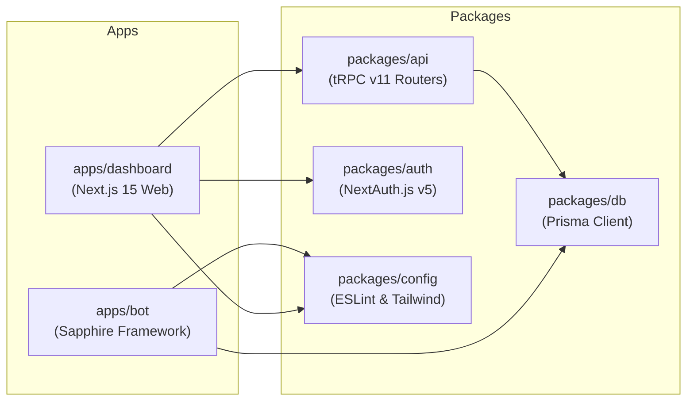

# Welcome to the Master-Bot Wiki

**Master-Bot** is a modern, production-grade Discord Bot and Next.js Web Dashboard built with **TypeScript**, **Sapphire Framework**, **tRPC v11**, **Prisma ORM**, **Next.js 15**, **Redis**, and **Lavalink v4**.

---

## 📖 Wiki Navigation

- **[Setup & Deployment Guide](Setup-and-Deployment.md)**: Step-by-step local development setup, unified launcher instructions (`pnpm dev` / `pnpm start`), and Docker Compose deployment.
- **[Cloud & Platform Deployment Guide](Cloud-Hosting.md)**: Production deployment instructions for **Render**, **Railway**, **Fly.io**, **Heroku**, **Koyeb**, **Northflank**, **Linux VPS**, and **Pterodactyl**.
- **[Web Dashboard Architecture](Dashboard-Architecture.md)**: Next.js 15 App Router architecture, 9 feature studios, tRPC v11 procedures, and glassmorphism command center.
- **[Lavalink v4 Audio Engine](Lavalink.md)**: In-depth Lavalink v4 configuration, plugin management (`youtube-plugin`, `lavasrc-plugin`), remote signature deciphering, and automatic YouTube OAuth device authorization.
- **[API Keys & Credentials](API-Keys.md)**: Guide on acquiring and setting up required and optional credentials (Discord, Twitch, Klipy, IGDB, NewsAPI, YouTube).
- **[Commands Reference](Commands-Reference.md)**: Full reference for all available slash commands, interactive help browser, and parameters.

---

## ⚡ Key Highlights

- **Workspace Architecture:** Managed via `pnpm` workspaces and Turborepo (`apps/bot`, `apps/dashboard`, `packages/api`, `packages/auth`, `packages/db`).
- **🔨 Moderation Suite:** Built-in slash commands for `/ban`, `/kick`, `/slowmode`, `/timeout`, and `/purge` with permission hierarchy validation.
- **🎫 Support Ticket System:** Thread-based ticket system with auto-posting panels, interactive button handlers (`ticket_create`, `ticket_close`), and secure transcript generation.
- **📜 Multi-Category Audit Logging:** 18 granular event triggers configurable via the dashboard.
- **Unified Cross-Platform Launchers:** `scripts/dev.mjs` and `scripts/start.mjs` automatically manage ports (`3000`, `6379`, `2333`), redirect service logs to separate files (`logs/bot.log`, `logs/dashboard.log`, `logs/lavalink.log`), and format YouTube OAuth device codes.
- **Native YouTube OAuth:** Terminal prompts and slash command (`/youtube-auth`) for YouTube device authorization, with atomic token persistence to `.youtube-oauth.json`.
- **Interactive Help System:** Built-in category browser dropdown menu (`StringSelectMenuBuilder`) and detailed command lookup.

---

## 🔗 Quick Links

- **Repository:** [galnir/Master-Bot](https://github.com/galnir/Master-Bot)
- **Lavalink v4 Releases:** [lavalink-devs/Lavalink](https://github.com/lavalink-devs/Lavalink/releases)
