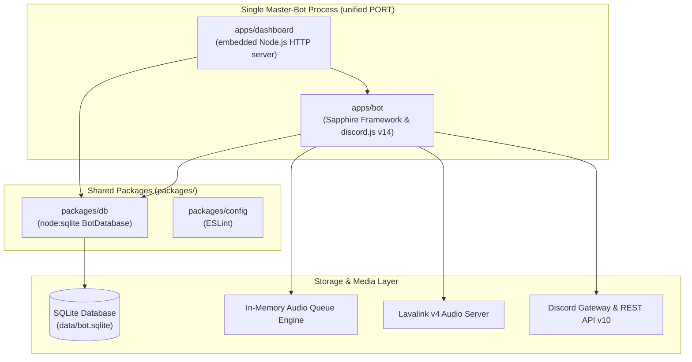

# 📖 Master-Bot Wiki

Welcome to the official **Master-Bot** documentation wiki. Master-Bot is a full-stack, production-grade Discord Bot with an embedded web dashboard built with **TypeScript**, **Sapphire Framework**, **discord.js v14**, **Node.js 22 (`node:sqlite`)**, and **Lavalink v4**. The Discord client, web dashboard, and OAuth2 login run together in a **single process** on one unified port (default `3000`).

---

## 🗺️ System Architecture



---

## 📚 Wiki Sections Hub

| Section | Description | Top-Level Guide |
| :--- | :--- | :--- |
| **⚙️ Getting Started** | Local setup for Windows, macOS, Linux, Raspberry Pi, and Docker | [Setup Guide](Setup) |
| **☁️ Cloud Hosting** | Manual production deployment across Render, Railway, Fly.io, Heroku, Koyeb, VPS | [Hosting Guide](Hosting) |
| **🎵 Lavalink & Audio** | Lavalink v4 setup, YouTube OAuth device flow, cipher deciphering, audio filters | [Lavalink Guide](Lavalink) |
| **🌐 Web Dashboard** | Embedded Node.js HTTP dashboard, OAuth2 login, live stats, and settings | [Dashboard Guide](Dashboard) |
| **🔑 Configuration** | Master-Bot environment variables, API keys (Twitch, IGDB, Klipy, NewsAPI), feature flags | [Configuration Guide](Configuration) |
| **📜 Commands** | Complete 74 slash command catalog and server configuration (`/set`) manual | [Commands Reference](Commands) |
| **🧪 Testing** | Vitest unit and integration test harness, coverage, and validation workflows | [Testing Guide](Testing) |

---

## ⚡ Quick Start (Local Development)

```bash
# 1. Clone repository
git clone https://github.com/galnir/Master-Bot.git
cd Master-Bot

# 2. Install dependencies
pnpm install

# 3. Configure environment
cp .env.example .env
nano .env

# 4. Launch unified dev stack (Bot, Dashboard, Lavalink)
pnpm dev
```
