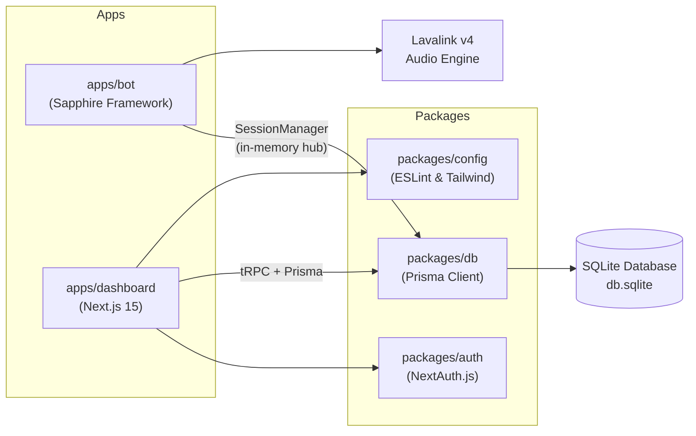

# 🤖 Master-Bot

**Master-Bot** is a production-ready Discord music, moderation, and utility bot with a full-featured **Next.js web dashboard**. It is built with **TypeScript**, **Sapphire Framework**, **discord.js v14**, **Prisma ORM** (SQLite), and **Lavalink v4** for high-fidelity audio.

---

## 🏗️ Architecture Overview

The bot keeps all runtime state — users, guilds, welcome messages, tickets, playlists, reminders, temp channels, and Twitch subscriptions — in an in-memory **SessionManager** that persists every change to SQLite through Prisma. Settings, playlists, and reminders survive bot restarts.

---

## ⚡ Key Features

- **🎵 High-Fidelity Audio:** Powered by Lavalink v4 with YouTube (multi-client + OAuth), Spotify metadata resolution (`lavasrc-plugin`), free built-in SoundCloud, Twitch, and Vimeo. Live player embeds with real-time progress bars and DSP filters (`/bassboost`, `/karaoke`, `/nightcore`, `/vaporwave`).
- **📚 Custom Playlists:** Per-user playlists, scoped per server, via `/create-playlist`, `/save-to-playlist`, `/my-playlists`, `/display-playlist`, and `/delete-playlist`.
- **🔨 Moderation Suite:** `/ban`, `/kick`, `/timeout`, `/slowmode`, and `/purge` with permission hierarchy validation.
- **📜 Audit Logging:** 20 granular server event triggers across members, messages, channels, roles, voice, and moderation.
- **🎫 Support Tickets:** Thread-based ticketing with interactive panels, custom greeting templates, manager roles, and `.txt` transcript archiving.
- **👋 Welcome Messages:** Templated join greetings in any channel with `{user}`, `{server}`, `{position}` placeholders.
- **🔊 Temp Voice Channels:** Users join a hub channel and get a private temporary voice channel on demand.
- **⏰ Reminders:** Personal and per-server scheduled reminders delivered by DM with a 30-second background scheduler.
- **🟣 Twitch Alerts:** Live stream notifications for managed streamers plus `/twitch-status`.
- **🌐 Web Dashboard:** Next.js 15 command center for server settings, welcome/ticket/log design, music controls, broadcast composer, system telemetry, and reminders.
- **🚀 Unified Launchers:** `pnpm dev` / `pnpm start` manage ports, route logs to `logs/`, optionally spawn Lavalink, and print a unified status console.

---

## 📖 Continue Reading

- Want to run it? → [**Getting Started**](Getting-Started.md)
- Full command list? → [**Commands Reference**](Commands.md)
- How data is stored? → [**Architecture**](Architecture.md)
- Everything in the wiki is linked in the [**sidebar**](_Sidebar.md).