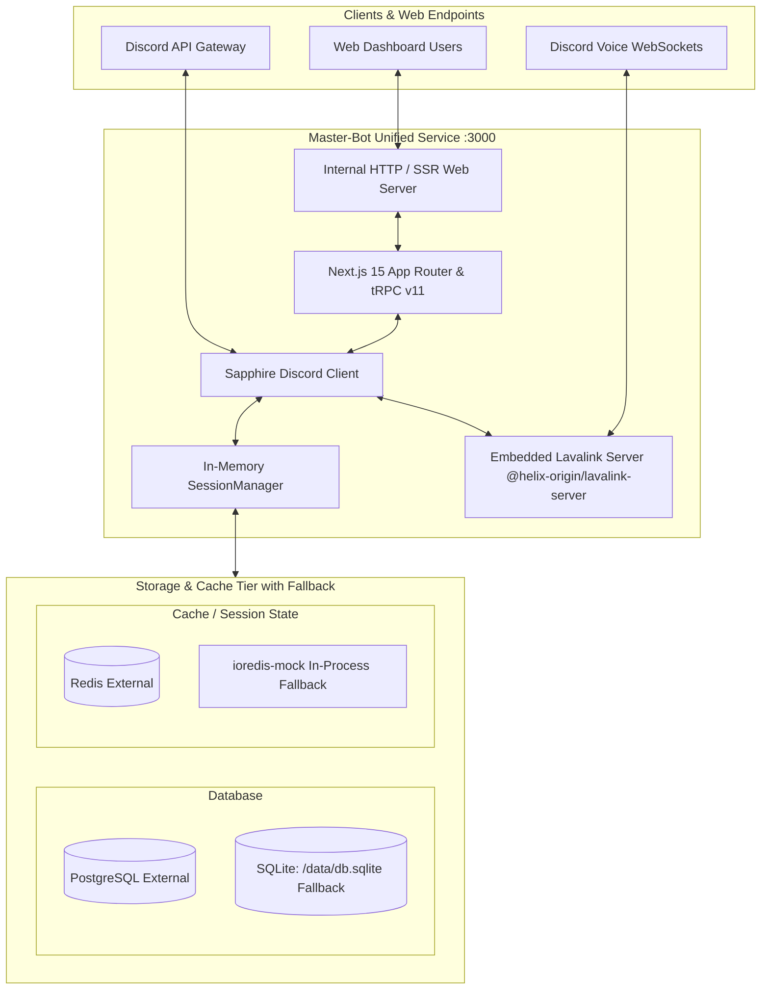

# 🤖 Master-Bot

**Master-Bot** is an enterprise-grade, unified Discord music, moderation, and utility bot with an embedded **Next.js 15 Web Dashboard**. Built with **TypeScript**, **Sapphire Framework**, **discord.js v14**, **Prisma ORM** (supporting external PostgreSQL with zero-ops SQLite fallback), in-memory/external Redis caching, and an embedded **Lavalink v4** audio server powered by [`@helix-origin/lavalink-server`](https://github.com/HELIX-Origin/Lavalink-Server).

---

## 🏗️ System Architecture

---

## ⚡ Key Modernization Features

- **🎵 Embedded High-Fidelity Audio:** Features an embedded Lavalink v4 server from [`@helix-origin/lavalink-server`](https://github.com/HELIX-Origin/Lavalink-Server), with YouTube OAuth support, Spotify metadata resolution (`lavasrc-plugin`), SoundCloud, and DSP audio filters (`/bassboost`, `/nightcore`, `/vaporwave`, `/karaoke`). Supports instant external node connection via `LAVA_EXTERNAL=true`.
- **🗄️ Dual Database Architecture:** Native support for external PostgreSQL (`DB_URI=postgresql://...`) with automatic, zero-configuration local fallback to SQLite (`file:/data/db.sqlite`).
- **⚡ Dual Cache Architecture:** Seamlessly connects to external Redis instances (`REDIS_URL`) while automatically falling back to in-memory `ioredis-mock` if Redis is unconfigured or unreachable.
- **🧪 Universal Testing Suite:** Preconfigured Vitest monorepo testing suite powered by [`@helix-origin/vitest-suite`](https://github.com/HELIX-Origin/vitest-suite) with dedicated Discord.js and Redis test doubles.
- **🌐 Next.js 15 Web Dashboard:** Modern command center with 9 feature studios (Guild Management, Music Studio, Broadcaster, Audit Logs, Ticket Hub, Reminders, Command Controls, Welcome Greetings, and Telemetry).
- **🤖 Autonomous Agent Ecosystem:** Complete [`.agents/`](../.agents) directory comprising specialized agents, production skills (including GitHub CLI and issue orchestration with Mermaid diagrams), standardized rules, and templates.
- **🚀 Low-Cost VPS & Docker Self-Hosting:** Production-ready guides for budget-friendly VPS providers (Hetzner, OVHcloud, DigitalOcean, Linode, Vultr, Contabo) with persistent SQLite storage, unthrottled networking, and optional Heroku cloud support.

---

## 🤖 Autonomous Agent Ecosystem

The repository is maintained and enhanced with a standardized multi-agent operating system defined in [`.agents/`](../.agents) and indexed in [`AGENTS.md`](../AGENTS.md):

- 🐙 **GitHub CLI Expert (`gh-cli-expert`)**: Full command automation for issues, PRs, runs, and releases.
- 📋 **Issue Orchestrator (`issue-orchestrator`)**: Creates human-readable issues with emojis, Mermaid diagrams, and separate child sub-issues.
- 📚 **Wiki Management (`wiki-management`)**: Enforces relative wiki links, sidebar hierarchy, and navigation footers.
- 🗄️ **Database Fallback Manager (`database-fallback`)**: Manages PostgreSQL/SQLite and Redis/`ioredis-mock` lifecycle.

---

## 📖 Continue Reading

- Want to run the bot? → [**Getting Started**](Getting-Started)
- Deep dive into components? → [**Architecture**](Architecture)
- Complete slash command catalog? → [**Commands Reference**](Commands)
- Reminders & stream alerts setup? → [**Reminders & Stream Alerts**](Reminders-and-Twitch)
- Configuring audio and plugins? → [**Music & Audio**](Music)
- Web dashboard guide? → [**Web Dashboard**](Dashboard)
- Contributing & extending the bot? → [**Developer's Guide**](Development-Guide)
- Production rollout? → [**Deployment**](Deployment)
- Common questions? → [**FAQ & Troubleshooting**](FAQ)
- Discord verification & legal policies? → [**Privacy Policy**](../PRIVACY.md) & [**Terms of Service**](../TOS.md)