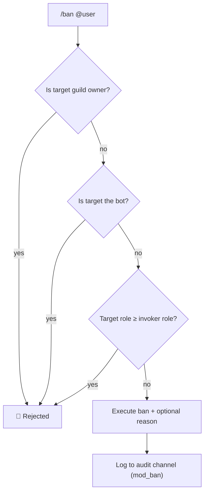
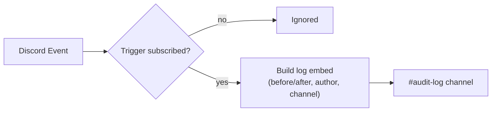

# 🔨 Moderation & Audit Logging

Master-Bot includes a tight moderation suite and a granular, event-driven audit log.

## ⚖️ Moderation Commands

| Command | What it does |
| --- | --- |
| `/ban <user> [reason]` | Bans a member by mention/ID, optionally with a reason. |
| `/kick <user> [reason]` | Kicks a member from the server. |
| `/timeout <user> <duration> [reason]` | Places a member in timeout for a duration. |
| `/slowmode <duration>` | Sets the current channel's slowmode. |
| `/purge <amount>` | Bulk-deletes up to 100 messages in the current channel. |

### Permission & Hierarchy Safety

Every moderation action validates the target before executing:

- The target cannot be the **guild owner**.
- The target cannot be the **bot** itself.
- The target's **highest role must rank below the invoker's** highest role — you can't punish someone at or above your own authority level.

Failures are reported back to the invoker; successful actions return a confirmation embed with the target and reason.



## 📜 Audit Logging

When a **log channel** is configured (`/set logging set-channel`), the bot dispatches embeds for **20 distinct server events** across six categories. Each trigger can be enabled or disabled independently from the dashboard's **Audit Log studio** or `/set`.



| Category | Event IDs | What gets logged |
| --- | --- | --- |
| 👥 **Member Events** | `member_join`, `member_leave`, `member_role`, `member_nick` | Joins (with account age + member count), leaves/kicks, role add/remove, nickname changes. |
| 💬 **Message Events** | `message_delete`, `message_edit`, `message_purge` | Deleted content + attachments, before/after edits, bulk purges. |
| 📁 **Channel Events** | `channel_create`, `channel_delete`, `channel_update` | Channel creation, deletion, rename/topic/permission edits. |
| 🛡️ **Role Events** | `role_create`, `role_delete`, `role_update` | Role creation, deletion, name/color/permission changes. |
| 🔊 **Voice Events** | `voice_join`, `voice_leave`, `voice_move` | Member voice joins, leaves, and channel switches. |
| ⚖️ **Moderation Actions** | `mod_ban`, `mod_unban`, `mod_timeout`, `mod_kick` | Staff-executed punishments. |

### Setting Up

```bash
/set logging set-channel  #channel        # pick the log channel
/set logging toggle-log-channel           # enable it (or disable)
```

All 20 triggers default to **enabled** the first time logging turns on — trim them per-category from the dashboard's **Audit Log** studio (`log-events-form`), which shows live counts (`X / 20 active`) with Enable-all / Disable-all shortcuts.

### Storage & Retention

Audit settings (`logChannel`, `logEvents`, `logChannelEnabled`) persist per guild in SQLite via the session layer — they survive reboots and are immediately available to the dashboard.