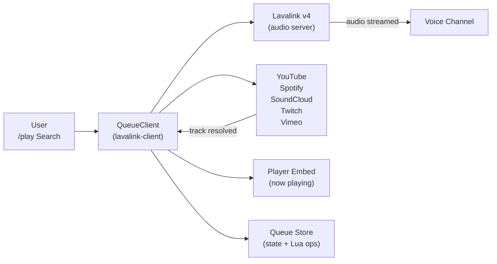

# 🎵 Music & Lavalink

Master-Bot's audio engine is powered by **Lavalink v4** — a standalone, high-performance audio server that streams and mixes audio, letting the bot stay lightweight. The bot itself never touches raw audio packets.

## 🔊 How Playback Works

- **`lavalink-client`** (`QueueClient`) negotiates WebSocket sessions with Lavalink and wraps the player API.
- **Queue/QueueStore** manage the guild queue, shuffle, removal, and position moves (fast list primitives via Redis-backed Lua scripts; state caches optionally in Redis).
- **`searchSong`** resolves queries/URLs across sources; the **`lavasrc-plugin`** resolves Spotify tracks, albums, and playlists to their YouTube counterparts.

## 🗄️ Lavalink Setup

1. Download the latest **Lavalink v4** jar from the [Lavalink releases page](https://github.com/lavalink-devs/Lavalink/releases).
2. Copy the repo's config: `cp application.yml.example application.yml`
3. Launch the server: `java -jar Lavalink.jar`

The example config ships with:

| Setting | Value |
| --- | --- |
| Server port | `2333` (matches `LAVA_PORT`) |
| Server password | `youshallnotpass` (matches `LAVA_PASS`) |
| `youtubePlugin` | `1.18.2` |
| `lavasrcPlugin` | `4.8.3` |
| YouTube resolver | plugin with `remoteCipher` (`${YOUTUBE_CIPHER_URL:https://cipher.kikkia.dev/}`) and multi-client rotation: `TV`, `MUSIC`, `ANDROID_VR`, `IOS`, `WEB`, `WEBEMBEDDED` |
| Native sources | `youtube: false` (handled by the plugin instead), Spotify/Local enabled |

> **Running remote?** Set `LAVA_EXTERNAL=true`, `LAVA_SECURE=true` when behind TLS, and open port 2333. `pnpm dev` auto-launches a local Lavalink when Java is present and `LAVA_ENABLED=true`.

## ▶️ Playing & the Player Embed

- `/play <query|url>` — play something fast. Comma-separated URLs are supported (`/play url1, url2`).
- The **now-playing embed** updates live with the track title, author, thumbnail, duration, and an animated progress bar, plus queue position/page hints.
- Player controls live on the embed (pause/stop/skip buttons via `buttonsCollector`); `/jump`, `/seek`, `/shuffle`, `/remove`, `/move`, `/volume` adjust the queue.
- When nobody is left in the voice channel the bot auto-disconnects (`voiceStateUpdate` listener).

## 🎛️ DSP Filters

Real-time audio effects applied server-wide, toggled per command:

| Effect | What it does |
| --- | --- |
| `/bassboost` | Boosts low frequencies. |
| `/karaoke` | Attenuates the vocal band (sing along!). |
| `/nightcore` | Pitch + tempo up. |
| `/vaporwave` | Pitch + tempo down with reverb. |

## 💿 Custom Playlists

Playlists are **per user and per server** — playlist names collide safely across guilds (unique on `userId + guildId + name`).

| Command | Purpose |
| --- | --- |
| `/create-playlist <name>` | Create an empty playlist for this server. |
| `/save-to-playlist <name>` | Add the current track. |
| `/remove-from-playlist <name> <title>` | Drop a specific track. |
| `/my-playlists` | List your playlists on this server. |
| `/display-playlist <name>` | View tracks (paginated). |
| `/delete-playlist <name>` | Delete it. |

Playlists and their songs are persisted in the database (`Playlist` / `Song` models, cascade-deleted with the owning user's membership).

## 🎙️ Music Trivia

`/music-trivia` starts a guess-the-song game built from the **artists currently in the queue**. Tracks play with the title/artist clues hidden while players answer; `/stop-trivia` ends it and posts the leaderboard. Powered by the bot's own trivia samples (`triviaSongs`/`triviaMatcher`).

## 🔐 YouTube OAuth (Recommended)

Public YouTube playback is throttled and can be blocked. The bot can play through an **authorized YouTube account** instead:

1. Run `/youtube-auth` and open the returned authorization URL.
2. Log in with the YouTube account you want to stream through and approve the scopes.
3. The bot stores the resulting refresh token in `.youtube-oauth.json` (also available as `YOUTUBE_REFRESH_TOKEN`) — playback now uses that account's session via the YouTube client.

## 🧰 Troubleshooting

| Symptom | Fix |
| --- | --- |
| `/play` errors "no available audio players" | Lavalink not running — start it, or ensure `LAVA_ENABLED=true` + correct `LAVA_PORT`/`LAVA_PASS`. |
| Spotify links don't resolve | Add `SPOTIFY_CLIENT_ID` + `SPOTIFY_CLIENT_SECRET`. |
| YouTube throttled/blocked | Complete [YouTube OAuth](#youtube-oauth). |
| No sound on remote host | `LAVA_EXTERNAL=true` (+ `LAVA_SECURE=true` if TLS). Verify the instance is reachable on port 2333. |
| Static/none playback after IP ban | Restart Lavalink with a different YouTube client via `application.yml` clients list. |