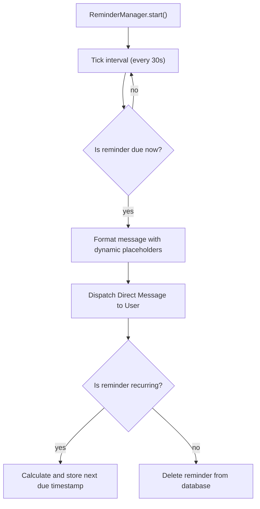
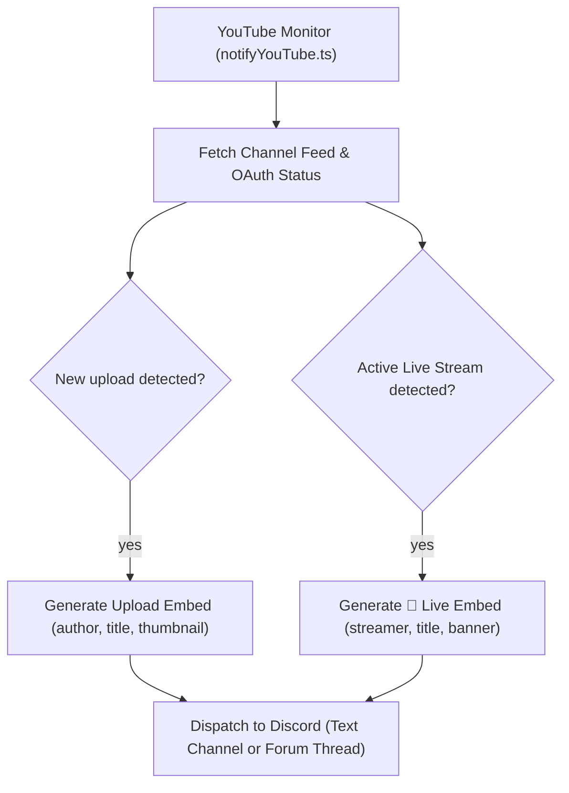
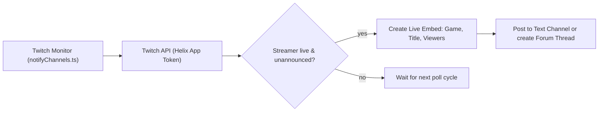

# ⏰ Reminders & Stream Alerts (YouTube & Twitch)

Master-Bot features background notification systems that monitor **scheduled reminders**, **Twitch live broadcasts**, and **YouTube video uploads & live streams**, routing notifications to text channels or creating organized threads in Discord Forum channels.

---

## 📑 Table of Contents
1. [⏰ Scheduled Reminders](#-scheduled-reminders)
2. [📺 YouTube Alerts (Streams & Uploads)](#-youtube-alerts-streams--uploads)
3. [🟣 Twitch Live Stream Alerts](#-twitch-live-stream-alerts)
4. [Forum vs. Text Channel Delivery](#-forum-vs-text-channel-delivery)
5. [Related Guides](#-related-guides)

---

## ⏰ Scheduled Reminders

The `/reminder` command schedules one-off or recurring reminders delivered directly via **Direct Message (DM)** to the requesting member.

### 💻 Usage

```text
/reminder description: "Server maintenance" dateTime: "2026-10-01 14:00" [repeat: "daily"] [event: "Ops"]
```

The bot sends a direct message at the scheduled timestamp containing your description and event tag.

### 📝 Template Placeholders

Reminder descriptions support dynamic interpolation placeholders:

| Placeholder | Replaced with |
| :--- | :--- |
| `{user}` / `{mention}` / `{username}` | The requesting user's mention or name. |
| `{event}` | The event name or category specified in the command. |
| `{date}` / `{time}` | The formatted date or time of the reminder. |
| `{countdown}` / `{relative}` | Dynamic relative time until the reminder fires. |
| `{timestamp}` | Discord relative timestamp (`<t:TIMESTAMP:R>`). |

### 📐 Scheduler Lifecycle & Architecture



- **Persistence**: Reminders are scoped per-server (`Reminder.guildId`) and stored in the database (`DB_URI`), persisting across bot restarts.
- **Cleanup**: If a member leaves a guild, their associated reminders for that guild are automatically cleaned up.

---

## 📺 YouTube Alerts (Streams & Uploads)

Master-Bot continuously monitors YouTube channels for new video uploads and active live streams without consuming external API quota for standard polling.

### Key Capabilities:
- **Fast Zero-Quota RSS Ingestion**: Parses channel Atom/RSS feeds for instant upload detection.
- **Live Broadcast Tracking**: Enriches live broadcast status with viewer counts and custom banners via OAuth.
- **Granular Filter Options**: Choose to receive `all` alerts, `streams` only, or `uploads` only.
- **Discord Forum Channels**: Automatically creates dedicated discussion threads for each video or stream.

### ⚙️ Managing YouTube Subscriptions

Use the consolidated `/set` command to configure YouTube subscriptions:

```text
# Subscribe to all alerts (streams and uploads) in a feed channel:
/set option: youtube-add value: @MKBHD channel: #videos alerts: all

# Subscribe only to live streams:
/set option: youtube-add value: @LofiGirl channel: #live-streams alerts: streams

# Subscribe only to video uploads:
/set option: youtube-add value: @Veritasium channel: #science alerts: uploads

# View all active YouTube subscriptions in the guild:
/set option: youtube-list

# Remove a channel subscription:
/set option: youtube-remove value: @MKBHD channel: #videos
```

#### Accepted Channel Formats:
- **Handle**: `@MrBeast`
- **Full Channel URL**: `https://www.youtube.com/@MrBeast`
- **Legacy URL**: `https://www.youtube.com/channel/UCX6OQ3DkcsbYNE6H8uQQuVA`
- **Direct Channel ID**: `UCX6OQ3DkcsbYNE6H8uQQuVA`

### 📐 YouTube Monitor Architecture



---

## 🟣 Twitch Live Stream Alerts

Monitors live broadcast states for Twitch streamers and posts rich embeds with game title, live viewer count, and stream preview thumbnails when they go live.

### ⚙️ Managing Twitch Subscriptions

```text
# Subscribe to live alerts for a Twitch streamer:
/set option: twitch-add value: shroud channel: #streams

# List all monitored Twitch streamers:
/set option: twitch-list

# Remove a Twitch streamer subscription:
/set option: twitch-remove value: shroud channel: #streams

# Check live broadcast status on demand:
/twitch-status streamer: shroud
```

### 📐 Twitch Monitor Flow



---

## 💬 Forum vs. Text Channel Delivery

Master-Bot dynamically adapts alert delivery based on Discord channel type:

| Destination Channel | Delivery Method | Behavior |
| :--- | :--- | :--- |
| **Standard Text Channel** (`GuildText`) | Direct Channel Message | Posts a styled embed with notification text. |
| **Forum Channel** (`GuildForum`) | Forum Thread Post | Automatically creates a new forum thread titled after the stream or video, allowing members to discuss the broadcast without cluttering the main channel. |

> [!TIP]
> Using Discord Forum channels is highly recommended for active servers with multiple subscribed creators, keeping discussions organized in dedicated threads.

---

## 🔗 Related Guides
- [Home](Home) — Return to wiki main page
- [Commands Reference](Commands) — Complete list of slash commands and `/set` options
- [Configuration](Configuration) — Setting up Twitch and YouTube credentials
- [Developer Guide](Development-Guide) — How to add new background monitors and alerts

---
[Home](Home) • [Documentation Index](Home) • [GitHub Repository](https://github.com/galnir/Master-Bot)