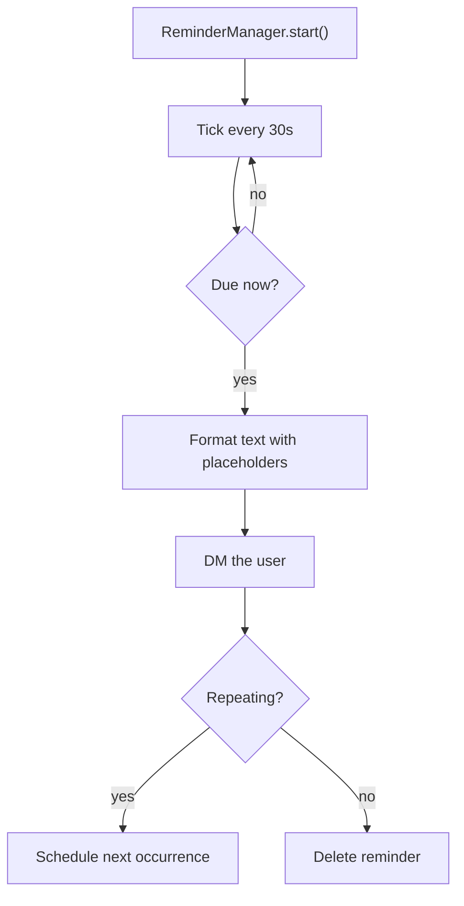
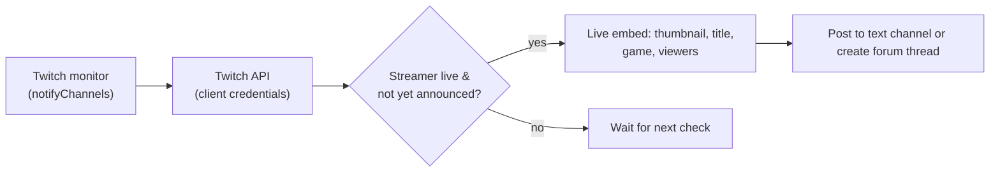
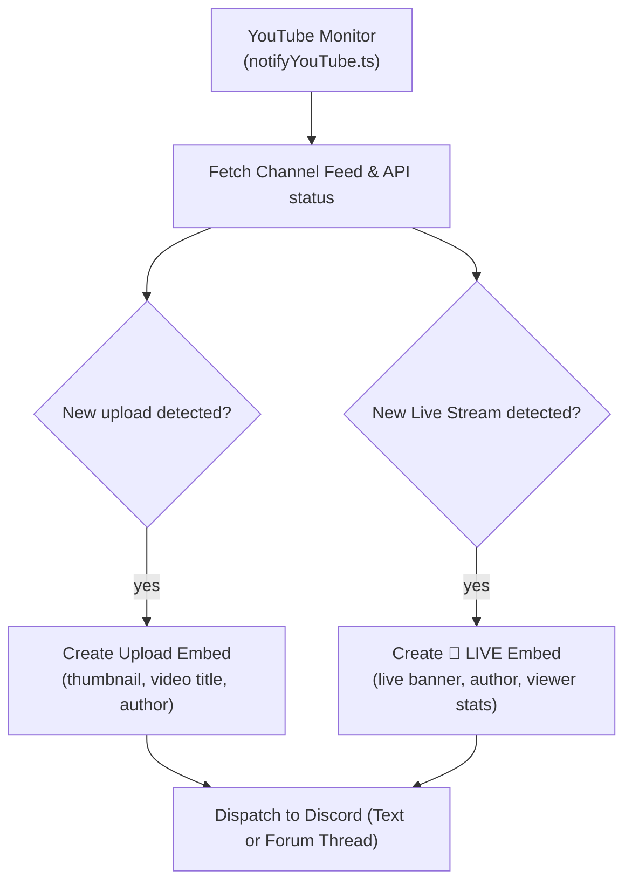

# ⏰ Reminders & Twitch Alerts

Two notification systems running quietly in the background: **scheduled reminders** and **Twitch live alerts**.

## ⏰ Reminders

`/reminder` schedules a one-off or repeating notification delivered by **DM**.

### Usage

```txt
/reminder description:"deploy checklist" dateTime:"2026-09-10 18:00" [repeat:"daily"] [event:"Deploy"]
```

The bot DM's you at the scheduled time with the description and any **event** attribute (`{event}`).

### Template Placeholders

`/reminder` descriptions and events support rich interpolation:

| Placeholder | Replaced with |
| --- | --- |
| `{user}` / `{mention}` / `{username}` | The requesting user. |
| `{event}` | The event name/attribute. |
| `{date}` / `{time}` | The scheduled date / time. |
| `{countdown}` / `{relative}` | Time until the reminder. |
| `{timestamp}` | Unix timestamp (`<t:N:R>` relative Discord format). |

### Scheduler



- Starts at boot, checks immediately, then every **30 seconds**.
- Reminders are **per-server scoped** (`Reminder.guildId` via the `ReminderGuild` cascade relation) and persisted in SQLite, so they survive bot restarts.
- A user leaving their guild removes their reminders for that guild as part of the member-lifecycle cleanup.

## 🟣 Twitch Alerts

Monitors the live status of streamers you subscribe to and posts an embed into the server when they go live (requires `TWITCH_ENABLED=true` and `TWITCH_CLIENT_ID`/`SECRET`).

### Forum & Text Channel Support
Alerts support both **Text Channels** and **Forum Channels** (`ChannelType.GuildForum`). When a forum channel is selected, Master-Bot automatically creates a new forum thread post for each stream event and updates the thread's starter message throughout the broadcast.

### Manage Streamers

```bash
/set setting: twitch-add value: shroud channel: #streams    # subscribe to a streamer's live alerts
/set setting: twitch-remove value: shroud channel: #streams # stop monitoring
/set setting: twitch-list                                   # paginated list of monitored streamers
```

You can also check status on demand: `/twitch-status "shroud"`.

### How the Twitch Monitor Works



- Streamer subscriptions live in the `twitchConfig` store and the `TwitchNotify` model (`userId`, `channelIds`, `live`, `sent`).
- The bot only announces once per stream (`sent` guard) and updates it for repeat checks.
- Twitch credentials come from `TWITCH_CLIENT_ID` / `TWITCH_CLIENT_SECRET` — the same pair powers IGDB `/game-search`.

---

## 📺 YouTube Alerts (Live Streams & Video Uploads)

Monitors YouTube channels for both new video uploads and active live streams.

### Features
- **Zero-Quota RSS Polling**: Checks channel Atom/RSS feeds for new uploads without consuming YouTube Data API quota.
- **Live Stream Tracking**: Identifies live broadcasts with YouTube brand embeds and viewer count metadata.
- **Forum & Text Channel Support**: Posts to text channels or creates structured forum threads in Forum Channels.
- **Granular Alert Filters**: Guild admins can choose to receive `all` alerts, `streams` only, or `uploads` only.

### Manage YouTube Channels

```bash
/set setting: youtube-add value: @MrBeast channel: #videos alerts: all       # subscribe to channel
/set setting: youtube-remove value: @MrBeast channel: #videos              # remove subscription
/set setting: youtube-list                                                  # list active subscriptions
```

Accepted channel formats:
- Handle: `@MrBeast`
- Channel URL: `https://www.youtube.com/@MrBeast` or `https://www.youtube.com/channel/UCX6OQ3DkcsbYNE6H8uQQuVA`
- Channel ID: `UCX6OQ3DkcsbYNE6H8uQQuVA`

### How the YouTube Monitor Works

