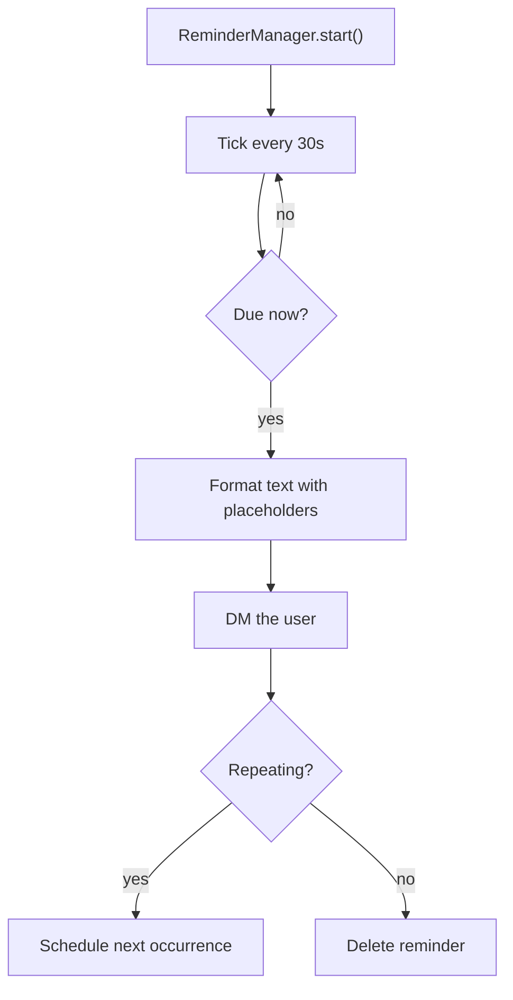
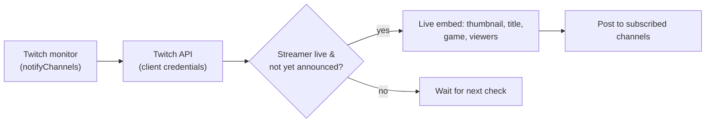

# ⏰ Reminders & Twitch Alerts

Two notification systems running quietly in the background: **scheduled reminders** and **Twitch live alerts**.

## ⏰ Reminders

`/reminder` schedules a one-off or repeating notification delivered by **DM**.

### Usage

```txt
/reminder description:"deploy checklist" dateTime:"2026-09-10 18:00" [repeat:"daily"] [event:"Deploy"]
```

The bot DM's you at the scheduled time with the description and any **event** attribute (`{event}`).

### Template Placeholders

`/reminder` descriptions and events support rich interpolation:

| Placeholder | Replaced with |
| --- | --- |
| `{user}` / `{mention}` / `{username}` | The requesting user. |
| `{event}` | The event name/attribute. |
| `{date}` / `{time}` | The scheduled date / time. |
| `{countdown}` / `{relative}` | Time until the reminder. |
| `{timestamp}` | Unix timestamp (`<t:N:R>` relative Discord format). |

### Scheduler



- Starts at boot, checks immediately, then every **30 seconds**.
- Reminders are **per-server scoped** (`Reminder.guildId` via the `ReminderGuild` cascade relation) and persisted in SQLite, so they survive bot restarts.
- A user leaving their guild removes their reminders for that guild as part of the member-lifecycle cleanup.

## 🟣 Twitch Alerts

Monitors the live status of streamers you subscribe to and posts an embed into the server when they go live (requires `TWITCH_ENABLED=true` and `TWITCH_CLIENT_ID`/`SECRET`).

### Manage Streamers

```bash
/set twitch add  "shroud"      # subscribe to a streamer's live alerts
/set twitch remove "shroud"    # stop monitoring
/set twitch list               # paginated list of monitored streamers
```

You can also check status on demand: `/twitch-status "shroud"`.

### How the Monitor Works



- Streamer subscriptions live in the `twitchConfig` store and the `TwitchNotify` model (`userId`, `channelIds`, `live`, `sent`).
- The bot only announces once per stream (`sent` guard) and updates it for repeat checks.
- Twitch credentials come from `TWITCH_CLIENT_ID` / `TWITCH_CLIENT_SECRET` — the same pair powers IGDB `/game-search`.