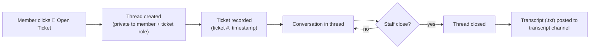

# 🎫 Support Tickets

Master-Bot's ticketing system creates **thread-based support tickets** from a button panel, with optional manager roles and `.txt` transcript archiving.

## ⚙️ Setup

```bash
/set tickets set-ticket-channel  #panel          # where the ticket button panel lives
/set tickets set-ticket-role    @Support        # role that can manage/view tickets
/set tickets set-transcript-channel #transcripts # where tickets are archived
/set tickets toggle-tickets                      # enable the system
```

The panel is posted to the ticket channel with a customizable greeting message (a sensible default is provided). When disabled, the panel is removed and the buttons stop responding.

## 🔄 Ticket Lifecycle



1. A user clicks the **Open Ticket** button on the panel (`ticketButtonListener`).
2. A **private thread** is created; the creator and any configured **ticket role** are added.
3. The thread ID, guild, creator, timestamp are persisted (`Ticket` model) so tickets can be tracked.
4. When staff close the thread, the full conversation is exported as a **`.txt` transcript** and posted to the transcript channel.

> 💡 Transcripts make disputes easy to resolve and provide an audit trail even after the thread is archived or pruned.

## 👥 Roles & Permissions

- **Ticket role** (`/set tickets set-ticket-role`) — members with this role get automatic access to every ticket thread.
- The creator always has access to their own thread.
- Regular members without the role can't read other people's threads (Discord's private-thread permissions are applied at creation).

## 🗂️ Storage

Ticket settings (`ticketChannel`, `ticketTranscriptChannel`, `ticketRoleId`, `ticketEnabled`, `ticketMessage`) and open-ticket records persist per guild via the session layer → SQLite. If a member leaves the server, their open ticket records are cleaned up as part of the member-lifecycle cascade.