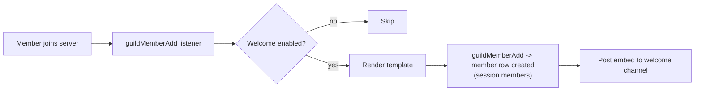
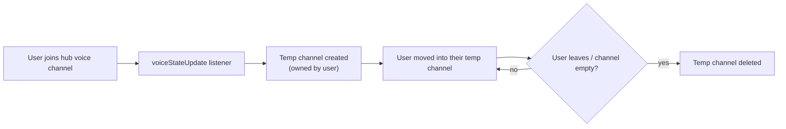

# 👋 Welcome & Temp Channels

Two member-experience features that make a server feel alive: automatic **welcome messages** and on-demand **temporary voice channels**.

## ✨ Welcome Messages

A templated greeting posted to a channel whenever someone joins the server.

### Setup

```bash
/set welcome set-channel  #welcome
/set welcome set-message  "Welcome {user} to {server}! You are member #{position}. 🎉"
/set welcome toggle
```

### Template Placeholders

| Placeholder | Replaced with |
| --- | --- |
| `{user}` | The new member's mention (`@Name`). |
| `{server}` | The server name. |
| `{position}` | The member's join position (e.g. `#128`). |

### How It Works



- A welcome-enabled server also creates the member's **`GuildMember` row** at join time (see [Architecture](Architecture.md#database-sqlite--prisma)).
- The message is an embed built from the template; settings persist in SQLite via the session layer.

## 🔊 Temp Voice Channels

Convert a hub channel into a **personal voice channel factory**.

### How It Works



1. The server marks a voice channel as the **hub** (stored in `hubChannels`).
2. When a user joins the hub, the bot instantly creates a **temporary voice channel** for them and moves them into it.
3. When the user leaves (or the temp channel empties), the channel is **automatically deleted**, keeping the voice area tidy.

Each temp channel is tracked (`TempChannel`: guild, owner, channel ID), so a user gets one dedicated space and staff can always see who owns which channel. Temp-channel ownership is part of the member-lifecycle data cleaned up when a member leaves.